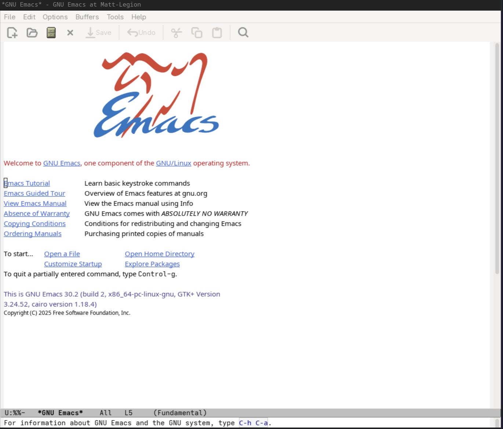
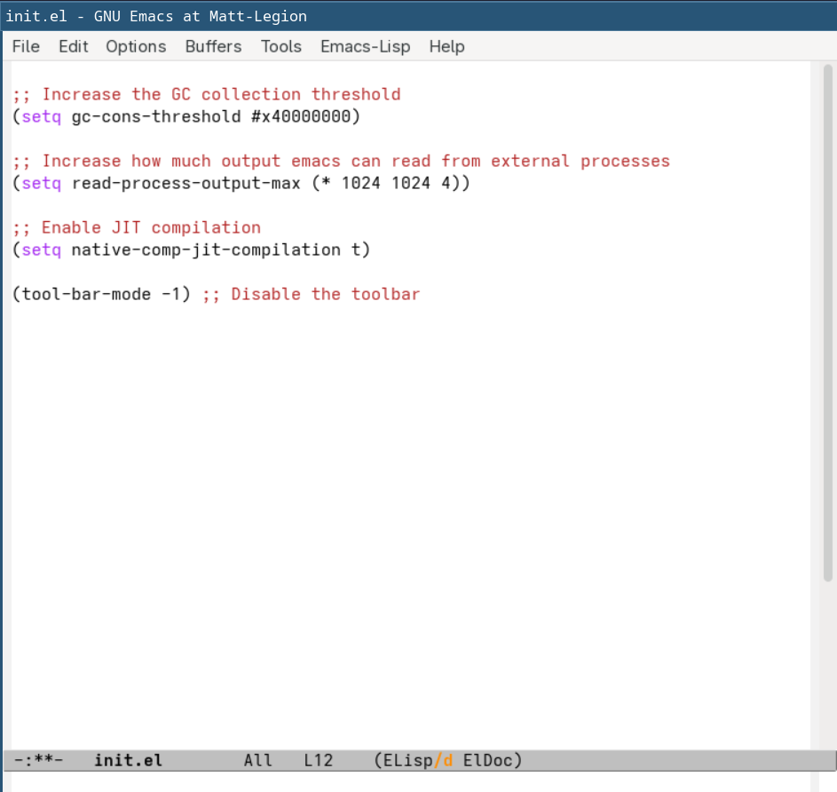

# Initial Configuration

Starting a brand new instance of Emacs shows the following:



It's pretty bare bones, but the links are useful. One initially helpful thing about
this interface is you can hover the mouse over many UI elements and get some some
information about what it means. So for example, the `U` means it's UTF-8 encoded,
the first `%` means the buffer is read-only, etc...

It's also worth going through the tutorial to understand the key combinations and
nomenclature, even if the intention is to use VIM bindings later.

Emacs is primarily a heavily pre-configured elisp interpreter, which means we can
write any elisp code we want and execute it inline. Since configuration is not done
with a custom DSL but instead actual elisp code. This is powerful because we are able
to actually write configuration code, evaluate it live, and if it does what we want 
only then save it to a persistent configuration file.

To get started with a bare bones configuration, we will want to create a new file
in the `~/.emacs.d/` folder named `init.el`. There are 
[several places](https://www.gnu.org/software/emacs/manual/html_node/emacs/Find-Init.html)
that Emacs looks for the initial configuration file to load, but I have had the most
success with this one.

The `C-x C-f` combination (`Ctrl+x` then `Ctrl+f`) opens the `find-file` command in
emacs, which allows opening a buffer that points to a (new or existing) file. Pressing
the key combination makes the bottom area (called the `minibuffer`) show `Find file:`. 
In here you can type in `~/.emacs.d/init.el`.


One thing that's not immediately apparent is if a directory or file exists already
you can press tab to complete from a partial value. So if the `~/.emacs.d` directory
already exists, you can do `~/.em<tab>` and that should auto-complete to `~/.emacs.d`
(assuming there are no other home directories with that prefix). Many mini-buffer
commands support this, so it's useful to keep in mind.

Pressing enter will open a buffer to that file, and if the file does not exist it should
say `(New File)`.


So lets start adding our basic starting configuration!

A couple of configuration settings I have seen in a variety of places for performance
are:

```elisp
(setq gc-cons-threshold #x40000000)
(setq read-process-output-max (* 1024 1024 4))
(setq native-comp-jit-compilation t)
```

`setq` allows setting a value to a specific variable, and each of these lines sets the
variable (the second argument) to the corresponding value (the third argument).

The `gc-cons-threshold` increases the garbage collection threshold so that emacs waits
longer before performing stop-the-world GC collection. This can help stuttering.

The `read-process-output-max` I have seen as a way to help performance with tooling that
interacts with external processes, specifically LSPs. It allows for larger buffer sizes
and thus can read data from external processes in much fewer calls.

The `native-comp-jit-compilation` is being set to `t`, which is a way to specify that
the variable has a value. It's usually used for boolean values (where saying it has no
value is done by giving it the `nil` value). This specific setting tells emacs to run
just-in-time compilation of elisp to improve performance. If this is disabled than it
always runs any non-natively compiled elisp code through the slower interpreter.

`native-comp-jit-compilation` is active by default, the configuration I have here ends
up being keeping the default. I list it here because some advice is to set this to `nil`
so that there is less stuttering the first time new elisp code is encountered. There is
supposedly a way to trigger a recompile of elisp code manually, but my preference is going
to be to keep it on unless I get noticable stutter.

One note is that you can prepend lines with `;;`, and that allows you to write comments in
your elisp code.

These settings by itself won't have visual changes, so lets add another configuration
option that has visible impact. We can add `(tool-bar-mode -1)` to disable the
bar at the top with fairly large icons. 

With these 4 configuration options set, we can now execute the code and see it in action.
This can be done with the mouse by going to the `Emacs-Lisp` menu item and `Evaluate Buffer`.
However, the more Emacs way to do it is by typing `M-x` (Meta key + x). 

`M-x` opens up the generic interface in Emacs which allows you to execute any interactive
function that is currently exposed. In the minibuffer prompt that opens, you can type
`eval-buffer` and press enter to evaluate all the elisp code in the current buffer.
Evaluating the buffer should result in the window updating with the tool bar now removed.



We have applied these settings, but we have *not* saved the file. If we kill
emacs without saving this buffer, we will lose these changes and emacs will
load next time with the defaults. We can save with `C-x C-s` (`Ctrl+x` then
`Ctrl+s`). The minibuffer should show a confirmation that it has been written.


If you now restart emacs then it will not have the icon toolbar.

