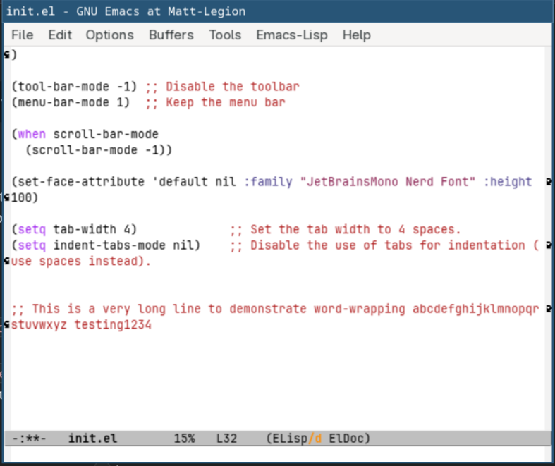
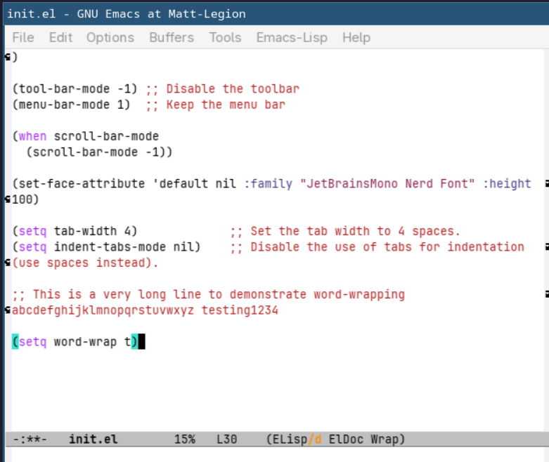
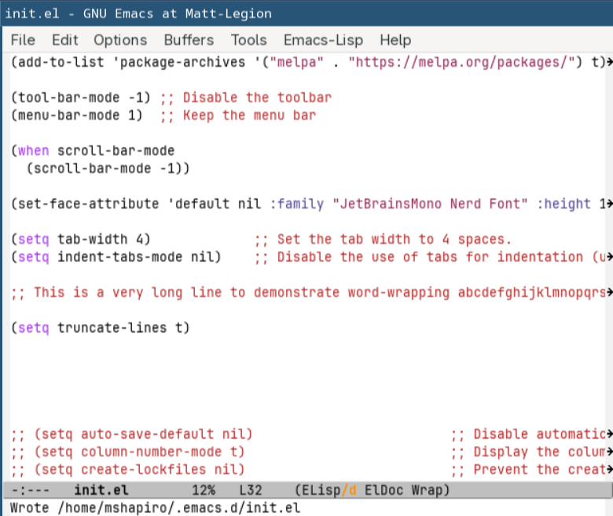

# Emacs Variables

<!-- markdown toc start -->
**Table of Contents**

  - [Customization UI](#customization-ui)
  - [Global Setting Functions](#global-setting-functions)
    - [Menu bar](#menu-bar)
    - [Disabling the Scroll Bar](#disabling-the-scroll-bar)
    - [Fonts](#fonts)
  - [Buffer Local Settings](#buffer-local-settings)
    - [Tab Indentation](#tab-indentation)
    - [Text Wrapping](#text-wrapping)
  - [Organizing These Settings](#organizing-these-settings)
    - [Additional Customization Variables](#additional-customization-variables)
  - [Line Numbers](#line-numbers)
  - [Mac Specific Settings](#mac-specific-settings)
  - [Default Frame Size](#default-frame-size)

<!-- markdown toc end -->

There are quite a few variables built into emacs that controls it's
behavior. 

Emacs contains a lot of documentation. Most variables can have its documentation
shown by typing `M+x describe-variable`.

## Customization UI

Emacs has a customization user interface, which allows changing behavior of
emacs through a graphical interface rather than programmatically. In theory this
lets aspects of Emacs changes to be more discoverable.

When changes through the customization system are made, it is saved by writing
the equivalent elisp code. 

However, it's not just manual customizations via the UI that can trigger code
generation. There is a function called `customize-set-variable`, which sets the 
default value for buffer local variables. Calling this function marks the variable as
set in the customization system, and thus triggers code generation. This is a setting
used in a lot of configurations and thus there's no getting around it customization
code-gen.

By default, this generated code goes into your initialization file (e.g. 
`init.el`). This can be a bit messy, but you can add code to your emacs
initialization to keep auto-generated customization code in a separate file.
This is done by adding the following elisp:

```elisp
(setq custom-file (locate-user-emacs-file "custom-vars.el"))
(load custom-file 'noerror 'nomessage)
```

The name doesn't have to be `custom-vars.el`, it can be anything you wish.
The `locate-user-emacs-file` function will ensure its in the same directory
as the `init.el` file.

## Global Setting Functions

### Menu bar

If you don't like the menu bar at the top (File, Edit, etc...) then that can
be disabled with `(menu-bar-mode -1)`. That being said I find the menu bar
does not take much space and is helpful for remembering key binds and 
major mode functionality. Therefore, I leave it enabled with `(menu-bar-mode 1)`.

### Disabling the Scroll Bar

If you do not want to see the scroll bar, it can be disabled via 

```elisp
(when scroll-bar-mode
  (scroll-bar-mode -1))
```

### Fonts

Since I come from a JetBrains background, I am used to using the `JetBrains Mono` font, not
only in my IDE but also in my terminal. I also use the
[Nerd Font](https://www.nerdfonts.com/) variation for the extra unicode icon support.

Regardless of what font you wish to use, you can get Emacs to use them in the GUI via

```elisp
(set-face-attribute 'default nil :family "JetBrainsMono Nerd Font" :height 100)
```

## Buffer Local Settings

Some variables are buffer local, which means they only affect the buffer they were set
with. This allows customizations for how Emacs looks and behaves for each buffer that
is opened. This allows changing behavior based on what programming language, file type,
or custom Emacs display is being viewed at any given time.

This also means you can't have your `init.el` file set the variable value (via 
`(setq <variable> <value)` for these, because they won't apply to any buffer.

In theory, you can set these globally via `(setq-default <variable> <value>)`. The caveat
to that is that many Emacs variables contain a `:set` function on them that not only
sets the value of the variable, but executes any side effects required for the new value
to take effect.

`setq` and `setq-default` do not run these. Instead `(customize-set-variable <variable> <value>)`
should be used, which will execute the `:set` function if they exist.

If you are unsure a variable is buffer local vs global, you can always use `M-x describe-variable`.
However, most variables I have come across are buffer local, and the global ones tend to start
with the `global-` prefix.

It's also worth keeping in mind that the variable name provided to `customize-set-variable` is
a string literal of the name of the variable. Therefore, `(customize-set-variable foo t)` is
**NOT** valid but `(customize-set-variable 'foo t)` is valid (specifically the `'` added in).

### Tab Indentation

The tab key does not work the same way as it does in most other editors. In most text
editors indentation isn't a real concept, but instead is purely a visual idea we have
for text alignment. While many editors have commands for changing the amount of white-space
at the beginning of a line, pressing the `<Tab>` key will insert either a tab code or
spaces where your cursor is.

Emacs does not do this, and the `<Tab>` key will only manage the indentation level of
the current line of text. In most cases it will only *fix* the current line's indentation
level based on the settings in the buffer's major mode (the active driver controlling
language and text settings in the current buffer).

Tab width and tabs vs spaces can be configured with the following settings:

```elisp
(customize-set-variable 'tab-width 4)             ;; Set the tab width to 4 spaces.
(customize-set-variable 'indent-tabs-mode nil)    ;; Disable the use of tabs for indentation (use spaces instead).

```

### Text Wrapping

By default, Emacs will wrap text to the next line on the character that collides with the
border of the screen.



You can see it shows indicators on the right side and the left side when wrapping occurred.

By setting `(customize-set-variable 'word-wrap t)` it then wraps on whole words, with long words moving
completely to the next line (Note that you may have to move your cursor to a new line
to get this to go into effect after evaluations).



If you want no text wrapping at all, it can be disabled via 
`(customize-set-variable 'truncate-lines t)`.



You still get indicators to know when some of the text has gone past the screen.

## Organizing These Settings

Between the last post and this post we have 3 different type of settings

1. Global variables (e.g. `gc-cons-threshold` and `custom-file`
2.* Functions to call on initialization (e.g. `menu-bar-mode`)
3.* Buffer local variables whose defaults we want to set (e.g. `tab-width`)

While global variable settings should still be set at the beginning of your 
`init.el` file via `setq` calls, we can organize the latter two using the
Emacs `use-package` macro.

The `use-package` macro has two relevant sections, `:custom` and `:init`. 

`:custom` allows us to easily define buffer local variables whose defaults we want to set.
Instead of `(customize-set-variable 'var1 nil` we can instead specify `(var1 nil)` in
this section.

The `:init` will call any functions we place in there upon package initialization.

While I will go into package management in a later post, Emacs contains an
`emacs` package that can be used to organize built-in emacs setting initialization.

For example, we can organize our current settings in the `init.el` with:

```elisp
(use-package emacs
  :ensure nil ;; built-in package
  :init
  (set-face-attribute 'default nil :family "JetBrainsMono Nerd Font" :height 100)
  (tool-bar-mode -1) ;; disable the toolbar
  (menu-bar-mode 1)  ;; Keep the menu bar
  (when scroll-bar-mode
    (scroll-bar-mode -1)) ;; Disable the scroll bar

  :custom
  (tab-width 4)
  (indent-tabs-mode nil)
  (truncate-lines t)
)
```

### Additional Customization Variables

I have some additional customization variables that is a good starting point as well.
Most of the following variables I have taken from the 
[Emacs-Kick init.el](https://github.com/LionyxML/emacs-kick/blob/master/init.el#L213)
configuration file, as they are defaults that make sense for me.

```elisp
  (auto-save-default nil)                         ;; Disable automatic saving of buffers.
  (column-number-mode t)                          ;; Display the column number in the mode line.
  (create-lockfiles nil)                          ;; Prevent the creation of lock files when editing.
  (delete-by-moving-to-trash t)                   ;; Move deleted files to the trash instead of permanently deleting them.
  (delete-selection-mode 1)                       ;; Enable replacing selected text with typed text.
  (display-line-numbers-type 'relative)           ;; Use relative line numbering in programming modes.
  (global-auto-revert-non-file-buffers t)         ;; Automatically refresh non-file buffers.
  (history-length 25)                             ;; Set the length of the command history.
  (ispell-dictionary "en_US")                     ;; Set the default dictionary for spell checking.
  (make-backup-files nil)                         ;; Disable creation of backup files.
  (pixel-scroll-precision-mode t)                 ;; Enable precise pixel scrolling.
  (pixel-scroll-precision-use-momentum nil)       ;; Disable momentum scrolling for pixel precision.
  (ring-bell-function 'ignore)                    ;; Disable the audible bell.
  (split-width-threshold 300)                     ;; Prevent automatic window splitting if the window width exceeds 300 pixels.
  (switch-to-buffer-obey-display-actions t)       ;; Make buffer switching respect display actions.
  (use-dialog-box nil)                            ;; Disable dialog boxes in favor of minibuffer prompts.
  (use-short-answers t)                           ;; Use short answers in prompts for quicker responses (y instead of yes)
  (warning-minimum-level :emergency)              ;; Set the minimum level of warnings to display.
```

Don't forget to save and use `M-x eval-buffer` to make them take effect!

## Line Numbers

It can be useful to have line numbers, especially in programming contexts. Emacs can display line numbers by
enabling the `display-line-number-mode`. 

While this can be manually activated via `M-x display-line-number-mode`, it can be automatically enabled. One
example configuration is to have it enabled any time a buffer activates a mode that's categorized as a
programming mode. This means you won't have line numbers for basic text buffers or markdown buffers, but
that's good for me.

This can be done by specifying some code that will run when a certain event (otherwise known as a hook) is
triggered. In this case, all programming related major modes invoke the `prog-mode-hook`. These hooks can
be applied pretty easily by adding a `:hook` section to the `use-package emacs` section:

```elisp
(prog-mode . display-line-numbers-mode)
```

This will execute the `display-line-numbers-mode` command every time a major mode is activated that runs the
prog-mode-hook event.

You can have line numbers be relative to your current position by changing the `(display-line-numbers-type 'relative)`.
This will have the display show the exact line number for the line your cursor is, and the relative line number for every
other line from the cursor. 

This can be helpful if you are good at going up or down X number of lines instead of using `C-n` and `C-p` 
one line at a time. If you see a line of text 20 lines down you can get to it with `C-u 20 C-n`.

Having `(display-line-numbers-type t)` will use exact line numbers for every line.

## Mac Specific Settings

Emacs knows what operating system it is running on, and it can be queried via the `system-type` variable.

This is useful in your configuration if you want settings that only take effect when run on a specific setting. 
For Mac OS, there are two specific oddities that I work around:

1. Emacs defaults to the `M` (Meta) key being the Option key, while on Linux and Windows it's the alt key.
   This means if you switch between Mac and PCs you have to switch out which key you hit for Meta based on
   what computer you are at. I also just prefer the placement of Mac's command key over option since Meta
   is used a good amount.
2. Mac's high DPI settings tends to make fonts appear smaller than they do on most PCs, even with
   the same monitor and resolution.

To address these, I have my `use-package emacs`'s `:init` section have the following:

```elisp
  ;; Mac specific settings
  (when (eq system-type 'darwin)
    (setq mac-command-modifier 'meta) ;; set command key to act as meta
    (set-face-attribute 'default nil :family "JetBrainsMono Nerd Font" :height 125)
    )
```

Your desired font height may be different, but I have 100 height on PC but 125 on Mac.

## Default Frame Size

When a new Emacs frame opens (even the initial one), it tends to open in a small window. On my
Linux desktop this isn't a big deal due to using a tiling window manager, but on Mac it opens in
the tiniest window by default.  

I have expanded my default with the following in my `(use-package emacs` `::init` section:

```elisp
  ;; Make sure frames open with a reasonable initial size
  (add-to-list 'default-frame-alist '(width . 120))
  (add-to-list 'default-frame-alist '(height . 45))
```

The values specified are in rows vs columns for text. I'm not sure how that calculates if you aren't
using a mono-spaced font though.
