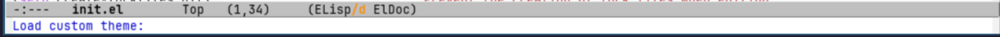
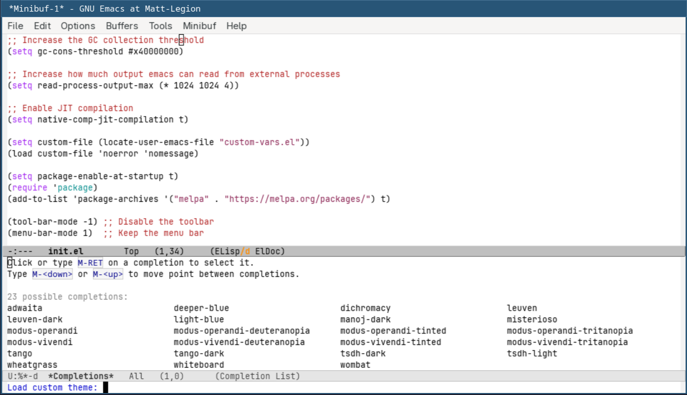
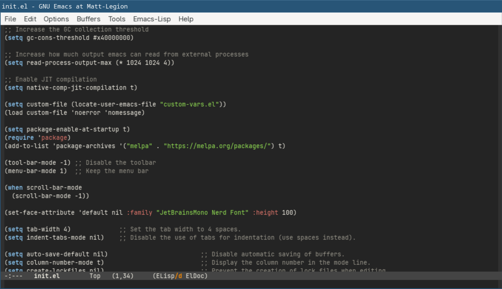

# Themes

Everyone has their preference of color-schemes for their editors, and
Emacs does not impose it's own scheme on you. 

Emacs contains some themes built in, but additional themes can be installed
via packages.

## Loading A Theme

There is a `load-theme` function which allows loading a theme by it's name. This function
can be activated by pressing `M-x load-theme` and pressing enter. The minibuffer should now
show `Load custom theme:` text.



This assumes you know the name of the themes you want, or even know which themes are installed.

Fortunately, if you press the `<Tab>` key at this prompt, you will be presented with a list
of theme options that are installed.



You can now type any of these (or select them with the mouse) and that theme will
become activated. For instance, selecting `wombat` shows: 



If you find a theme that suits you, you can add the following to your `init.el` 
configuration:

```elisp
(load-theme 'wombat)
```

You can replace `wombat` with the name of the theme you want to use.

**NOTE:** that you will need the `'` before the name. That tells elisp the value is a
string literal and not a function to be evaluated. Without this, it will try to run the
`wombat` function, which doesn't exist and thus will fail.

## External Themes

You may find a built-in theme that you are satisfied with, but if not you are not limited by
those choices. Many third party packages include additional themes.


