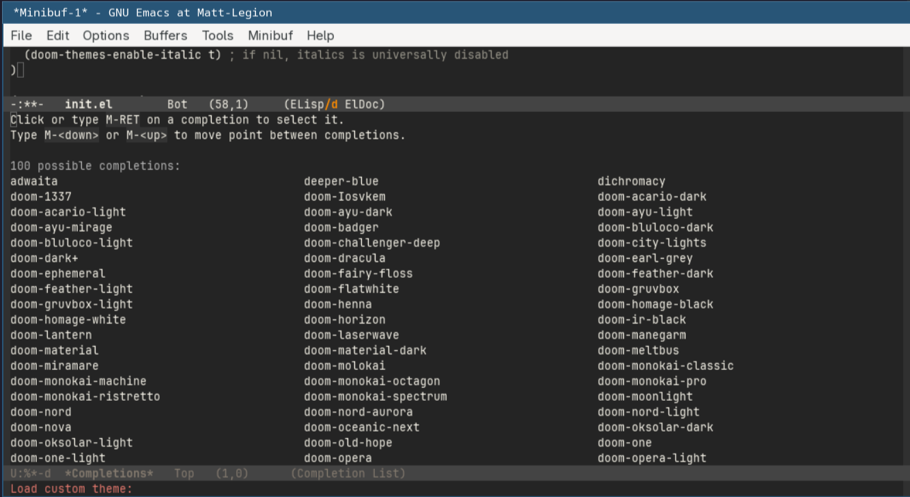
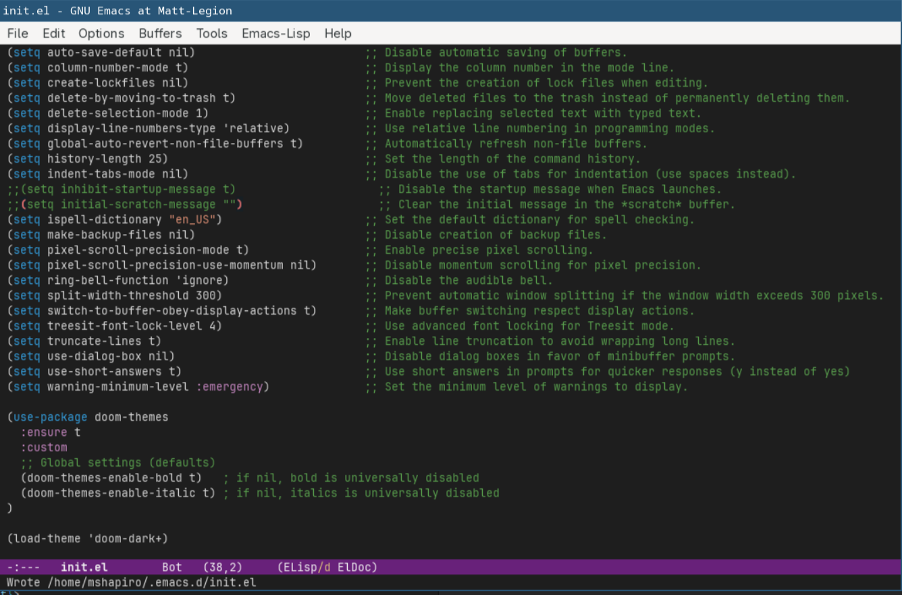

# Themes

<!-- markdown toc start -->
**Table of Contents**

  - [Loading A Theme](#loading-a-theme)
  - [External Themes](#external-themes)
  - [When To Load Themes](#when-to-load-themes)

<!-- markdown toc end -->


Everyone has their preference of color-schemes for their editors, and
Emacs does not impose it's own scheme on you. 

Emacs contains some themes built in, but additional themes can be installed
via packages.

## Loading A Theme

There is a `load-theme` function which allows loading a theme by it's name. This function
can be activated by pressing `M-x load-theme` and pressing enter. The minibuffer should now
show `Load custom theme:` text.


This assumes you know the name of the themes you want, or even know which themes are installed.

Fortunately, if you press the `<Tab>` key at this prompt, you will be presented with a list
of theme options that are installed.


You can now type any of these (or select them with the mouse) and that theme will
become activated. For instance, selecting `wombat` shows: 


If you find a theme that suits you, you can add the following to your `init.el` 
configuration:

```elisp
(load-theme 'wombat)
```

You can replace `wombat` with the name of the theme you want to use.

**NOTE:** that you will need the `'` before the name. That tells elisp the value is a
string literal and not a function to be evaluated. Without this, it will try to run the
`wombat` function, which doesn't exist and thus will fail.

## External Themes

You may find a built-in theme that you are satisfied with, but if not you are not limited by
those choices. Many third party packages include additional themes.

One comprehensive theme pack is the 
[themes from the Doom emacs distribution](https://github.com/doomemacs/themes/tree/screenshots).

The theme pack can be loaded via

```elisp
(use-package doom-themes
  :ensure t
  :custom
  ;; Global settings (defaults)
  (doom-themes-enable-bold t)   ; if nil, bold is universally disabled
  (doom-themes-enable-italic t) ; if nil, italics is universally disabled
)
```

Save this in your `init.el`, then put the cursor on the last `)` and do `C-x C-e` 
(Ctrl+x then Ctrl+e). This evaluates the previous statement. In the bottom minibuffer
you should see it reading and trying to download the new package.

Now when you do `M-x load-themes` and hit tab you should see a new list of packages
installed.



Experiment with the different themes, and once you picked one set your `init.el`
to have `(load-theme '<theme-name>)` in it. The `(load-theme)` function call
can either go in your `:init` section of the `use-package` of the package that
installs the theme, or your `use-package emacs` call if it's a built-in theme.



## When To Load Themes

Themes can be loaded pretty early (external themes must be loaded at least after
the package manager has been setup though). 

However, I have found it useful to always have my `(load-theme)` call at the very
end of my `init.el` file. This means that if I ever have a syntax error in my
`init.el` I will immediately notice because the theme will be wrong. Without this,
I have had scenarios where it took me quite a while to realize something was wrong
and I only had half my expected functionality.
