# Enhancing The Minibuffer

<!-- markdown toc start -->
**Table of Contents**

  - [Default Functionality](#default-functionality)
  - [Immediate Feedback](#immediate-feedback)
  - [Adding More Info](#adding-more-info)
    - [More Flexible Typing](#more-flexible-typing)
  - [Minibuffer Word Wrapping](#minibuffer-word-wrapping)

<!-- markdown toc end -->


## Default Functionality

When you activate a command in the minibuffer (such as `M-x` to run
an interactive function), it's a bit basic and not very discoverable.

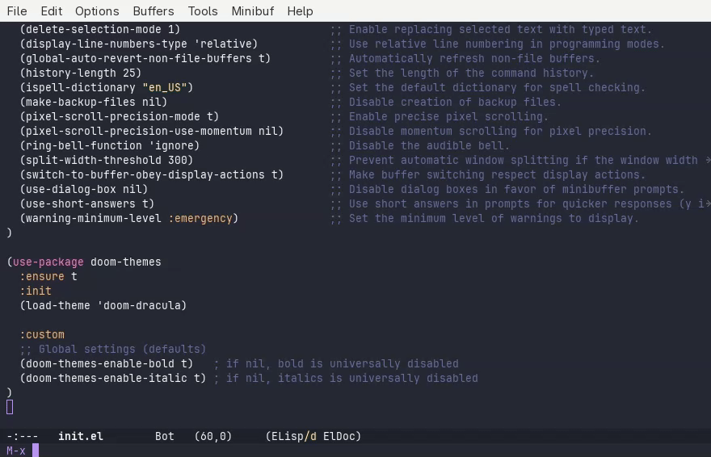

Pressing `<Tab>` will provide what Emacs calls `completing-read`, which is just
its term for auto-complete in the minibuffer. Pressing `<Tab>` once will complete
the function name up until the most common known prefix. So typing `eva<Tab>`
causes the minibuffer to complete to `eval-`, since multiple functions exist
that start with `eval-`.

Pressing `<Tab>` a second time pops up a list of options, but those options
don't actually update as you continue typing.

So let's improve this experience!

## Immediate Feedback

The biggest improvement we can get is having an immediate list of options
as we start interacting with the minibuffer.

Emacs has a solution to this built-in, called `fido-vertical-mode`. This
expands the minibuffer to provide contextual options as you type. You can
experiment with it by calling the `fido-vertical-mode` interactive function
with `M-x`. 

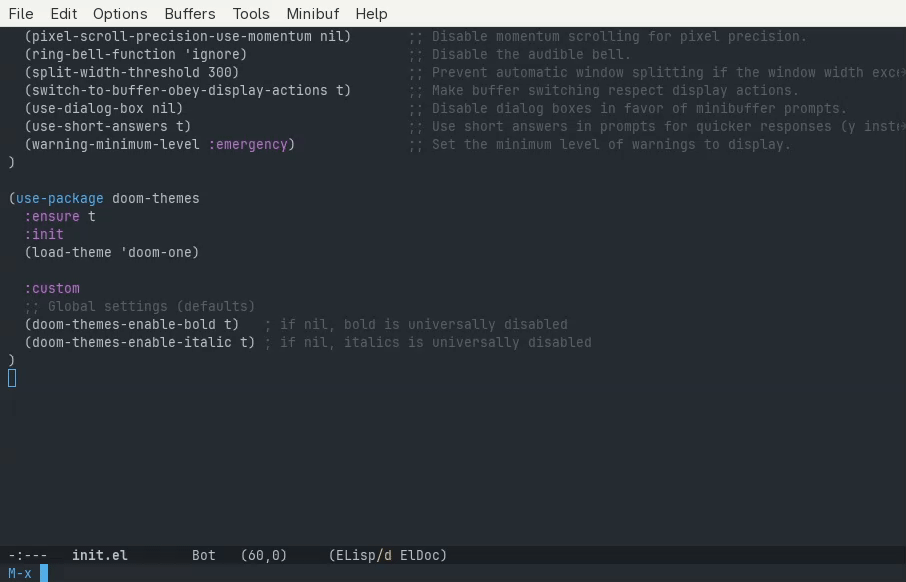

This can be activated by default by adding `(fido-vertical-mode)` to the
`:init` section of the `use-package emacs` declaration.

## Adding More Info

Most of the Emacs interactive function have comments that tell you what
each function does. `fido-vertical-mode` provided a list of options, but
if you don't know what each function does then that limits its helpfulness.

This requires a third party package, [Marginalia](https://github.com/minad/marginalia).
We can add it by adding the following to our `init.el`:

```elisp
(use-package marginalia
  :ensure t ;; always install
  :init
  (marginalia-mode))
```

Save this and re-evaluate the buffer, and now you'll see some helpful documentation
along-side the available interactive functions.

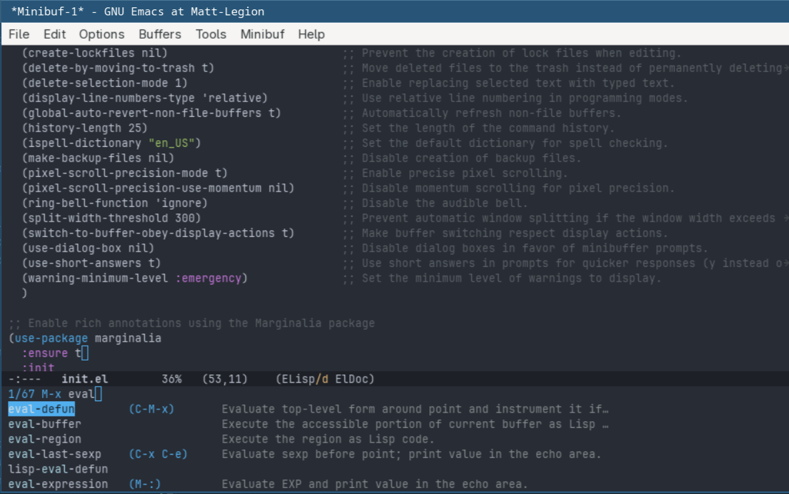

It also adds useful info to other minibuffer completions, such as the find file
results.

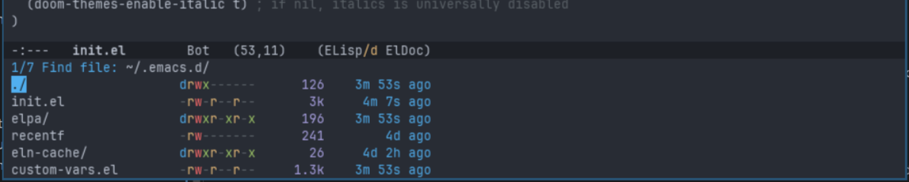


### More Flexible Typing

These enhancements have made the minibuffer a bit more easier to manage, and made
it easier to discover and invoke desired functions. It can still be improved though.

For example, if we know we want to have Emacs re-evaluate the whole buffer but don't
remember the exact function name, we can type `M-x evbuff` and our current setup will
successfully match on that (and some other close options).

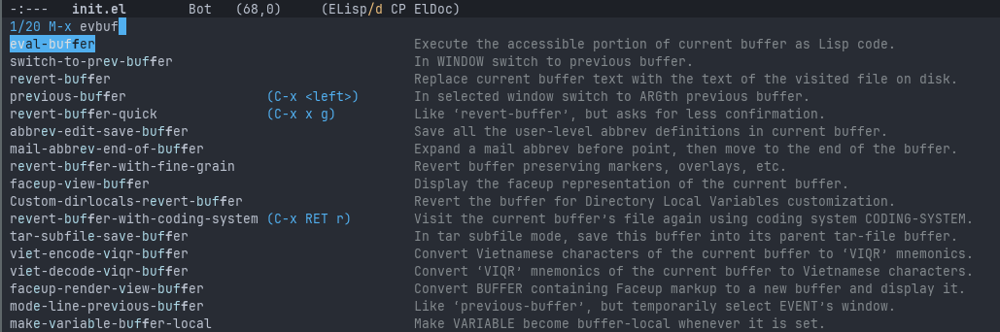

However, if you think about commands as separate words that happen to be separated
by a space you might want to search with `M-x ev<space>buff`. If you try this though
you end up with the following:

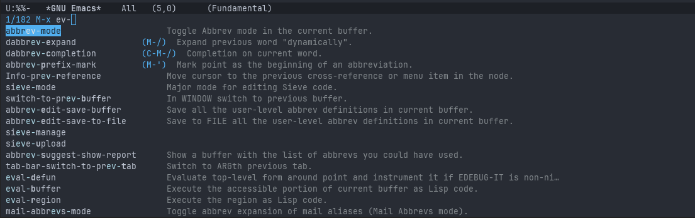

This probably wasn't what you meant. It becomes even more obvious if you do `M-x buff<Space>`,
as that completes the minibuffer to `M-x buffer-`. What's happening is the `<Space>` key is bound to 
`minibuffer-complete-word`, and is the same as `<Tab>`.

We can customize this but setting a keymap only after `icomplete` has loaded. 
`icomplete` is the built in minibuffer completion framework and `fido` is an
extension of it that we are using for vertical support. So by adding the following
to the `:init` section of our `use-package emacs` directive, we can get actual
spaces in our minibuffer.

```elisp 
  (with-eval-after-load 'icomplete
    (keymap-set icomplete-fido-mode-map "SPC" #'self-insert-command))
```

Now if you re-evaluate the buffer, typing `M-x ev<Space>buff` will show `ev buff` in the
minibuffer.

However, now we have a problem. Searching for `ev buff` doesn't find anything because no
interactive commands actually have a space in their name.

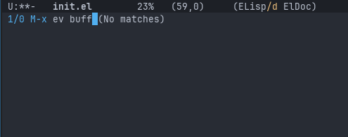

This is where a helpful package called [orderless](https://github.com/oantolin/orderless) 
becomes useful. It breaks the minibuffer completion options into distinct words that
can be fuzzily searched in any order. 

So lets add the package with the following in our `init.el` file:


```elisp
(use-package orderless
  :ensure t
  :custom
  (completion-category-defaults nil)
  (completion-category-overrides '((file (styles partial-completion))))
  )

(defun my-icomplete-styles ()
  (setq-local completion-styles '(orderless basic)))

(add-hook 'icomplete-minibuffer-setup-hook 'my-icomplete-styles)
```

Once that's re-evaluated the orderless package should be installed. Now if you
type `M-x ev<Space>buff` you get useful results.

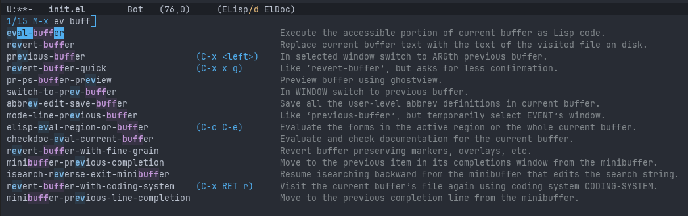

The real power of this is to not have to remember the exact order of terms. So this
same list of options comes up with `M-x buff<Space>ev` as well.

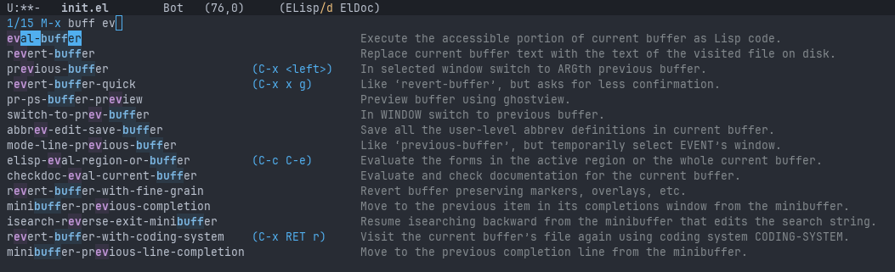

This also works as expected for the `find-file` commands.

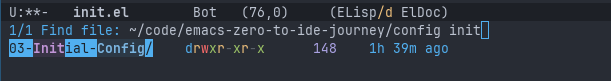

If you are curious, the reason the `add-hook` function call is needed is because
every time `icomplete` is invoked, it resets the completion styles. So we need to
make sure that our function with sets the `completion-styles` variable is invoked
after `icomplete` is set up.

One issue that may become apparent is that now you can type `ev<SPC>buff` to find
`eval-buffer` but not `evbuff`, which we could before. We can address this by adding
the following to the orderless `:custom` section:

```elisp
(orderless-matching-styles '(orderless-literal orderless-regexp orderless-flex))
```

This means the following matching behavior will occur for `eval-buffer`:
* `evbuff` will match
* `ev buff` will match
* `buff ev` will match
* `buffev` will *NOT* match

So if you know the order of the words then not including the spaces can help, but 
if you don't know the order than space between the sections is needed to search. That being said
I leave the `orderless-flex` removed from the completion styles and just get in the habit 
of using space to separate potential words. The problem with the `orderless-flex` is that
its too flexible, and makes it really hard to find the expected match when filtering down
a large list of matches (such as all files within a project). It rarely gives me what I want
in those cases, and thus I can find what I am looking for faster without it.

# Minibuffer Word Wrapping

With marginalia activated and an Emacs window of limited width, it is possible to
have minibuffer completion options to be word wrapped. This has the unfortunate
interaction with `fido-vertical-mode` where options below the visible minibuffer
area are not visible. 

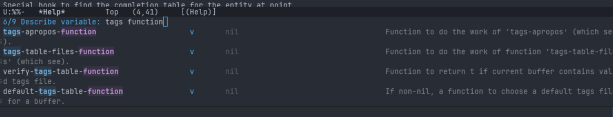

In this example I have the 6th item selected, but you can't see which option
that actually is. Presumably this is because the selection UI does not realize
that word wrapped lines cause the 6th item to not be on the 6th line, and thus
out of view.

Like everything else in Emacs, this can be customized by using a hook to call
a function when the minibuffer is setup. In the `use-package emacs` add:

```elisp
  :hook (minibuffer-setup . (lambda () (setq truncate-lines t)))
```

When the minibuffer is created, it will now run the provided lambda function
and thus truncate the lines instead of word wrapping.

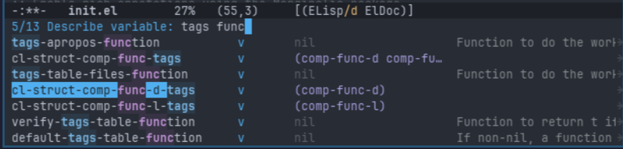

We can consolidate this hook with the `add-hook` function call we previously added.
If we add `(setq-local truncate-lines t)` to our `defun my-icomplete-styles` and
remove the `(add-hook)` line, we can then change the `:hook` section to be:

```elisp
  :hook
  (icomplete-minibuffer-setup . my-icomplete-styles)
```

That will now have the same effect as we had before with the `my-icomplete-styles`
being invoked any time the icomplete minibuffer is setup.
