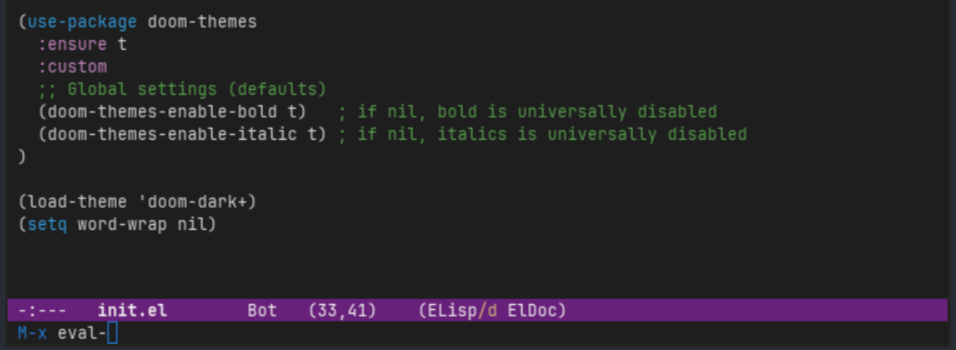
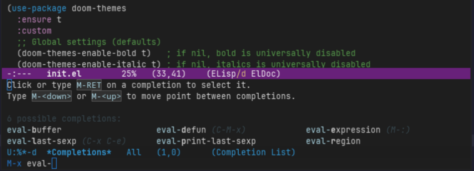

# Enhancing The Minibuffer

When you activate a command in the minibuffer (such as `M-x` to run
an interactive function), it looks a bit bare and not very discoverable:

 
Pressing `<Tab>` will provide what Emacs calls `completing-read`, which is just
its term for auto-complete in the minibuffer. Pressing `<Tab>` once will complete
the function name if only one interactive function exists for the prefix typed
so far, while pressing `<Tab>` twice will show a list of functions that begin
with the text you have typed so far.

