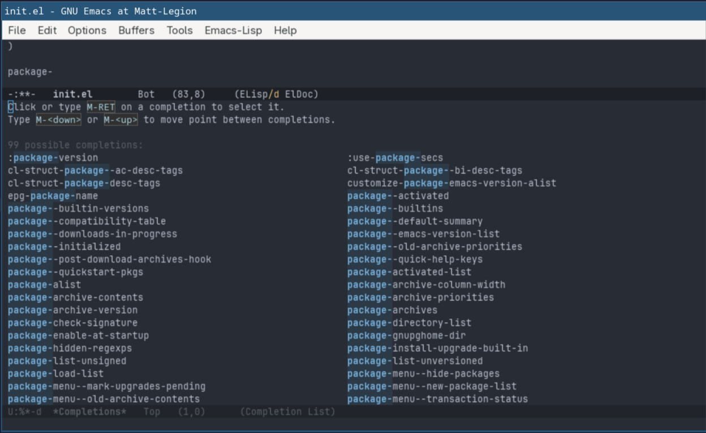
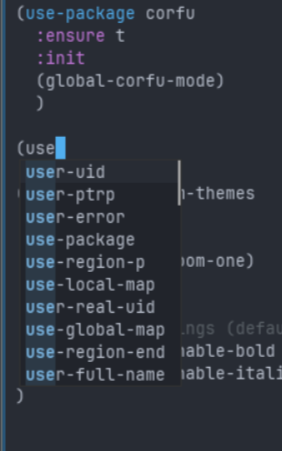
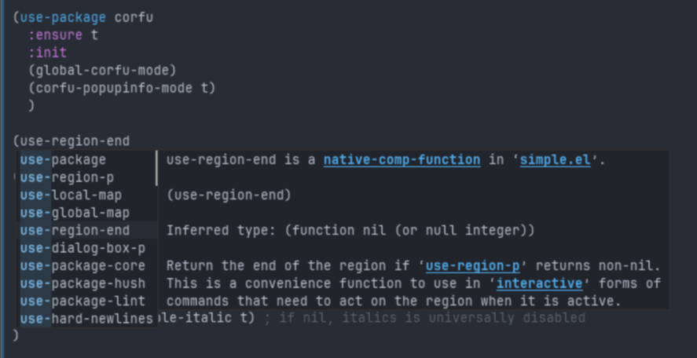
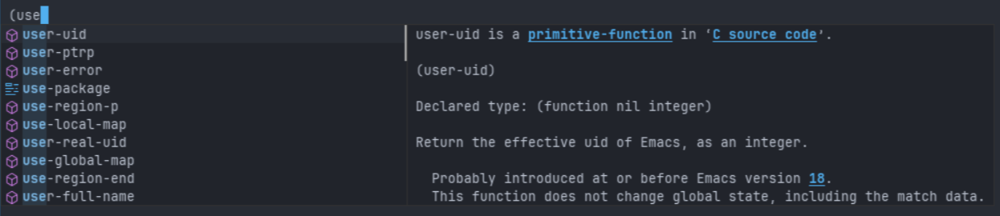

# Code Completion UI

Almost all editors support the ability to display a list of completion options 
that's based on the core area of text you are typing from. Sometimes this is
automatic as you are typing, other times it has to be manually invoked via a
shortcut.

Sometimes this shows as ghost letters and other times it's a full flowing box
with available options to select, documentation, etc... 

In Visual Studio it's called `intellisense` and JetBrains just calls it 
`Code Completion`.

Emacs has a framework to support these in-buffer code completions, and the primary
name I find for it is called `Completion At Point`. It's called this because the
point is what Emacs calls the cursor in the currently active buffer. So this
functionality shows completion options for text where the cursor is on the
current buffer.

It's also sometimes referred to `In Buffer Completions`.

The completion mechanism in Emacs is built with with a separation between
the generation of completion options (the backend) and the display of
those completion options (the frontend). 

Completion backends are managed by the `completion-at-point-functions`, which
contains a list of functions that are invoked one at a time for completion options.
The first function that has a non-nil result is used for the completion UI.

We can experiment with completion in a scratch buffer, or in a buffer
for our `init.el` file. This will let us experiment with elisp code.

# Built-In UI

Bringing up the Emacs completion at point interface for the current buffer
is invoked by executing the `completion-at-point` interactive function. We
can see this in action by typing `(package-` and then invoking the function
with `M-x completion-at-point`.



This shows us the 99 possible completions that are available with the term 
`package-` in it. You can scroll up and down, and select one to activate it. Activating
it will end up updating the text at the cursor with the selection. Like most UIs in
Emacs, it can be closed with `C-g` if none of the options are desired.

Obviously, doing this every time we want a completion to show up is not ideal, but
the `completion-at-point` function is also tied to `M-TAB`. So typing `package-<M-TAB>`
will bring up that same UI.

If there is only one option available, the UI won't show up and it will just complete
to that one option. This can be seen by typing `(use-pa<M-TAB>`, which will complete to
`(use-package`.

Completion can be invoked by just the `TAB` key alone by adding the following to the
`:custom` section of the `use-package emacs` configuration:

```elisp
(tab-always-indent 'complete)
```

This tells Emacs that the first tab should always fix the indentation of the current line.
If the indentation is already at the correct level, then it invokes the `completion-at-point`
function. So in a new line, typing `(use-pa<TAB>` with this option on will activate the 
completion, but typing `<space>(use-pa<TAB>` will fix the indentation level, and pressing `TAB`
a second time is what will invoke the completion.

Another built-in option is `completion-preview-mode`. If you activate this mode via `M-x`,
you will see faded text after your cursor showing a completion option based on what you
have typed so far. So typing `(use` shows `r-uid` as preview text at the cursor. Pressing
`TAB` here will complete the previewed option, while `M-TAB` will bring up the UI to see
other available options.

This works OK, but is not a workflow that's expected from a modern development environment.

## Completion Popup

Most modern IDEs have completion options display as a popup right at the cursor. We can
have the same concept with a package called [corfu](https://github.com/minad/corfu).

We can enable corfu by adding the following to our `init.el`:

```elisp
(use-package corfu
  :ensure t
  :init
  (global-corfu-mode)
  )
```

Save and evaluate the buffer. Now when you start typing a command and press `TAB` you'll
be presented with a popup of available options:



You can use the arrow keys or the standard Emacs `C-n` and `C-p` to cycle through
options. Likewise, using `M-x completion-at-point` will now pop up the Corfu popup
instead of the native completion list.

We can improve the usefulness of this popup by adding `(corfu-popupinfo-mode t)`
to the corfu `:init` section. With this mode enabled, once you use `C-n` or `C-p`
to navigate through the options (without selecting an option), you'll get an additional
popup with info about the selected completion.



Corfu has a lot of customization options which can be specified in the
`:custom` section of the `use-package corfu` declaration. For example, you
can have corfu popu-up automatically appear after a certain number of characters
have been typed, popup minimum and maximum sizes, how long of a delay
before the additional info popup appears, etc...

You can further add some flare if your Emacs or terminal is setup to use
a [Nerd Font](https://www.nerdfonts.com/#home). If so, there is a package
called [nerd-icons-corfu](https://github.com/LuigiPiucco/nerd-icons-corfu) which
adds a formatter that populates the corfu popup with appropriate nerd font icons.

It can be loaded by adding:

```elisp
(use-package nerd-icons-corfu
  :ensure t
  :after (:all corfu))
```

Then adding the following to the `use-package corfu` declaration:

```elisp
  :config
  (add-to-list 'corfu-margin-formatters #'nerd-icons-corfu-formatter)
```

After re-evaluating the buffer we now have some icons on them.



