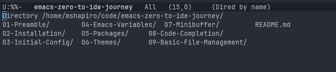
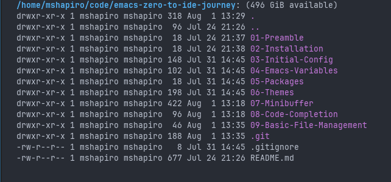
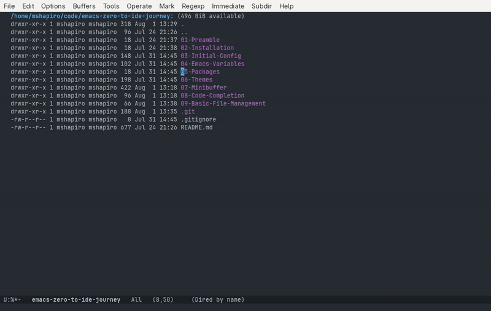
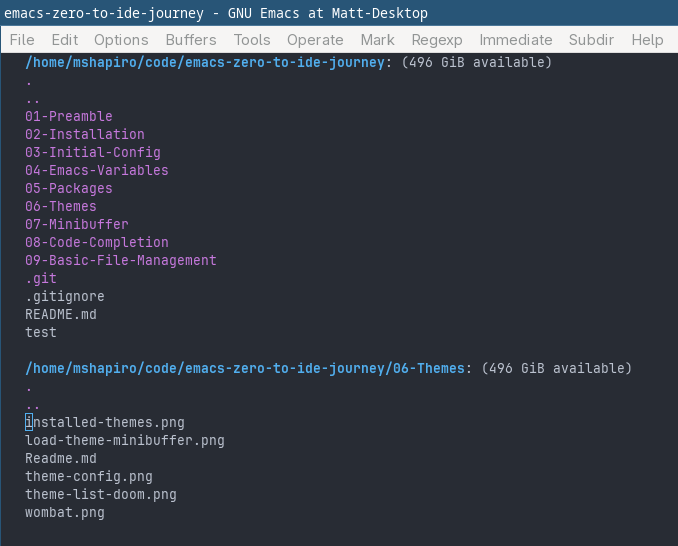
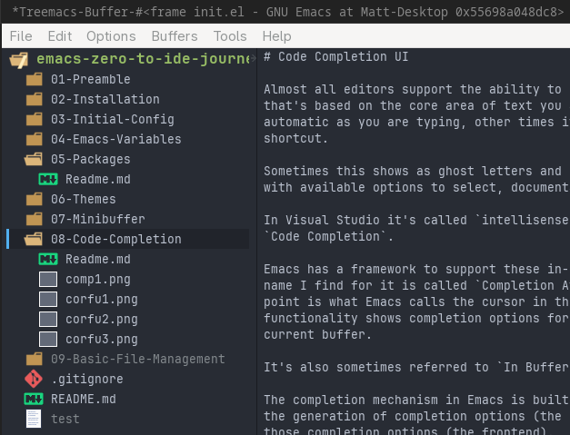
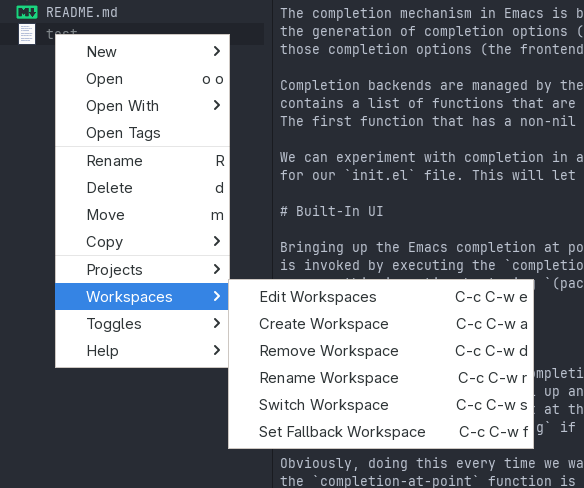

# Basic File Management

<!-- markdown toc start -->
**Table of Contents**

  - [Dired](#dired)
    - [Quick Searching](#quick-searching)
  - [Treemacs](#treemacs)

<!-- markdown toc end -->


So far we've used `C-x C-f` (the `find-file` command) to open our `init.el` file,
but that's not the full extent of file management capabilities that Emacs has.

If you just want a quick listing of files in a directory than `C-x C-d` (the `list-files` command)
can be used. 



This opens a buffer that's not very useful, nor well organized.

## Dired

The better option for managing files and directories that's built into Emacs is
a tool called Dired (Directory Editor). Dired is bound to `C-x d` (no control on the latter `d`), and
opens a minibuffer prompt for you to enter the directory to enter.

Upon selecting a directory then a read only buffer opens up:



At first blush this doesn't seem that better. Yes it's more organized and gives
you some more info, but so what?

Despite this being a read-only buffer, it is still interactive. So for example, you
can move the cursor to a file, press `<Enter>` to open it. You can move the cursor to a
directory and enter it (or `..` to move to the parent).

Since this is a read-only buffer, a lot of characters you would normally type are 
bound to Dired specific actions. For example:
* `n` moves to the next  line even without `Ctrl`
* `p` moves to the previous line (again, even without `Ctrl`)
* `j` allows you to search for a file and move the cursor to that file
* `C` will prompt to copy the selected file or directory into a new file/directory
* `D` will prompt to delete the selected file or directory
* `E` will open the file in the external program. Useful for opening an image 
  or some other file that has dedicated applications for.
* `R` will rename the selected file or directory
* `i` will show the contents of the selected subdirectory at the end of the current buffer.
  * This is very useful to be able to see multiple subdirectories at one time.
  * `C-u k` on the header line will close the subdirectory listing
  * `$` will collapse the subdirectory 
* 'g' will refresh the contents of shown directories.
* `w` will copy the name of the file or directory the cursor is on and copy it to 
  the clipboard (the kill ring in Emacs).
* `+` will create a new subdirectory

One of the advantages of Emacs GUI is being able to view images. In `Dired` you can view images
by navigating to the ones you want to see, marking them with the `m` key, then pressing
`C-t d` to see thumbnails of each selected. Selecting any image thumbnail will open a buffer
with the full size image displayed.



While all actions we've been doing have consumed a buffer sized to the whole screen, we can
take advantage of Emacs buffer and window management capabilities in Dired by opening
the selected file in another window. So putting the cursor on a file and hitting
`C-o` will keep the Dired buffer as the current one, while viewing the file in a second buffer.

This is generally useful because Emacs has shortcuts to move around windows that are not the
active one, such as `C-M-v` to page down in the other winodw, or `C-M-S-v` to page up. This allows
quick skimming and browsing of files without leaving the Dired interface (for example, if you don't
remember which file has the info you are looking for).

(Efficient window management is still an Emacs concept I need to deep dive in at some point).

The [dired section of the Emacs manual](https://www.gnu.org/software/emacs/manual/html_node/emacs/Dired.html)
contains a lot of useful information on how to use and navigate dired. 

Pressing the `(` key toggles the extra details. Most of the detail information is not
information I need day to day, and thus I'd like to have it default to off. Unsurprisingly,
we are able to customize dired in quite a few ways.  

In our `init.el` we can add:

```elisp
(use-package dired
  :ensure nil
  :hook
  (dired-mode . dired-hide-details-mode)
  )
```



Of course, if I ever need these details I can use `(` to toggle them back on.

There are some other configuration options that can be added to the `:config` section
of the `use-package dired` directive (most of which come from 
[this blog post](https://baty.net/posts/2024/09/tweaks-to-my-dired-config-in-emacs/)):

* `(dired-dwim-target t)` - "Do What I Mean", seems to make smarter choices for target actions
* `(dired-recursive-copies 'always)` - don't ask when making copies of directories
* `(dired-create-destination-dirs 'ask)` - Always ask if a rename/copy would require creating
   additional directories that don't yet exist.
* `(dired-clean-confirm-killing-deleted-buffers nil)` - Don't ask whether to kill buffers visiting deleted files
* `(dired-mouse-drag-files t)` - Allows using the mouse to drag files
* `(dired-kill-when-opening-new-dired-buffer t)` - Kill the current buffer when selecting a new directory

It's also possible to customize what external program is used to open different file types via the
`dired-guess-shell-alist-user` configuration variable.  One example from the Emacs kick start is

```elisp
(dired-guess-shell-alist-user
   '(("\\.\\(png\\|jpe?g\\|tiff\\)" "feh" "xdg-open" "open") ;; Open image files with `feh' or the default viewer.
     ("\\.\\(mp[34]\\|m4a\\|ogg\\|flac\\|webm\\|mkv\\)" "mpv" "xdg-open" "open") ;; Open audio and video files with `mpv'.
     (".*" "open" "xdg-open")))                              ;; Default opening command for other files.  (dired-guess-shell-alist-user
```

Finally, for any Mac users I see this in a lot of dired configurations to use GNU ls tool:

```elisp
  (when (eq system-type 'darwin)
    (let ((gls (executable-find "gls")))                     ;; Use GNU ls on macOS if available.
      (when gls
        (setq insert-directory-program gls)))))
```

### Quick Searching

Exploring the file system one file and directory at a time isn't always the most efficient. We can instead
use search capabilities to recursively search for files and open dired instances just for those files.

This is done via `M-x find-name-dired`, which searches recursively in the directory you specify (in the first
argument) for the file name pattern you specify (in the second argument). The file name pattern is what Emacs
will send as the `PATTERN` in a `find DIR -name PATTERN` call.

So lets search for all `Readme.md` files that I have written so far:


This has all the flexibility of the dired interface but with a more precise set of files that I am potentially
looking for.

We can also use the `M-x find-grep-dired` to do the same but with a grep command. This is not as useful as I
hoped, as the dired buffer starts to show it's limitations. Ideally it would not only show a list of but also
grep snippets from each file that I can use to narrow the search a bit more.

## Treemacs

So Dired is pretty flexible and powerful. In fact I should definitely get more experience with it
as I have probably just skimmed the surface of what it's capable of.

At the same time, there are some distinct differences of how dired works vs how modern IDEs expose
the file system. Most IDEs expose the file system in a tree like structure that lives in a window
usually docked to the left or right side of the workspace. They tend to have icons and color schemes
that make it easy to visually scan for the file you are looking for.

One package I have found mentioned a lot is [treemacs](https://github.com/Alexander-Miller/treemacs).

Lets install it by adding the following to our `init.el`:

```elisp
(use-package treemacs
  :ensure t
  :defer t
  :bind
  (:map global-map
        ("M-0"       . treemacs-select-window)
        ("C-x t 1"   . treemacs-delete-other-windows)
        ("C-x t t"   . treemacs)
        ("C-x t d"   . treemacs-select-directory)
        ("C-x t B"   . treemacs-bookmark)
        ("C-x t C-t" . treemacs-find-file)
        ("C-x t M-t" . treemacs-find-tag))
  )
```

After saving and re-evaluating the buffer, we can bring up the Treemacs interface with 
`C-x t t`. The first time this is run a minibuffer comes up asking for the default root
directory for Treemacs to start in. After picking one the Treemacs window appears:



Not only can you navigate the tree with standard Emacs dired keys (`n` and `p`),
you can also use the mouse and right click on items to get a variety of actions 
that can be performed on specific files:



While many vim and Emacs users swear by keyboard-only navigation, this is a huge
boon for me, as it provides discoverability for features I may not interact much.

For example, this exposed me to the concept of Treemacs workspaces, which allows
me to map different directory roots I have on my system and being able to quickly
switch between them without typing absolute paths. This is something I will
definitely be digging into later.

Some keys in the Treemacs buffer have their own prefixes, namely `o` and `c`.

The `o` prefix allows a variety of ways to open files, you can
* Open it directly in the main window via `o o`
* Open it in a new window that's horizontally split from the current window with `o h`
* Open it in a new window that's vertically split from the current window with `o v`.

That seems to give a lot more flexibility than dired has, but that may mostly be
due to discoverability with the right click menu.

Likewise, the `c` prefix can be used to add files and directories to the currently
selected file.

All in all, I am very happy with the UI treemacs provides.

I have also added the following to my `init.el`:

```elisp
(use-package treemacs-icons-dired
  :ensure t
  :hook (dired-mode . treemacs-icons-dired-enable-once)
  )
```

This adds Treemacs icons to the dired interface. Treemacs has a different purpose
for me than dired, and I can see both will being used in normal Emacs life.

## Addendum

While I initially liked Treemacs, the more I use Emacs the more I find that 90%
of my use cases are better solved with `project-find-file` (the project
oriented `C-x C-f`) due to it allowing quick searches by file name (I'll get into
what projects are in a later post). 

Even using`dired` sometimes ends up being more convienient for general browsing, 
that I find myself sometimes reaching for it instead of `treemacs`.

Treemacs comes in handy in some cases, but for me the biggest day-to-day boon I 
got from installing it was its icon pack for `dired`. In fact, most of the time
I completely forget treemacs is even installed and active.

