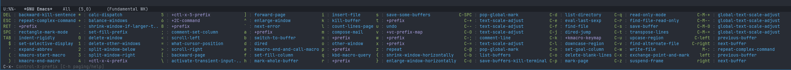

# Which Key

One issue I keep running into is remembering key combinations, not only which prefix
I should be using, but what key follows the prefix. It will take some practice before
I have a lot of the key combinations down.

Until then, it turns out there's a mode in Emacs that can help, called `which-key-mode`.

Enabling this with `M-x which-key-mode`, and then typing a prefix such as `C-x` will
pop-up a window at the bottom of the sceen with options for follow up commands.



This is helps fix one of my frustrations with Emacs so far, which is not realizing
when I have a prefix already activated. For example, if I accidentally hit `C-c`
and then went to do `C-x C-f` to find a file, this will fail because `C-c C-x C-f`
is undefined.

This would especially be frustrating with the `ESC` or `C-[` keys, which I accidentally hit
more often than I should due to Vi habits.

Now with `which-key` activated, if I'm in a prefix mode and waiting for subsequent key presses
it's obvious because the `which-key` window will (usually) pop up.

This isn't always the case though, as if a prefix isn't defined (like `C-c`) then nothing
will pop-up.  It's a start though.

We can make sure `which-key-mode` is enabled by adding the following to our
`use-package emacs` directive's `:hook` section:

```elisp
(after-init . which-key-mode)
```