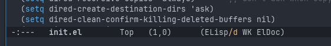
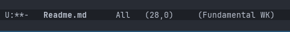

# Markdown Support

<!-- markdown toc start -->
**Table of Contents**

  - [Intro](#intro)
  - [Adding A Markdown Major Mode](#adding-a-markdown-major-mode)
  - [Generating Table Of Contents](#generating-table-of-contents)

<!-- markdown toc end -->

## Intro

So far I have been writing these posts as plain text files and validating
they render as expected outside of Emacs. It's time to fix that.

The bottom bar in Emacs is called the `mode line`. This contains all different
types of information relevant to the current/active buffer.

So for example, I see the following when looking at my `init.el` file:



There is a section on the mode line that's in parenthesis, these are the modes that
are active in the buffer. A mode is a set of functionality that defines the editing
behavior of the buffer while that buffer is the current one. Each buffer can have
one major mode and additional minor modes to enhance the capabilities.

The screenshot above shows that I am in the `Elisp` major mode, with a `WK` (which-key)
and `Eldoc` minor modes. The `Elisp` major mode is what gives us syntax highlighting,
completion-at-point support, etc...

If we go to the markdown file I am currently writing, we see:



We can see this shows the `Fundamental` major mode and the `WK` minor mode. The 
`Fundamental` mode is the most basic text editing major mode that Emacs has.

## Adding A Markdown Major Mode

In order to make Emacs more functional for writing markdown, we need to enable a markdown
specific major mode. Unfortunatly, as of Emacs 30 (the current released version) there is
nothing built in. Emacs 31 will have a native markdown mode, but that is only in very
early preview.

So we need to reach out to third party packages. The two main packages are:

1. [markdown-mode](https://jblevins.org/projects/markdown-mode/)
2. [markdown-ts-mode](https://github.com/LionyxML/markdown-ts-mode)

`markdown-ts-mode` is what was enhanced and merged into Emacs 31. So at first it seems
like I should use that one. However from a quick glance it appears slightly less
feature-full, less documented, and requires third party tree-sitter support. I will need
tree-sitter, but I will have to dedicate some time to properly tackle that.

that's released. It will be easy to switch once that occurs.

To activate `markdown-mode`, I just had to add the following to my to my `init.el`:

```elisp
(use-package markdown-mode
  :ensure t
  :mode ("README\\.md\\'" . gfm-mode)
  :init (setq markdown-command "multimarkdown")
  :bind (:map markdown-mode-map
         ("C-c C-e" . markdown-do)))
```

And now I have highlighting that makes it easy to scan my document. More importantly,
I can now use `C-c C-x C-i` to toggle inline images, and now can see the images while
editing.

There are a lot of options and commands available in this mode, and maybe I will explore
them a bit more in due time. I can explore a lot of different options using `C-c` and
letting `which-key` pop up available options. 

## Generating Table Of Contents

We can add a package called `markdown-toc` in order to automatically generate and refresh
table of contents:

```elisp
(use-package markdown-toc
  :ensure t
  )
```

Now we can place the cursor where we want the TOC generated and use
`M-x generate-toc-generate-or-refresh-toc` and viola!.

For a variety of reasons many Markdown guidelines usually only have one level 1 heading 
per page, and that usually includes the title of the page. It usually is not helpful
to have the level 1 heading in the table of contents, since it's at the top of the page
anyway.

We can customize the TOC generation in the following way:

```elisp
(defun my/markdown-toc-manip (toc-structure)
  ;; Don't include level 1 headings
  (-filter (lambda (l) (let ((index (car l))) (<= 1 index))) toc-structure)
  )

(use-package markdown-toc
  :ensure t
  :custom
  (markdown-toc-user-toc-structure-manipulation-fn 'my/markdown-toc-manip)
  (markdown-toc-header-toc-start "<!-- markdown toc start -->")
  (markdown-toc-header-toc-end "<!-- markdown toc end -->")
  )
```

This makes it so that only level 2 headings and above will be listed. It also customizes
the start and end tags to not have Emacs specific settings in it.
