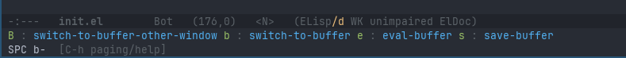

# Keybinds, Chords, and Modality

As someone who has always installed Vim emulation in every editor I have tried to use
(and refuse to use ones that don't support it)  it's time to tackle the elephant in the
room: should I stick with Emacs bindings and non-modal editing, set up a Vim emulation layer.

## Initial Opinion Of Emacs Defaults

Everyone has strong opinions about keybindings and text editing styles. That is even less
surprising in the Vim and Emacs world as a reason for adoption is customizing each to
their own likings. 

Everyone will claim that their preferences are the most productive way ever and be confused
when other people just don't get it. 

The reality is that almost all editors default to the way Emacs does editing. It is a (mostly) non-modal
editor, which means it only has one editing mode where each characer press equals an character
being inserted into the text area. If you wnat extra functionality you have to use a hotkey,
usually involving a modifier key.

As much as I have loved Vi's modal editing system from the the last decade I have used it, the 
reality of the situation is that I have had several decades prior that I was fine with non-modal editing in my
text editors and IDEs. 

I have spent the last few weeks tinkering and learning Emacs, trying to learn the Emacs
way, This way if I end up using a VI emulation layer than it's not just because I am afraid of change. At
some point I had to dive in and learn how to get good with Vi bindings in the same way.

My conclusion is a bit nuanced. 

I actually don't mind the default Emacs experience, except for all the chording (having to constantly
hold control, meta, and/or shift to perform an action). For the most part I can see the logic around
the categories of the default keybinds.

I did change my Linux and Mac configurations to have Caps Lock mapped to control and that certainly helped
but didn't totally solve the issue. Holding my pinky off to the side and using my middle finger down to 
hit `C-x` is just not natural for me. Then trying to do `C-x C-s` to save my current buffer requires significant thinking. 

There are also a lot of key bindings in Emacs, and that means you can't have every action be a single `C-` action.
Thus you end up with some significant chains where you have to keep thinking about whether the next character
requires a modifier key or not. For example, `C-x C-f` is completely different functionality than `C-x f`, and the
latter is easy to do accidentally by being on autopilot and removing your pinky too much.

I also just feel like `Ctrl` as a modifier is hard and awkward to hold with other keys on my keyboards. A
lot of advice seems to revolve around getting a better split ergonomic keyboard, and I can see getting one
could help. However I am not always at my desk and frequently use my laptops as a laptop, and in those cases
I do not have a say in what the keyboard layout is. Even with Caps Lock as Control, I end up accidentally
hitting shift at times instead of Control.

The other frustration I have with the Emacs defaults is the constant switching between Control and Meta.
For example, navigating forward by a two words then back by two characters involves `M-f M-f C-b C-b`.
The mental switching between when I need to hit Meta vs Control for quick navigating is something I am
finding difficult, especially since it's more ergonomic for me to do control via my left pinky but alt
via my right thumb. 

I'm sure I can works towards getting comfortable with these, but I also feel like I should consider
alternative options.

## What Options Are There?

From what I can tell there are 5 main options for me to get comfortable with Emacs

1. Use the VI emulation layer
2. Use Meow for modal editing
3. Use the God Mode package
4. Use OS sticky keys so I can use chorded hotkeys without holding them down
5. Just keep at vanilla experience until I get better at it

### Emacs VI Layer (aka evil)

As part of my research for editing modes, I had come across two points that came up in a variety
of places about the evil package

1. Evil mode is extremely heavy and can add latency/slowness to working in Emacs
2. Evil interacts on a per mode basis, and thus needs to be customized for different
   use cases (e.g. text editing vs dired vs magit).
3. Vi keybinds sometime utilize some Emacs prefixes, making them unavailable for Emacs (or vice versa)
4. Vi bindings completely change non-editing modes in Emacs, making it confusing to figure out
   what the correct analog is for usage with evil mode.
   
Luckily, testing configuration options in Emacs is simple so there's no harm in seeing it first hand.
Adding it with the default configuration is just a matter of:

```elisp
(use-package evil
  :ensure t
  :init
  (evil-mode 1)
  )
```

Evaluating the buffer immediately adds a `<N>` to my mode line, indicating I am in the vi normal state
(Emacs uses the term modes for major/minor modes, so the emulation layer uses the term states for vi 
modes to disambiguate them).

Pressing `i` successfully goes into insert state, `ESC` or `C-[` bring me back out. Navigation works
as expected except for `C-u` to go a half page up (even though `C-d` does work). It seems like this is
due to point #3 above, since `C-u` is left for normal Emacs behavior (do something 4 times). This can
be changed by adding `(evil-want-C-u-scroll t)` to evil's `:custom` section.

This works, but I quickly came up to another issue. Using `u`, then `C-r` to redo fails, telling me to
customize `evil-undo-system` variable to enable. Adding `(evil-set-undo-system 'undo-redo)` to the
`:config`section seems to enable it.

Playing around with some areas it seems to be working ok. `hjkl` movement in `Dired` and `Treemacs`
seems to just work, which is surprising since the Treemacs documentation explicitely said I needed
a `treemacs-evil` package for it.

One nice thing is that if I am in normal state I can type `:` and access the same interactive functions 
I'd use `M-x` for normally. I don't get all the completing-read options we set up earlier (and I can't 
fuzzy search) but hitting tab does pop up the completion at point popup UI.

I don't get vi bindings in my minibuffer, but apparently I can add the `evil-collection` package to get
that. I was hoping it would allow `hjkl` movement between completing-read options, but that was not the
case and only really let me traverse the minibuffer horizontally. 

One of the main reasons I like vi bindings and think that they would beneficial is the leader key
system. Leader keys are essentially what Emacs calls prefixes, but using the `SPACE` key as a leader
key is common. This allows you to build a mnemonic tree of quickly accessible actions based on mnemonic
mappings. So for example, I added the following to my `:config` section for `use-package evil`:

```elisp
  (setq evil-leader/in-all-states t)
  (evil-set-leader 'normal (kbd "SPC"))
  (evil-set-leader 'visual (kbd "SPC"))
  (evil-define-key 'normal 'global (kbd "<leader> o d") 'dired)
  (evil-define-key 'normal 'global (kbd "<leader> o f") 'find-file)
  (evil-define-key 'normal 'global (kbd "<leader> b s") 'save-buffer)
  (evil-define-key 'normal 'global (kbd "<leader> b b") 'switch-to-buffer)
  (evil-define-key 'normal 'global (kbd "<leader> b B") 'switch-to-buffer-other-window)
  (evil-define-key 'normal 'global (kbd "<leader> b e") 'eval-buffer)

  (evil-define-key 'normal 'global (kbd "<leader> w o") 'other-window)

  (evil-define-key 'normal 'global (kbd "] b") 'switch-to-next-buffer)
  (evil-define-key 'normal 'global (kbd "[ b") 'switch-to-prev-buffer)
```

This allows me to `<SPC> o f` to open a file, I can then `<SPC> b o` to switch to a buffer in another window,
etc... 

Which-key is automatically knowledgeable on these command trees, so `<SPC> b` gives me a display of all
my buffer commands.



You can also define key maps that are only active in specific mode contexts. For example, to enable
markdown specific options when the markdown mode's keymap is active, I can do:

```elips
(evil-define-key 'normal markdown-mode-map (kbd "<leader> m i") 'markdown-toggle-inline-images)
(evil-define-key 'normal markdown-mode-map (kbd "<leader> m t") 'markdown-toc-generate-or-refresh-toc)
```

While I can tell I already have a significant amount of key defining in my future, so far I am happy
with it in my ~1 hour of exploration. I will have to decide if I want my leader trees to mimic
the standard Emacs style combinations or use logical groupings that I can remember easier (e.g. `<SPC> x b`
vs `<SPC> b b` for switching buffers (since Emacs default is `C-x b`).

I have not noticed any performance degredations and we'll see how happy I am as I get to 
more complex Emacs use cases.

That being said, after trying standard Emacs keymaps for the past week or so, it does not necessarily
feel like a definite win.

### Meow

[Meow](https://github.com/meow-edit/meow) is a modal editing setup for Emacs which tries to
minimize how many keys it requires to keep the number of conflicts down. It claims to be fast,
and utilizes the leader key concept to remove the need for modifier keys.

It changes the motion concepts from Vi in that Vi is `verb -> motion` instead of `selection -> verb`. So
for example, instead of `dw` to delete the next word. The idea is that unlike in vi, you can see
what items you are going to operate on before you do so, and thus are less surprised. This seems
inspired by concepts from the [Kakoune editor](https://kakoune.org/) and the 
[Helix editor](https://helix-editor.com/).

I suspect the supposed speed and compatibility comes from the `selection -> verb` maps more simply to
the Emacs system and does not require buffering of past verbs while it waits for the motion.

By default, meow has no keybinds (since the key binds will differ based on keyboard layout). So we
need to set up the layout for QWERTY keyboards and install the package via 

```elisp
(defun meow-setup ()
  (setq meow-cheatsheet-layout meow-cheatsheet-layout-qwerty)
  (meow-motion-define-key
   '("j" . meow-next)
   '("k" . meow-prev)
   '("<escape>" . ignore))
  (meow-leader-define-key
   ;; Use SPC (0-9) for digit arguments.
   '("1" . meow-digit-argument)
   '("2" . meow-digit-argument)
   '("3" . meow-digit-argument)
   '("4" . meow-digit-argument)
   '("5" . meow-digit-argument)
   '("6" . meow-digit-argument)
   '("7" . meow-digit-argument)
   '("8" . meow-digit-argument)
   '("9" . meow-digit-argument)
   '("0" . meow-digit-argument)
   '("/" . meow-keypad-describe-key)
   '("?" . meow-cheatsheet))
  (meow-normal-define-key
   '("0" . meow-expand-0)
   '("9" . meow-expand-9)
   '("8" . meow-expand-8)
   '("7" . meow-expand-7)
   '("6" . meow-expand-6)
   '("5" . meow-expand-5)
   '("4" . meow-expand-4)
   '("3" . meow-expand-3)
   '("2" . meow-expand-2)
   '("1" . meow-expand-1)
   '("-" . negative-argument)
   '(";" . meow-reverse)
   '("," . meow-inner-of-thing)
   '("." . meow-bounds-of-thing)
   '("[" . meow-beginning-of-thing)
   '("]" . meow-end-of-thing)
   '("a" . meow-append)
   '("A" . meow-open-below)
   '("b" . meow-back-word)
   '("B" . meow-back-symbol)
   '("c" . meow-change)
   '("d" . meow-delete)
   '("D" . meow-backward-delete)
   '("e" . meow-next-word)
   '("E" . meow-next-symbol)
   '("f" . meow-find)
   '("g" . meow-cancel-selection)
   '("G" . meow-grab)
   '("h" . meow-left)
   '("H" . meow-left-expand)
   '("i" . meow-insert)
   '("I" . meow-open-above)
   '("j" . meow-next)
   '("J" . meow-next-expand)
   '("k" . meow-prev)
   '("K" . meow-prev-expand)
   '("l" . meow-right)
   '("L" . meow-right-expand)
   '("m" . meow-join)
   '("n" . meow-search)
   '("o" . meow-block)
   '("O" . meow-to-block)
   '("p" . meow-yank)
   '("q" . meow-quit)
   '("Q" . meow-goto-line)
   '("r" . meow-replace)
   '("R" . meow-swap-grab)
   '("S" . meow-kill)
   '("t" . meow-till)
   '("u" . meow-undo)
   '("U" . meow-undo-in-selection)
   '("v" . meow-visit)
   '("w" . meow-mark-word)
   '("W" . meow-mark-symbol)
   '("x" . meow-line)
   '("X" . meow-goto-line)
   '("y" . meow-save)
   '("Y" . meow-sync-grab)
   '("z" . meow-pop-selection)
   '("'" . repeat)
   '("<escape>" . ignore)))

(use-package meow
  :ensure t
  :config
  (meow-setup)
  (meow-global-mode 1))
```

Once this is evaluated, meow is up and runnng. Learning meow is best done by running `M-x meow-tutor`.

After going through the tutor I am surprised how intuitive and powerful it is. There are
a lot of little differences from the vi model that is really compelling to me.

For example, moving multiple words and lines in fewer keystrokes because of the numerics you can use to
advance. For example `e3` goes to the end of the 3rd word, but then typing `2` goes 2 more
additional words.

The keypad mode it has effectively turns the existing Emacs bindings into leader based commands with
the space bar as the leader key. So `SPC x f` is the same as `C-x C-f`.  `SPC m x` is the same as
`M-x`.  `SPC x SPC f` is the same as `C-x f`.

This is an interesting compromise, because it keeps me concious of Emacs bindings while allowing me
to not have to hold down modifier keys.

Overall, I am really happy with what I've seen of Meow so far.


