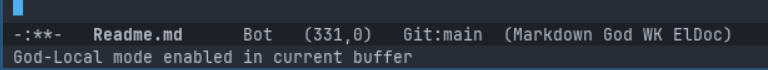
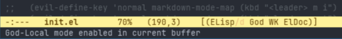
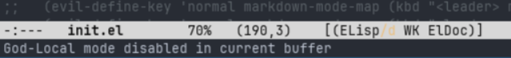

# Keybinds, Chords, and Modality

<!-- markdown toc start -->
**Table of Contents**

  - [Initial Opinion Of Emacs Defaults](#initial-opinion-of-emacs-defaults)
  - [What Options Are There?](#what-options-are-there)
    - [Emacs VI Layer (aka evil)](#emacs-vi-layer-aka-evil)
    - [Meow](#meow)
    - [God Mode](#god-mode)
    - [Sticky Keys](#sticky-keys)
  - [End Result](#end-result)
  - [Addendum](#addendum)

<!-- markdown toc end -->

As someone who has always installed Vim emulation in every editor I have tried to use
(and refuse to use ones that don't support it)  it's time to tackle the elephant in the
room: should I stick with Emacs bindings and non-modal editing, set up a Vim emulation layer.

## Initial Opinion Of Emacs Defaults

Everyone has strong opinions about keybindings and text editing styles. That is even less
surprising in the Vim and Emacs world as a reason for adoption is customizing each to
their own likings. 

Everyone will claim that their preferences are the most productive way ever and be confused
when other people just don't get it. 

The reality is that almost all editors default to the way Emacs does editing. It is a (mostly) non-modal
editor, which means it only has one editing mode where each characer press equals an character
being inserted into the text area. If you wnat extra functionality you have to use a hotkey,
usually involving a modifier key.

As much as I have loved Vi's modal editing system from the the last decade I have used it, the 
reality of the situation is that I have had several decades prior that I was fine with non-modal editing in my
text editors and IDEs. 

I have spent the last few weeks tinkering and learning Emacs, trying to learn the Emacs
way, This way if I end up using a VI emulation layer than it's not just because I am afraid of change. At
some point I had to dive in and learn how to get good with Vi bindings in the same way.

My conclusion is a bit nuanced. 

I actually don't mind the default Emacs experience, except for all the chording (having to constantly
hold control, meta, and/or shift to perform an action). For the most part I can see the logic around
the categories of the default keybinds.

I did change my Linux and Mac configurations to have Caps Lock mapped to control and that certainly helped
but didn't totally solve the issue. Holding my pinky off to the side and using my middle finger down to 
hit `C-x` is just not natural for me. Then trying to do `C-x C-s` to save my current buffer requires significant thinking. 

There are also a lot of key bindings in Emacs, and that means you can't have every action be a single `C-` action.
Thus you end up with some significant chains where you have to keep thinking about whether the next character
requires a modifier key or not. For example, `C-x C-f` is completely different functionality than `C-x f`, and the
latter is easy to do accidentally by being on autopilot and removing your pinky too much.

I also just feel like `Ctrl` as a modifier is hard and awkward to hold with other keys on my keyboards. A
lot of advice seems to revolve around getting a better split ergonomic keyboard, and I can see getting one
could help. However I am not always at my desk and frequently use my laptops as a laptop, and in those cases
I do not have a say in what the keyboard layout is. Even with Caps Lock as Control, I end up accidentally
hitting shift at times instead of Control.

The other frustration I have with the Emacs defaults is the constant switching between Control and Meta.
For example, navigating forward by a two words then back by two characters involves `M-f M-f C-b C-b`.
The mental switching between when I need to hit Meta vs Control for quick navigating is something I am
finding difficult, especially since it's more ergonomic for me to do control via my left pinky but alt
via my right thumb. 

I'm sure I can works towards getting comfortable with these, but I also feel like I should consider
alternative options.

## What Options Are There?

From what I can tell there are 5 main options for me to get comfortable with Emacs

1. Use the VI emulation layer
2. Use Meow for modal editing
3. Use the God Mode package
4. Use OS sticky keys so I can use chorded hotkeys without holding them down
5. Just keep at vanilla experience until I get better at it

### Emacs VI Layer (aka evil)

As part of my research for editing modes, I had come across two points that came up in a variety
of places about the evil package

1. Evil mode is extremely heavy and can add latency/slowness to working in Emacs
2. Evil interacts on a per mode basis, and thus needs to be customized for different
   use cases (e.g. text editing vs dired vs magit).
3. Vi keybinds sometime utilize some Emacs prefixes, making them unavailable for Emacs (or vice versa)
4. Vi bindings completely change non-editing modes in Emacs, making it confusing to figure out
   what the correct analog is for usage with evil mode.
   
Luckily, testing configuration options in Emacs is simple so there's no harm in seeing it first hand.
Adding it with the default configuration is just a matter of:

```elisp
(use-package evil
  :ensure t
  :init
  (evil-mode 1)
  )
```

Evaluating the buffer immediately adds a `<N>` to my mode line, indicating I am in the vi normal state
(Emacs uses the term modes for major/minor modes, so the emulation layer uses the term states for vi 
modes to disambiguate them).

Pressing `i` successfully goes into insert state, `ESC` or `C-[` bring me back out. Navigation works
as expected except for `C-u` to go a half page up (even though `C-d` does work). It seems like this is
due to point #3 above, since `C-u` is left for normal Emacs behavior (do something 4 times). This can
be changed by adding `(evil-want-C-u-scroll t)` to evil's `:custom` section.

This works, but I quickly came up to another issue. Using `u`, then `C-r` to redo fails, telling me to
customize `evil-undo-system` variable to enable. Adding `(evil-set-undo-system 'undo-redo)` to the
`:config`section seems to enable it.

Playing around with some areas it seems to be working ok. `hjkl` movement in `Dired` and `Treemacs`
seems to just work, which is surprising since the Treemacs documentation explicitely said I needed
a `treemacs-evil` package for it.

One nice thing is that if I am in normal state I can type `:` and access the same interactive functions 
I'd use `M-x` for normally. I don't get all the completing-read options we set up earlier (and I can't 
fuzzy search) but hitting tab does pop up the completion at point popup UI.

I don't get vi bindings in my minibuffer, but apparently I can add the `evil-collection` package to get
that. I was hoping it would allow `hjkl` movement between completing-read options, but that was not the
case and only really let me traverse the minibuffer horizontally. 

One of the main reasons I like vi bindings and think that they would beneficial is the leader key
system. Leader keys are essentially what Emacs calls prefixes, but using the `SPACE` key as a leader
key is common. This allows you to build a mnemonic tree of quickly accessible actions based on mnemonic
mappings. So for example, I added the following to my `:config` section for `use-package evil`:

```elisp
  (setq evil-leader/in-all-states t)
  (evil-set-leader 'normal (kbd "SPC"))
  (evil-set-leader 'visual (kbd "SPC"))
  (evil-define-key 'normal 'global (kbd "<leader> o d") 'dired)
  (evil-define-key 'normal 'global (kbd "<leader> o f") 'find-file)
  (evil-define-key 'normal 'global (kbd "<leader> b s") 'save-buffer)
  (evil-define-key 'normal 'global (kbd "<leader> b b") 'switch-to-buffer)
  (evil-define-key 'normal 'global (kbd "<leader> b B") 'switch-to-buffer-other-window)
  (evil-define-key 'normal 'global (kbd "<leader> b e") 'eval-buffer)

  (evil-define-key 'normal 'global (kbd "<leader> w o") 'other-window)

  (evil-define-key 'normal 'global (kbd "] b") 'switch-to-next-buffer)
  (evil-define-key 'normal 'global (kbd "[ b") 'switch-to-prev-buffer)
```

This allows me to `<SPC> o f` to open a file, I can then `<SPC> b o` to switch to a buffer in another window,
etc... 

Which-key is automatically knowledgeable on these command trees, so `<SPC> b` gives me a display of all
my buffer commands.


You can also define key maps that are only active in specific mode contexts. For example, to enable
markdown specific options when the markdown mode's keymap is active, I can do:

```elips
(evil-define-key 'normal markdown-mode-map (kbd "<leader> m i") 'markdown-toggle-inline-images)
(evil-define-key 'normal markdown-mode-map (kbd "<leader> m t") 'markdown-toc-generate-or-refresh-toc)
```

While I can tell I already have a significant amount of key defining in my future, so far I am happy
with it in my ~1 hour of exploration. I will have to decide if I want my leader trees to mimic
the standard Emacs style combinations or use logical groupings that I can remember easier (e.g. `<SPC> x b`
vs `<SPC> b b` for switching buffers (since Emacs default is `C-x b`).

I have not noticed any performance degredations and we'll see how happy I am as I get to 
more complex Emacs use cases.

That being said, after trying standard Emacs keymaps for the past week or so, it does not necessarily
feel like a definite win. As I'm paying active attention to my hand in this process I am realizing
that I am still using modifier keys more than I realized when running in Vi modes.

### Meow

[Meow](https://github.com/meow-edit/meow) is a modal editing setup for Emacs which tries to
minimize how many keys it requires to keep the number of conflicts down. It claims to be fast,
and utilizes the leader key concept to remove the need for modifier keys.

It changes the motion concepts from Vi in that Vi is `verb -> motion` instead of `selection -> verb`. So
for example, instead of `dw` to delete the next word. The idea is that unlike in vi, you can see
what items you are going to operate on before you do so, and thus are less surprised. This seems
inspired by concepts from the [Kakoune editor](https://kakoune.org/) and the 
[Helix editor](https://helix-editor.com/).

I suspect the supposed speed and compatibility comes from the `selection -> verb` maps more simply to
the Emacs system and does not require buffering of past verbs while it waits for the motion.

By default, meow has no keybinds (since the key binds will differ based on keyboard layout). So we
need to set up the layout for QWERTY keyboards and install the package via 

```elisp
(defun meow-setup ()
  (setq meow-cheatsheet-layout meow-cheatsheet-layout-qwerty)
  (meow-motion-define-key
   '("j" . meow-next)
   '("k" . meow-prev)
   '("<escape>" . ignore))
  (meow-leader-define-key
   ;; Use SPC (0-9) for digit arguments.
   '("1" . meow-digit-argument)
   '("2" . meow-digit-argument)
   '("3" . meow-digit-argument)
   '("4" . meow-digit-argument)
   '("5" . meow-digit-argument)
   '("6" . meow-digit-argument)
   '("7" . meow-digit-argument)
   '("8" . meow-digit-argument)
   '("9" . meow-digit-argument)
   '("0" . meow-digit-argument)
   '("/" . meow-keypad-describe-key)
   '("?" . meow-cheatsheet))
  (meow-normal-define-key
   '("0" . meow-expand-0)
   '("9" . meow-expand-9)
   '("8" . meow-expand-8)
   '("7" . meow-expand-7)
   '("6" . meow-expand-6)
   '("5" . meow-expand-5)
   '("4" . meow-expand-4)
   '("3" . meow-expand-3)
   '("2" . meow-expand-2)
   '("1" . meow-expand-1)
   '("-" . negative-argument)
   '(";" . meow-reverse)
   '("," . meow-inner-of-thing)
   '("." . meow-bounds-of-thing)
   '("[" . meow-beginning-of-thing)
   '("]" . meow-end-of-thing)
   '("a" . meow-append)
   '("A" . meow-open-below)
   '("b" . meow-back-word)
   '("B" . meow-back-symbol)
   '("c" . meow-change)
   '("d" . meow-delete)
   '("D" . meow-backward-delete)
   '("e" . meow-next-word)
   '("E" . meow-next-symbol)
   '("f" . meow-find)
   '("g" . meow-cancel-selection)
   '("G" . meow-grab)
   '("h" . meow-left)
   '("H" . meow-left-expand)
   '("i" . meow-insert)
   '("I" . meow-open-above)
   '("j" . meow-next)
   '("J" . meow-next-expand)
   '("k" . meow-prev)
   '("K" . meow-prev-expand)
   '("l" . meow-right)
   '("L" . meow-right-expand)
   '("m" . meow-join)
   '("n" . meow-search)
   '("o" . meow-block)
   '("O" . meow-to-block)
   '("p" . meow-yank)
   '("q" . meow-quit)
   '("Q" . meow-goto-line)
   '("r" . meow-replace)
   '("R" . meow-swap-grab)
   '("S" . meow-kill)
   '("t" . meow-till)
   '("u" . meow-undo)
   '("U" . meow-undo-in-selection)
   '("v" . meow-visit)
   '("w" . meow-mark-word)
   '("W" . meow-mark-symbol)
   '("x" . meow-line)
   '("X" . meow-goto-line)
   '("y" . meow-save)
   '("Y" . meow-sync-grab)
   '("z" . meow-pop-selection)
   '("'" . repeat)
   '("<escape>" . ignore)))

(use-package meow
  :ensure t
  :config
  (meow-setup)
  (meow-global-mode 1))
```

Once this is evaluated, meow is up and runnng. Learning meow is best done by running `M-x meow-tutor`.

After going through the tutor I am surprised how intuitive and powerful it is. There are
a lot of little differences from the vi model that is really compelling to me.

For example, moving multiple words and lines in fewer keystrokes because of the numerics you can use to
advance. For example `e3` goes to the end of the 3rd word, but then typing `2` goes 2 more
additional words.

The keypad mode it has effectively turns the existing Emacs bindings into leader based commands with
the space bar as the leader key. So `SPC x f` is the same as `C-x C-f`.  `SPC m x` is the same as
`M-x`.  `SPC x SPC f` is the same as `C-x f`.

This is an interesting compromise, because it keeps me concious of Emacs bindings while allowing me
to not have to hold down modifier keys.

Overall I am really happy with what I've seen of Meow so far.

Unfortunately, the core concepts are just different enough from vi to make it require work to get used
to. Since I do not yet have Emacs working enough as an IDE to be productive, I still need normal
development environments for my day job. While some IDEs have a "Helix" mode, there seems to be
differences between them and Moew to make it not trivial.

So I might investigate Meow more when I'm using Emacs full tiem in personal and work contexts, but it
does not make sense while I am taking my time to explore and getting familiar with Emacs.

### God Mode

[God mode](https://github.com/emacsorphanage/god-mode) is a package that adds modal editing
capabilities that focuses less on text/cursor movement and selection, and more on using the
command mode to simplify executing Emacs commands that usually require modifier keys to be held.

Meow's keypad mode is based on the God Mode and uses the same key mappings.

* `x` -> `C-x`
* `x s` -> `C-x C-s`
* `x SPC s` -> `C-x s`
* `x SPC r t` -> `C-x r t` (Space key is sticky)
* `g x` -> `M-x` (`g` acts as Meta, so there's no way to `C-g` while in god mode)
* `G x` -> `C-M-x`

This can be activated with the following in your `init.el` file:

```elisp
(use-package god-mode
  :ensure t
  :demand t ;; Otherwise key bind won't load
  :config
  (global-set-key (kbd "<escape>") #'god-local-mode)
  )
```

Now, when you hit the `ESC` key in a buffer, the mode line shows the `God` minor
mode being activated: 



Now that god mode is activated, I can navigate to previous lines with the `p` key,
page down with `v`, page up with `g v`, etc..

Since Emacs is heavily customizable, we can make it more noticable if we are currently
in or out of god-mode:

```elisp

(defun my/god-mode-enabled ()
    (set-face-attribute 'mode-line nil
                        :foreground "#604000"
                        :background "#fff29a")
    (set-face-attribute 'mode-line-inactive nil
                        :foreground "#3f3000"
                        :background "#fff3da")
    )

(defun my/god-mode-disabled ()
    (set-face-attribute 'mode-line nil
			:foreground "#0a0a0a"
			:background "#d7d7d7")
    (set-face-attribute 'mode-line-inactive nil
			:foreground "#404148"
			:background "#efefef")
    )
  
(use-package god-mode
  :ensure t
  :demand t ;; Otherwise key bind won't load
  :config
  (global-set-key (kbd "<escape>") #'god-local-mode)
  (define-key god-local-mode-map (kbd ".") #'repeat)

  :hook
  (god-mode-enabled . my/god-mode-enabled)
  (god-mode-disabled . my/god-mode-disabled)
```

Now when we enter god mode the mode line turns yellow



where as when it is off it becomes white



If I was going to keep that concept then I'd want to tailor the colors to be a bit less
drastic and more inline with the theme I'm using, but it's at least a good example of
the options.

More subtle indicators can be used like changing the cursor depending on what mode you
are currently in. This sets the cursor to be a vertical bar when in text editing mode
while a filled in box while in god mode:

```elisp
(defun my/god-mode-enabled ()
  (setq cursor-type 'box)
  )

(defun my/god-mode-disabled ()
  (setq cursor-type 'bar)
  )
```

After playing with the mode for a while I can see its appeal. It (mostly) keeps Emacs functionality
front and center to your experience. There are two downsides that I see with it so far.

The escape key is the most logical "enter command mode" key, and yet it is hard to reach. Changing
my caps lock key to escape instead of control is a viable option unless I want to be able to do
a one off command outside of god mode, and that means going down to the bottom control. I tried
to get `C-[` to exit/enter god mode but could not do it, it just kept acting as Escape (but not
the type of escape that would trigger god mode).

The bigger thing for me is that it got confusing dealing with mentally transforming key maps all
the time. With undo I hit `x` but even though which-key tells me I have to hit `u` next, in reality
I have to remember that which-key lies and I have to hit `SPC u`. `C-c M-h` (to mark a whole block
of text in markdown) has to be mapped to `c g h` (again despite which-key telling me something
different). I just found the constant translation an issue.

I also kept losing key maps randomly, to the extent that Emacs would complain that `M-x` is unbound!
I suspect I was in god mode accidentally at one point and hit some key combination that caused
random things to be unbound. This happened twice and each time I had to kill Emacs via my window manager.

So as initially appealing as god-mode is, I don't think it's for me. If I have to mentally transform
and think about every hotkey I invoke, I might as well use evil with a customized space leader
combinations. At least then if I forget the exact key I'm looking for which-key will help me out.

### Sticky Keys

I haven't really thought about sticky keys in decades, since the one time long ago I pressed shift
too many times and disabled the popup that came up. So it hadn't really occurred to me now to
look at them more closely.

For anyone who isn't totally aware, the concept of sticky keys revolves around the idea that if
you hit a modifier key and release it (without pressing another key), then the OS will consider
that modifier key pressed (aka latched) until the next non-modifier key is pressed. If you press the modifier
key twice in a row, it keeps it locked and will apply that modifier until you hit the key again.

So when you want to load a file with `C-x C-f`, you don't have to stretch stretch your pinky out
the whole time, but can instead bounce around to do `Ctrl -> x -> Ctrl -> f`. You can also do
`Ctrl -> Ctrl -> x -> f -> Ctrl`. It has more obvious benefits when you want to go forward
4 words, instead of `M-f M-f M-f M-f` you can then do `Meta -> Meta -> f -> f -> f -> f -> Meta`. 
If you went too far you can then go backwards a word by `b` before the last `Meta`. 

This solves one of the biggest issues I've seen with the modal editing of previous modes. You
are always in editing mode until you start a sequence of keys for a shortcut, and you are
back in editing mode once your single command is gone, unless you have explicitely locked
one of the modifier keys. 

I feel like there is much less confusion on if I press a
character if it's going to insert that character or execute/prefix a command.

Sticky keys essentially gives me two leader keys (Control and Meta) that don't require me to be
in a specific "mode" to utilize them.

The modifier keys are much easier to hit when I don't have to hold them down with another
key, especially with caps lock mapepd to control.

I am also able to better ease into tapping modifier keys instead of holding them. With sticky keys,
you can still do Mod+key combinations and the modifier becomes inactive once you release it (as long
as you pressed one non-modifier key while holding it). So I can start off doing `C-n` to navigate
my document and slowly work towards getting my habit to be `C n` instead.

I do sometimes accidentally end up in a state where I accidentally locked a modifier when I didn't
intend to. I feel like that happens less than I was being in the wrong modality in the other modes
though, and having visual indicators helps.

On Mac (what I use for work), sticky keys is really easy activate. It also puts a visual indicator
in one of the corners of the screen so you are always aware what modifiers are latched and which
are locked at any given time.

Linux (what my personal machines are) are not nearly as trivial to setup. I had to use the following
configuration to setup my xkb keymap file to support sticky modifiers:

```bash
#!/bin/bash
set -euo pipefail

DST=$HOME/.config

# Reset keyboard layout (to your preferred language), remap Caps Lock to Control
setxkbmap us -option ctrl:nocaps

# Apply locked modifiers, then rewire LED indicators to track different modifiers
# Sway doesn't support locked modifiers, so super shouldn't lock, only latch
xkbcomp $DISPLAY -xkb - | \
    sed 's|SetMods|LatchMods|g' | \
    perl -pe 's/LatchMods\(([^)]*)\)/
        $1 =~ \/latchToLock\/ ? "LatchMods($1)" : "LatchMods($1,latchToLock)"
    /ge' | \
    perl -0777 -pe '
        # Keep Super as latch-only: strip latchToLock back out of its interpret blocks
        s/(interpret\s+Super_[LR]\+\w+\([^)]*\)\s*\{[^}]*?action=\s*LatchMods\([^)]*?),latchToLock(\))/$1$2/gs;
    ' | \
    perl -0777 -pe '
        s/indicator\s+"Caps Lock"\s*\{[^}]*\};/indicator "Caps Lock" {\n\twhichModState= latched+locked;\n\tmodifiers= Control;\n    };/s;
        s/indicator\s+"Num Lock"\s*\{[^}]*\};/indicator "Num Lock" {\n\twhichModState= latched+locked;\n\tmodifiers= Mod1;\n    };/s;
        s/indicator\s+"Scroll Lock"\s*\{[^}]*\};/indicator "Scroll Lock" {\n\twhichModState= latched+locked;\n\tmodifiers= Shift;\n    };/s;
        if (!/indicator\s+"Fn Lock"/) {
            s/(indicator "Scroll Lock" \{\n\twhichModState= locked;\n\tmodifiers= Shift;\n    \};)/$1\n    indicator "Fn Lock" {\n\twhichModState= latched;\n\tmodifiers= Mod4;\n    };/s;
        }
    ' > \
        $DST/keymap_with_locked_modifiers.xkb
```

This also maps my keyboard's caps lock indicator light to be on when control is latched/locked,
num lock when alt is latched/locked, and scroll lock when shift is latched/locked.

Since I use sway as my window manager, I created a script to show control, alt, and shift indicators
on my waybar (top status bar) so I can clearly see when one of them is latched or locked.

The one disadvantage of sticky keys is holding down control and scrolling the mouse is keeps the latch,
because the scroll wheel isn't considered a key press. So that will some times leave control latched
after increasing/decreasing font text with the mouse.

## End Result

After trying all these options, I'm going to stick with sticky keys (no pun intended).

It's much less cognitative load for getting started, because I can rely on knowledge of native
Emacs bindings to know how to achieve operations. 

I can use `describe-key` to find out what a key does, or `describe-function` to see what bindings 
the function is and know for sure that's what it is bound to (evil has this issue).

I don't have to mentally convert Emacs bindings to slightly different letters (god mode and meow keymap require this).

I can ease into more ergonomic hand positions (by not holding the keys down all the time) as I start
feeling comfortable with it.

It also has the benefit of being OS wide, so I can now paste into my terminal without holding 2 modifiers
plus another key.

I am really happy with how it's working out for me so far.

## Addendum

After almost a month into my Emacs journey I think I can say I have given standard Emacs editing
a chance. However even with sticky keys I still can't wire my brain up for it. 

The biggest issue for me is navigating text documents. I don't mind modifier keys being used for
shortcuts, but it's proving really difficult for me to adapt to using modifier keys for normal
text navigation.

`C-v` works ok for quickly scrolling until you get towards the end, at which point the remaining navigation
has to be done with something else. `M-f` to move forward to the end of the word and `M-b` to
move to the beginning of the word are not exact opposites, so you can't undo an extra `M-f` with
a `M-b` and vice versa. I know there are deterministic rules (that aren't even that complex, mostly
around how each considers punctuation) but I have yet to internalize it and it throws me off every
time. 

`M-e` goes to the end of paragraphs, but if you want to go to the beginning of the 2nd
paragraph you have to go `M-e M-e M-a`, and I haven't found an easy way to navigate
by paragraphs but starting at the next paragraph. `M-e` has to be done multiple times if
there are trailing spaces at the end of your text. 

Even with sticky keys, the constant modifier key for navigation feels really awkard to me, and
then when you want back and forth navigation where you need to swap between `C` and `M`, it
just makes it feel awkard.

Navigation keys don't seem to support repeat mode, so I can't even do `M-e e e M-a`.

All in all, Emacs mode feels like it's good if you are used to using arrow key and page
navigation, but for me it just feels too awkard to use for normal text navigation.

I need to spend more time with Evil and Meow to figure out if those end up being a better fit
long term.
