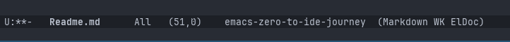
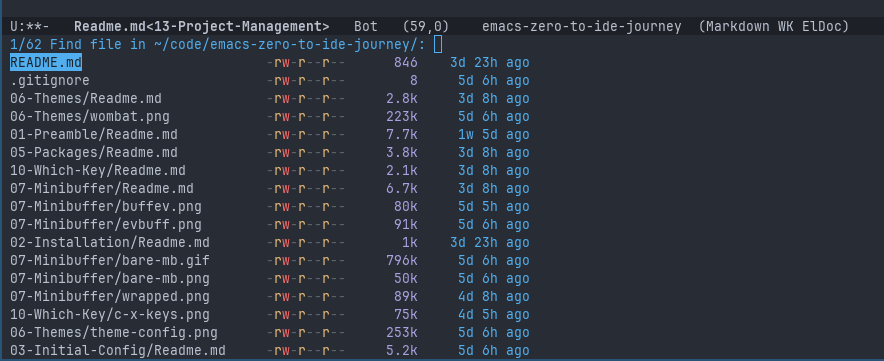
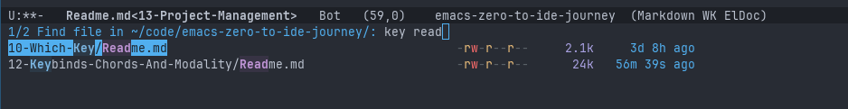
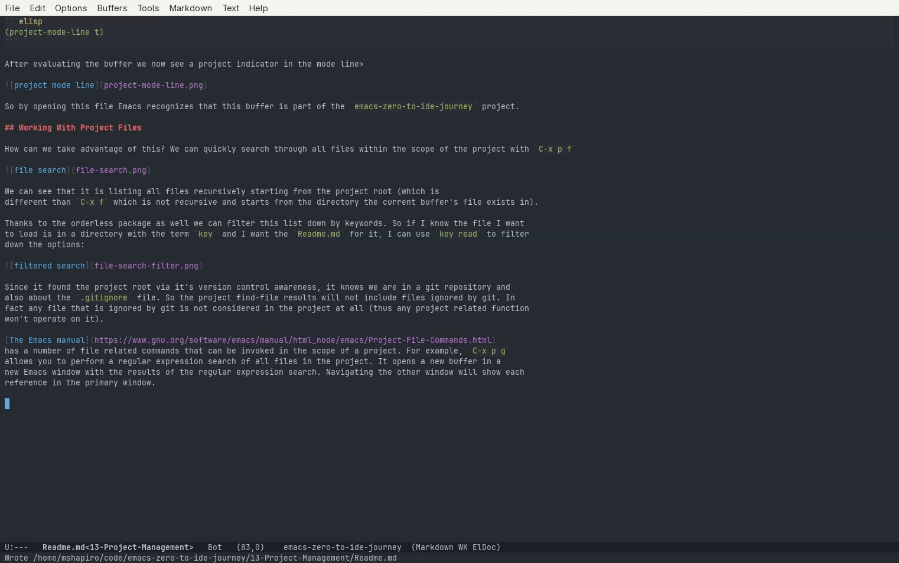
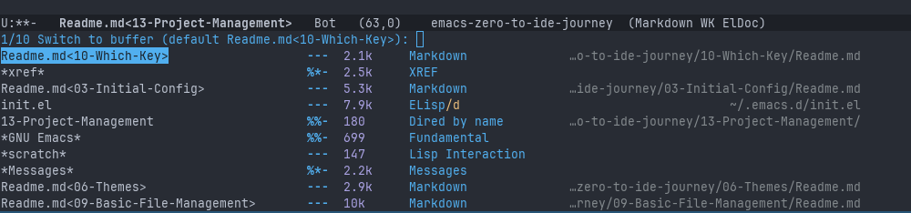
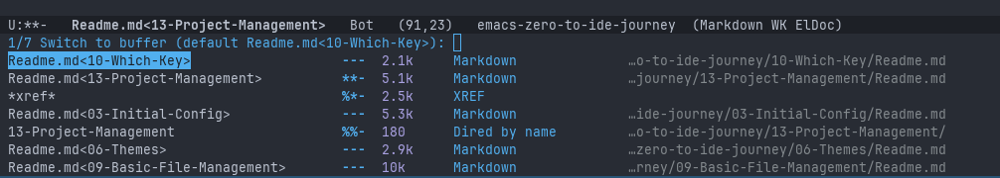
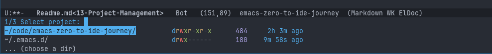
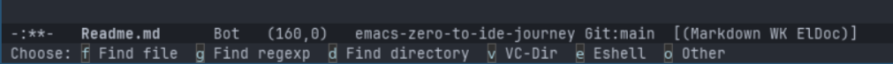
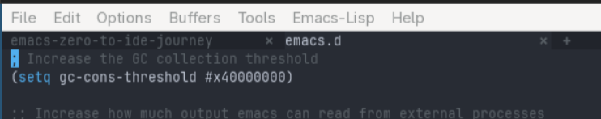

# Project Management
<!-- markdown toc start -->
**Table of Contents**

  - [What Am I Looking For?](#what-am-i-looking-for)
  - [project.el](#projectel)
  - [Working With Project Files](#working-with-project-files)
  - [Working With Project Specific Buffers](#working-with-project-specific-buffers)
  - [Nested And Non-Git Projects](#nested-and-non-git-projects)
  - [Switching Between Projects](#switching-between-projects)
  - [Project Specific Frames](#project-specific-frames)
  - [Project Specific Tabs](#project-specific-tabs)
  - [Saving Frame / Tab Configurations](#saving-frame--tab-configurations)

<!-- markdown toc end -->

## What Am I Looking For?

This series is around 16 Readme files right now all in different subfolders. Each
subfolder contains separate set of images. It's all contained within it's own
git repository.

When I want to work on these writings, I'm mostly focused only on this directory
structure I have placed this series' git repository in (`~/code/emacs-zero-to-ide-journey`).
If I am looking at a file in one repository it is rare that I am searching or trying
to open files in another directory.

Let's say that I want to find all files that in the tree that contain the word `emacs`. If
I `M-x find-name-dired` it will default to the directory of the file I am currently editing.
I know the file exists, but is in some (possibly nested) subdirectory that is at the root of
the repository. So when I `M-x find-name-dired` I have to manually use the backspace to go up
to the root directory of my git clone (and hope I don't press it too many times).

For me, it is rare that I am working on a file in isolation of other files around it. If I
am looking at one file and want to open another file or directory, it is usually related
to the context of the file I'm already looking at.

In most IDEs, This is solved by having multiple instances of the editor for each project I am
actively working on at the time. Each editor is scoped only to the directory that I provided to
it, giving me the option to search only through files within that directory structure and giving
tasks that are specific to that project.

That is the type of workflow I am looking to replicate. I want to be able to scope Emacs to a
specific directory for file searching, shell commands, etc... Ideally I can switch between active
projects without losing the way that project's workspace is setup.

Bonus points if I can maintain one Emacs window (the operating system kind) and making it trivial to 
swap between active projects.

## project.el

`project.el` is the built in project management system. It automatically knows if a file is associated
with a project if it can identify a project root in the file's directory hierarchy. Since Emacs is version
control aware it can identify if the file exists within the scope of a git repository and will implicitely
consider that file a part of that project.

Does that mean Emacs recognizes me as inside a project while writing this file? We can have emacs show us
what project (if any) is active for the current buffer by adding the following to the `:custom` section
of our `init.el`'s `use-package emacs` configuration:

```elisp
(project-mode-line t)
```

After evaluating the buffer we now see a project indicator in the mode line>



So by opening this file Emacs recognizes that this buffer is part of the `emacs-zero-to-ide-journey` project. 

## Working With Project Files

How can we take advantage of this? We can quickly search through all files within the scope of the project with `C-x p f`



We can see that it is listing all files recursively starting from the project root (which is
different than `C-x f` which is not recursive and starts from the directory the current buffer's file exists in).

Thanks to the orderless package as well we can filter this list down by keywords. So if I know the file I want
to load is in a directory with the term `key` and I want the `Readme.md` for it, I can use `key read` to filter
down the options:



Since it found the project root via it's version control awareness, it knows we are in a git repository and 
also about the `.gitignore` file. So the project find-file results will not include files ignored by git. In
fact any file that is ignored by git is not considered in the project at all (thus any project related function
won't operate on it).

[The Emacs manual](https://www.gnu.org/software/emacs/manual/html_node/emacs/Project-File-Commands.html)
has a number of file related commands that can be invoked in the scope of a project. For example, `C-x p g`
allows you to perform a regular expression search of all files in the project. It opens a new buffer in a
new Emacs window with the results of the regular expression search. Navigating the other window will show each
reference in the primary window.



## Working With Project Specific Buffers

When using Emacs it is common to not kill buffers and let them linger in the background. This means that despite
being in a project you might have many non-project related buffers open. In most cases many people operate with
a single instance of Emacs opened (even if they have multiple frames (Emacs OS windows) across their displays). This
means that if you have multiple projects open at one time, you will have buffers accessible to Emacs that span
the different projects.

If you `C-x b` it will show you all buffers that are open for your active Emacs setup, but like with files we
can instead use the `C-x p b` to provide us with a list of buffers only relevant to the current project.

This is what `C-x b` currently shows me:



And this is what `C-x p b` shows:



You can see that the project version of the function filtered out a lot of extraneous buffers, like my `init.el`
and the scratch buffer. You can imagine how helpful this gets for switching between buffers when you have 
multiple separate code bases loaded at one time.

When I am done with a project for the day, I can use `C-x p k` to kill all buffers related to the current project,
allowing me to save some memory and clean up a bit.

One interesting shortcut that is available is `C-x p o`, which will take whatever command you execute next and
execute it in the scope of the current project. This is possible because a lot of interactive functions in Emacs
respect a `default-directory` variable, and the `C-x p o` temporarily sets the `default-directory` to the
current directory.

This means that `C-x p o C-x C-f` will automatically default to the project root instead of your current root,
which can be useful if you need to operate on a file that is ignored by git (and thus not considered part of the
project). You can make a directory in the project root by doing `C-x p o M-x make-directory`. So it adds a good
amount of flexibility to how you operate within the scope of a project.

## Nested And Non-Git Projects

Sometimes we have multiple logical projects in a single git repository (think mono-repo). You may want each
individual logical project to be its own Emacs project. One way this can be done is by adding the following
to the `:custom` section of the `use-package emacs` declaration:

```elisp
(project-vc-extra-root-markers '(".project" "package.json" "Cargo.toml"))
```
    
This allows me to create an empty file in any directory called `.project` and that will be recognized
as a project. For example, I added that to my `~/.emacs.d/` folder and now I can consider my emacs config
directory a project I can switch in and out of, despite the folder itself not being managed by git.

It's worth noting that nested projects isn't a formally recognized concept by the built-in Emacs package
system. This means that if you have multiple rust crates inside a single git repository, the above
description will consider each rust crate it's own project, and you won't be able to have a single
project with all the rust crates inside of it. 

I have not yet determined if this is a big issue or not, since switching projects seems relatively easy. I
can see some code bases where this would be ok and others where it would be a pain, so it will take
some more experimentation to figure out.

More fine-grained control for finding project roots can be done by using `defun` to create a new function
that and add it to the `project-find-functions` list. So in theory if you want a specific git repository
to be treated as one Emacs project without them being nested, this can be used to possibly ignore the
sub-projects and only consider the root.

## Switching Between Projects

You can switch between projects with `C-x p p`. This opens a list of all known projects. 



A project is added only when you open a file that Emacs considers to be in a project and perform a 
project related (`C-x p`) command on that buffer.

When selecting a project from this menu you get a list of actions you can take on the selected project:



This makes it easy to either open a file for editing that's specific to that project, or search for something
in that project to cross reference with the current file you are editing.

## Project Specific Frames

What operating systems call windows Emacs calls a frame, while a window in Emacs is a subdivision of a frame,
where each window displays a buffer.

Most IDEs maintain a separate operating system window per project, and will open a new instance if you want
two separate projects opened at the same time. We can mimic this behavior in Emacs by opening a project in
another frame using `C-x 5 p p`.  This will open the normal `C-x p p` select project minibuffer function
but once a file is selected that file will be opened in a new Emacs frame (OS window). 

The `C-x 5` prefix is used for functions that operate on frames.

Now you can use your window manager to arrange the emacs frames as desired, efficiently utilize multiple
monitors, etc.. Each frame can have it's own Emacs window configuration that's independent of each other.

Frames can also be renamed with `M-x set-frame-name` so they can be named for the project they are
managing.

## Project Specific Tabs

Despite this being the primary way most editors operate, I do not really want to have multiple frames
active to switch between projects quickly. I do not like the way window switching works on Mac, and
I cannot easily use Emacs commands to easily switch and navigate frames (at least not in the Sway
window manager).

For me I want a single Emacs frame where I can manage multiple projects. Emacs actually has a tab bar that
is hidden by default (while there is only one tab) that we can use in this manner. Tab management is
under the `C-x t` prefix. So just as we did with frames, we can use `C-x t p p` to select a project
and open that project's file in a new tab.



`C-x t r` can be used to rename the current tab, so you can have each tab named distinctly to make it
obvious what project that tab is dedicated to. I can quickly switch tabs with `C-x t o` or `C-TAB`. 

You can also switch between tabs by name with `C-x t <RET>`. 

## Saving Frame / Tab Configurations

Each tab can have it's own window configuration. If you usually work with the same projects on regular
basis you may find it annoying to have to recreate the tabs and window configurations every time you
start Emacs. 

You can manually save your configuration via `M-x desktop-save`. This will save the current frame,
windows, tabs, and buffers. This means you can have different configurations and as required swap between
them. You can also add `(desktop-save-mode 1)` to the `use-package emacs`'s `:config` section
to have it always save the desktop when you exit emacs and load it (so you start right where you
left off).

I will need to investigate it further to figure out the right workflow that works for in regards to maintain
tab and window configurations, as I have seen some hints there might be a better solution.
