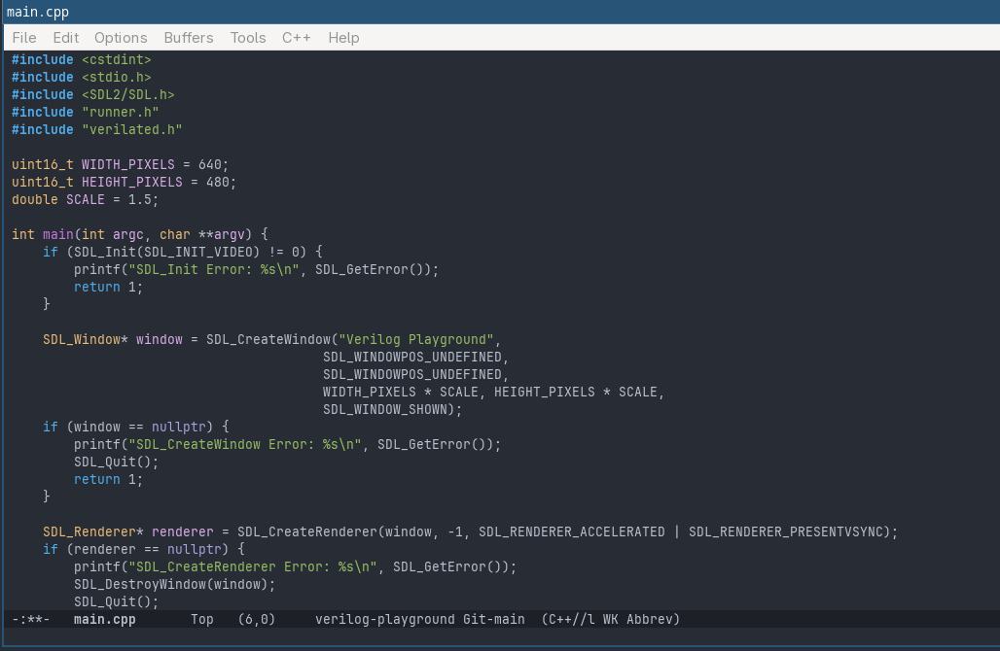
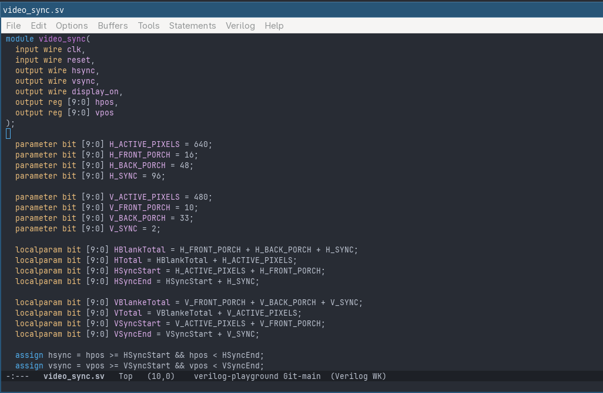
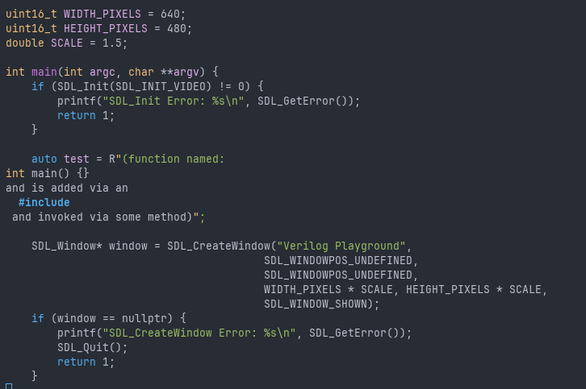
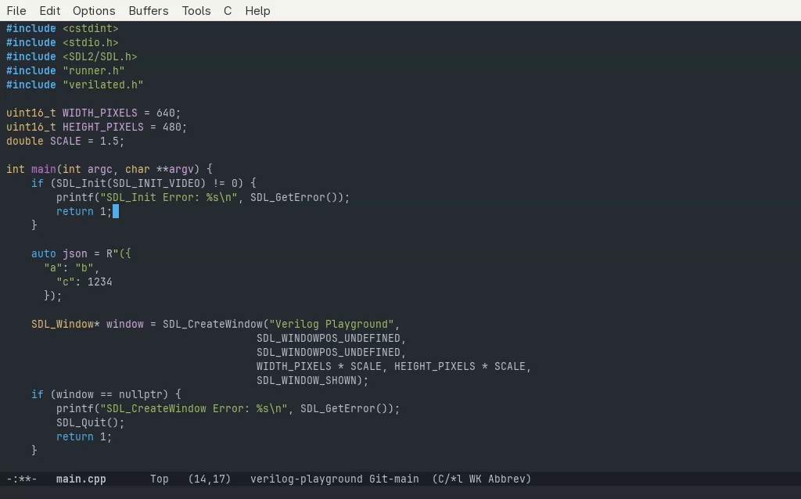
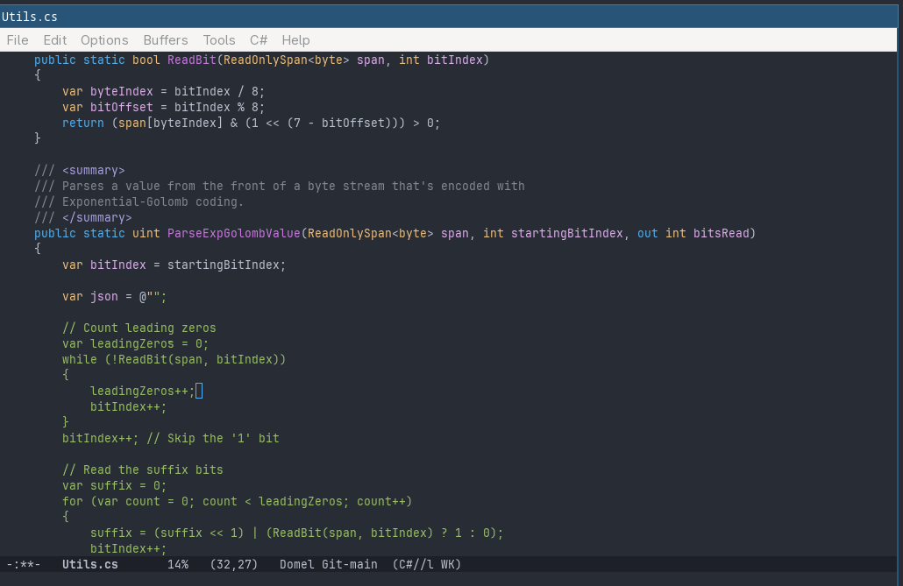
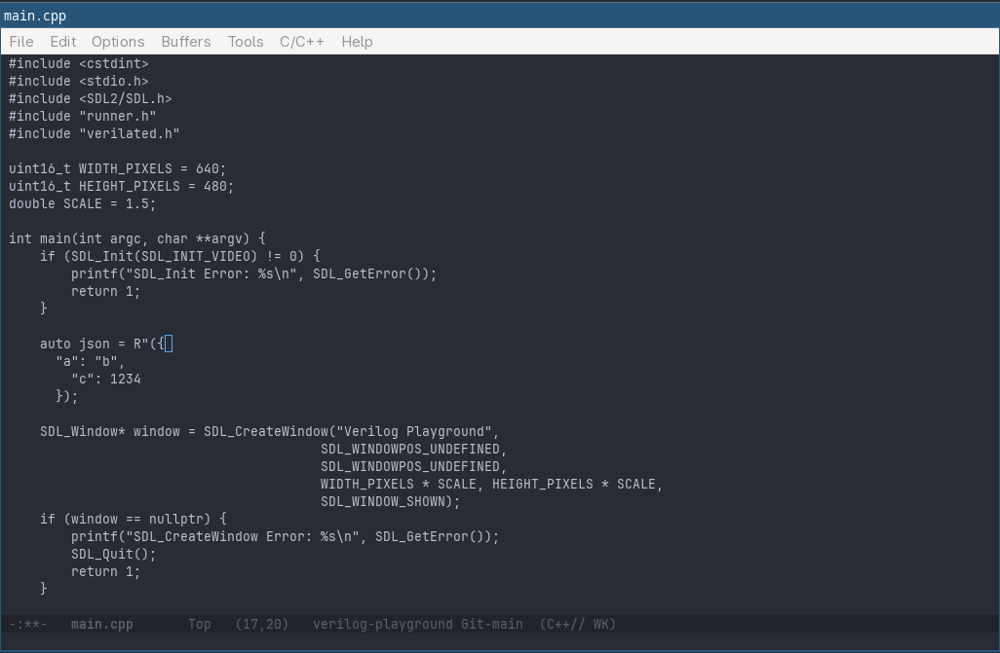
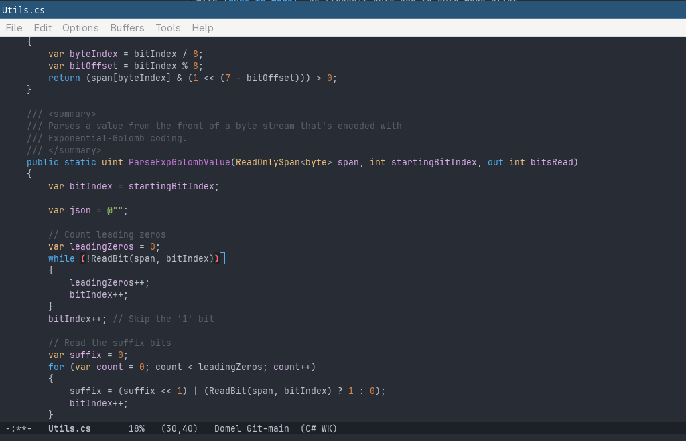
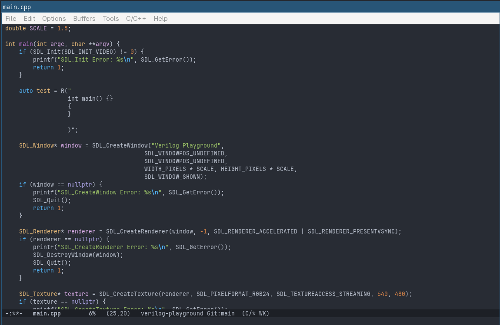
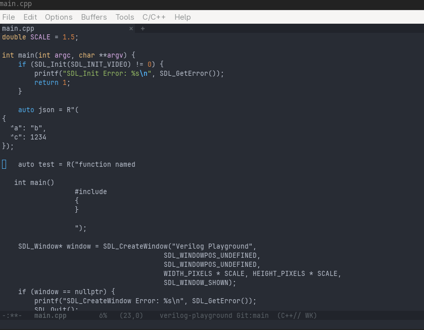

# Syntax Highlighting

<!-- markdown toc start -->
**Table of Contents**

  - [Standard Programming Major Modes](#standard-programming-major-modes)
  - [Tree-sitter](#tree-sitter)
  - [Tree Sitter Navigation](#tree-sitter-navigation)
  - [Ensuring Proper Configuration](#ensuring-proper-configuration)

<!-- markdown toc end -->


We have seen how editing elisp code provides syntax highlighting, but what about other languages?

Opening up a C++ file presents me with:



Well... that was easy. I guess C++ is common enough for Emacs to have a built in C++ major mode.
assume C is the same. What about if we open up a Verilog file (one of the bigger reasons this
journey started for me)?



Even opening a C# file seems to work. Ok then problem solved?

## Standard Programming Major Modes

So it turns out, Emacs by default has built-in major modes for a lot of different languages.
There's `c++-mode`, `verilog-mode`, etc... These modes provide usable intendentation,
highlighting, and navigation features. 

For example, in almost any programming file we
open with native support, we can go to any spot and do `M-x beginning-of-defun` to go
to the beginning of the current function. There is also `M-x end-of-defun` to go
to the end of the current function.

At least that's the theory. In reality, these modes are brittle and don't truly understand
the syntax. They perform syntax highlighting and navigation via a lot of regular expressions
and syntax tables (a lookup table Emacs modes use to specify what purpose characters have).

It does not really have a lot of understanding of the syntax past that. An example
of where that breaks down is: 



The regular expressions can't figure out that the inner `int main()` is all encapsulated
in a raw string literal, and thus highlights it thinking it's actual code.

You might think "so what, it's just a string rendering issue", but it's actually not. Since
the mode thinks that it is a valid function it will "helpfully" try and adjust indenting
for you and break navigation.

A more practical example is containing multi-line json:



Before this json string literal was added, I could `end-of-defun` just fine but now it's
thrown everything off and it can't actually figure out the correct end of the function.

A keen eyed observer might think this is because of the missing `"` at the end of the
string literal, but even with that in it still does not navigate as expected.

C# with a literal string is even worse:



Not only does not not know where the end of the string literal ends (it has the whole
remaining file highlighted green), but `end-of-defun` now complains about unbalanced
parentheses. 

From research I have done, the regular expressions and other mechanisms this uses doesn't
scale well to large files and is sub-optimal in many ways.

## Tree-sitter

[Tree-sitter](https://tree-sitter.github.io/tree-sitter/) is an open-source project which
allows incremental parsing of programming languages. When invoked with a provided grammar,
it generates an AST for the code it is trying to parse.

Emacs has tree-sitter built in since Emacs 29, and so the tree-sitter enabled major modes
use this AST for smarter syntax highlighting and navigation that's built around the actual
language semantics instead of regular expression guesses.

The incremental parsing is (in theory) useful because it doesn't have to parse the whole
code file to understand what the AST is at your current spot, and should be faster to
react to changes in large source files as you type.

The Emacs tree-sitter modes all end with `-ts-mode`. So the C++ mode is `c++-ts-mode`.
So in the C++ file we can change to the tree-sitter mode via `M-x c++-ts-mode`.



Well that's not quite what I expected. To make matters worse, there is no Messages or 
indications on what went wrong.

As it turns out, the issue is that we have not installed any grammars/parsers. These
language specific parsers are compiled libraries that Emacs' embedded tree-sitter
will be able to load and run. Installing these grammars and making sure they are
compatible is not trivial, but luckily there's a package that simplifies it.

Adding the following to `init.el` makes live much easier:

```elisp
(use-package treesit-auto
  :ensure t
  :custom
  (treesit-auto-install 'prompt)
  :config
  (treesit-auto-add-to-auto-mode-alist 'all)
  (global-treesit-auto-mode)
  )
```

This package will notice when you try to load a programming mode that has a tree-sitter
equivalent and use the tree-sitter mode instead of the basic one. It will then detect
if you have a suitable grammar for it. If you don't, it will prompt you to download it.

If the download doesn't work or there isn't one, it will fall back to the non-tree-sitter
mode.

So after adding this and re-evaluating it, we can load our C# code, press `y` to the prompt
to install the grammar, and viola:



If we then navigate to the C++ example:



Unlike the C# mode, the C++ tree-sitter mode makes the string literal just white and you can see
that it recognizes the code inside tring literal as plain text and not code. If you type
`M-x end-of-defun` you'll notice it acts correctly and doesn't get tripped up due to the string literal.

In fact, we can see that if we have the same bug as before with the missing quote it becomes much more obvious:



We can see that now the rest of the file is white and has no highlighting, because the unclosed string literal
means that the tree-sitter mode is correctly realizing that the rest of the code is part of the string literal.
This can be extremely helpful in finding real bugs and not waiting for the compiler to hopefully give a clear
message on why things are not as you expect.

## Tree Sitter Navigation

This also unlocks some smarter functionality too due to Emacs being AST aware. For example,
if you put the point on the `int` in `int main` and do `C-M-SPC`, it knows you want to select
the whole function.  You can then do `M-w` to copy it.

Move to the beginning of a function call and the same operations will select and copy the whole
function call and arguments. Do it on an if statement and copy the whole block, etc...

Going to the beginning of a statement and using `C-M-SPC C-M-SPC` select the current
statement and the next statement.

Another example that tree-sitter gets us is being able to navigate to specific nodes. For
example, let's say we want to navigate to the next `if` statement. We can't just use a 
search for the word `if` because that would get string literals and other hits. We can
use some elisp and create a function to do this though using the `treesit-search-forward`
function.

```elisp
(defun my/treesit-next-if ()
  "Jump to the next if-statement node."
  (interactive)
  (let ((node (treesit-search-forward
               (treesit-node-at (point))
               "if_statement")))
    (if node
        (goto-char (treesit-node-start node))
      (message "No more if-statements found"))))
```

Now every time we do `M-x my/treesit-next-if` it will navigate to the next if statement. This
isn't that useful but it shows how tree-sitter starts to give us the flexibility to really customize
and take advantage of the AST.

## Ensuring Proper Configuration

The `treesit-auto` package is a great help on setting up grammars. However I have noticed the
automatic conversion from non-tree sitter major modes to tree sitter modes does not always take
effect.

You can verify what mode you are in with `M-: major-mode`. If you find that you are not
in a tree sitter mode when you expect to be, there are two things to do.

The first is to ensure the tree sitter grammars are installed via `M-x treesit-auto-install-all`.

Then you can add the following to the end of your `init.el`:

```elisp
(setq major-mode-remap-alist
      '((c-mode           . c-ts-mode)
        (c++-mode         . c++-ts-mode)
        (c-or-c++-mode    . c-or-c++-ts-mode)
        (csharp-mode      . csharp-ts-mode)
      ))

```

You can add additional entries for other programming modes you want to map.
