# LSP Support Via Eglot
<!-- markdown toc start -->
**Table of Contents**

  - [What Are Language Servers](#what-are-language-servers)
  - [Language Server Installation](#language-server-installation)
  - [What Is Eglot](#what-is-eglot)
  - [Xref](#xref)
  - [Eldoc](#eldoc)
  - [Imenu](#imenu)
  - [Flymake](#flymake)
  - [Completion At Point](#completion-at-point)
  - [Code Actions](#code-actions)
  - [Other Languages](#other-languages)
    - [C# (Roslyn Language Server)](#c-roslyn-language-server)
      - [Fixing The Error ](#fixing-the-error)
      - [Loading The Solution](#loading-the-solution)
      - [Launching Roslyn Language Server](#launching-roslyn-language-server)
      - [Missing Diagnostics](#missing-diagnostics)
    - [Typescript](#typescript)
      - [Typescript 6 And Below](#typescript-6-and-below)
      - [Typescript 7](#typescript-7)
      - [Better Eldoc Support](#better-eldoc-support)
    - [Verilog](#verilog)
    - [Rust](#rust)
  - [Conclusion](#conclusion)

<!-- markdown toc end -->

While tree-sitter works great for parsing the code into an AST to provide highlighting
and basic navigation, it doesn't actually understand the code. It knows that your code
has the correct grammar but it doesn't know that you are referring to a variable
that doesn't exist, or if a function you are calling has the correct visibility, etc...

Thus we need something more to provide IDE like capabilities to Emacs.

## What Are Language Servers

Language servers are independent programs designed to provide semantic understanding 
and advanced editing capabilities for programming languages. They can provide
diagnostic messages, cross referencing to locate related code, provide smart
completion options, refactoring utilities, etc...

Since each language server tends to specialize in one specific programming language,
it knows the actual semantic meaning of the code and how it relates to other code
and packages being referenced.

As the name implies, each language server acts as an independent process outside of
the client which is utilizing it. This means that any editor can use the same
language server.

LSPs unlock a significant amount of power for code-editing, and is critical for me
to act as a usable development environment.

The Language Server Protocol (LSP) is the standard interface for editors to communicate
and interact with language servers. 

So our goal here is to set Emacs up as an LSP client, so that it can automatically invoke
functionality from the correct language server at the right time.

## Language Server Installation

Editors act as clients for the language servers. Some editors may helpfully install
language servers themselves but ultimately they are third-party servers.

Most LSP-integration packages in Emacs will assume you have the language servers
installed already, instead of installing them for you. Each language has its
own (and sometimes multiple exist for the same languages). 

For my personal use case, these are the language servers I have installed and the
installation instructions I use for them:

* bash - `pnpm i -g bash-language server`
* C++ - `clangd` installed via brew or system package manager
* C# - `dotnet tool install --global roslyn-langauge-server --prerelease`
* CMake - `pipx install cmake-language-server`
* docker - `pnpm i -g dockerfile-language-server-nodejs`
* docker compose - `pnpm i -g @microsoft/compose-language-service`
* F# - `dotnet tool install --global fsautocomplete`
* fish shell - `pnpm i -g fish-lsp`
* Lua - `lua-language-server` installed via brew or system package manager
* PytEhon - `pipx install pyright`
* typescript - `pnpm i -g typescript typescript-language-server`
* Verilog - `slang-server` manually installed [from Github](https://github.com/hudson-trading/slang-server)

## What Is Eglot

[Eglot](https://elpa.gnu.org/devel/doc/eglot.html) is the LSP client integration that's natively
built into Emacs. 

Using Eglot is actually easy. Since I already had `clangd` installed I was able to go to my 
`main.cpp` file, run `M-x eglot` and saw the following message:

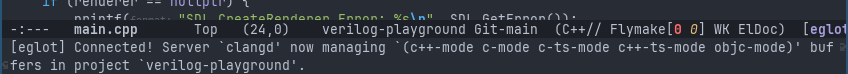

Now that Eglot is activated, it will communicate with the clangd process it established a connection with
to provide LSP-based enhancements to the buffer. It will use the existing connection any time I open a
new buffer for a file whose mode is one that it is managed. However Eglot is project based, which means
it will not activate if I open a C++ file outside of the current project. Each project will need it's own
invocation of `M-x eglot`.

Eglot being activated has also enhanced the view of our editor in a number of helpful ways:

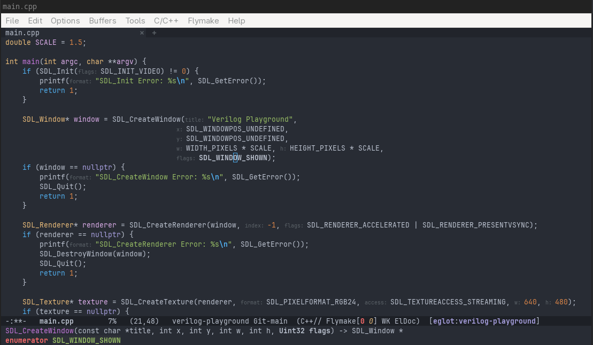

All function calls now have non-obvious arguments prefixed with the name of the parameter. So we can clearly
see that the string I'm passing into `SDL_CreateWindow()`'s first argument is for the `title` parameter. 
If you don't like these, they can be toggled with `M-x eglot-inlay-hints-mode`. You can also bind
`eglot-momentary-inlay-hints` to allow you to see them only when you hold down a specific key.

I also have the point over one of the arguments into the `SDL_CreateWindow` function. At the bottom of the
screen, the `ElDoc` minor mode is now receiving information from the language server to tell me the signature
of the function, it is bolding the parameter relevant to where the point is currently at, and shows me
that the `SDL_WINDOW_SHOWN` is an enum type. 

## Xref

Xref is a framework built into Emacs and takes an identifier (be it a function, macro, variable, etc...) and
find where that identifier is defined and referenced. Xref is just a frontend for actually picking and
navigating cross references and Eglot is one such backend for it. We used the xref system previously when
doing regular expression searches within a project earlier.

We can utilize Eglot and the language server's xref capabilities by invoking `xref-find-definitions`, bound
to `M-.` by default. Emacs will then immediately go to where the symbol under the point is defined.

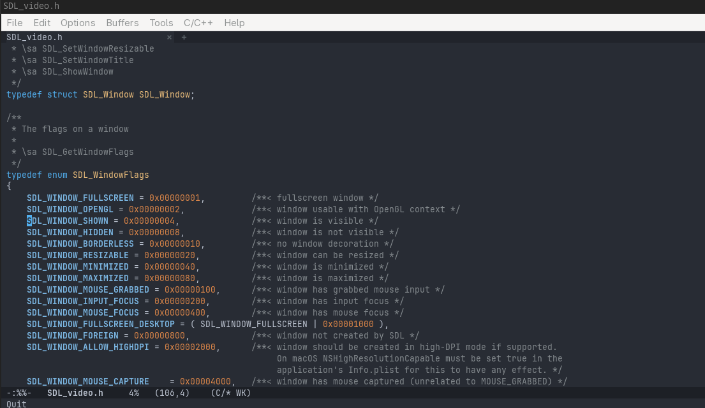

In this case, clangd knows where all my includes are and which include is relevant for the
`SDL_Window_SHOWN` enumeration. 

By invoking the `xref-go-back` command (bound to `M-,`) we will be brought right back to where we were
before we performed the find definition call.  The xref system will maintain a stack of navigations, and no matter
how many times you `M-.` into something you can always `M-,` back.

We can use `xref-find-references` (bound to `M-?`) to open an xref window that shows us all known references
clangd has for what we had under the pointer. 

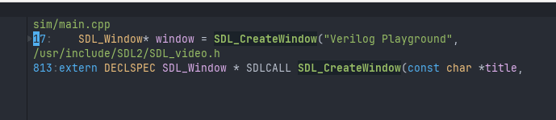

We can navigate these options with `n` and `p` (no control modifier needed) and the non-xref window will automatically
update and load the file at that specific point. This provides us a very quick way to navigate references within
our projects. `M-,` will bring us right back to where we were before the xref request.

I need to do a deep dive to figure out what `apropos` is in Emacs, but there is an `xref-find-apropos` function,
which allows you to specify an arbitrary symbol name and get xref results for them. For example, searching for
`pixels` brings up the following:

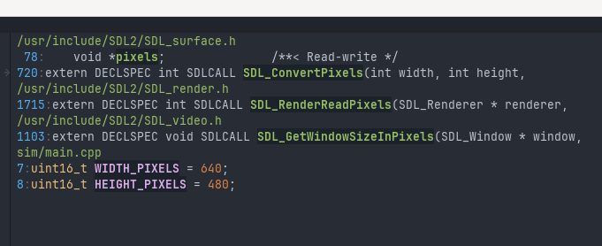

At first test with this, this seems extremely useful. The search is case insensitive and it uses a fuzzy search.

## Eldoc

What if we want additional documentation for what's under the point? 

Eldoc is Emac's at-point documentation system. It provides a mechanism to show documentation based on
what symbol is underneath the point at any given time and is fully compatible with Eglot.

The Eldoc function doesn't just populate basic information in the minibuffer area, it also has it's own
buffer with more comprehensive documentation fed by the language server. This can be opened by typing `C-h .`.

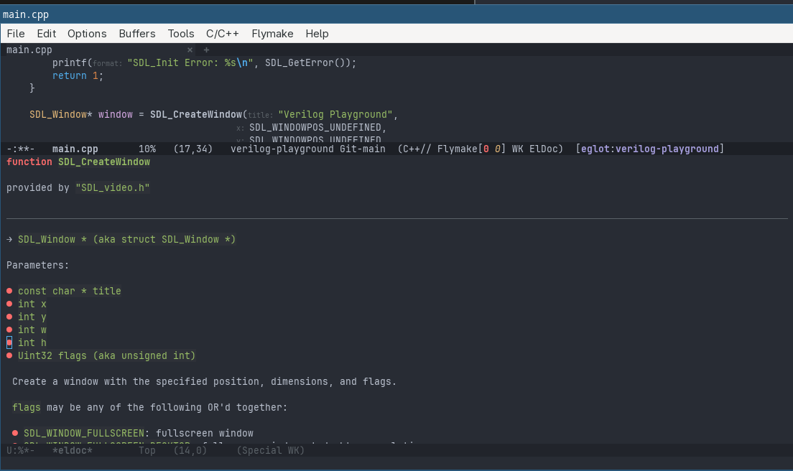

Obviously this is cramped because I have my Emacs frame small for demonstration purposes, but there is
adaquate space if you are running Emacs full screen. Without changing changing focus you can scroll
the Eldoc window up and down with `C-M-v` and `C-M-S-v` while maintaining the code as your current
buffer. 

The power of Emacs windowing really comes into play here. If you don't want the window below
but want it to the right, you can do:

* `C-x 1` to maximize the current code window
* `C-x 3` to split the current window to the right
* `C-x 4 b` to switch the other window's buffer to `*eldoc*`.

Now the documentation is on the right side of the screen, and as you move the cursor around to different
parts of the code the documentation window automatically updates. 

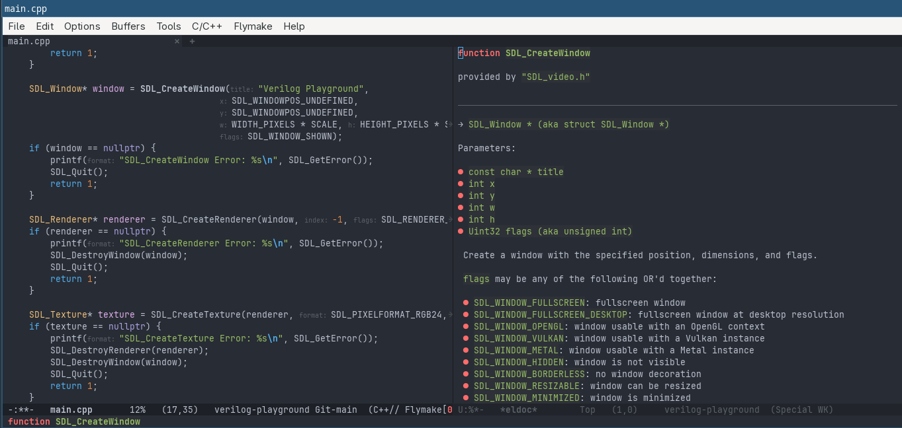

You can also do `C-x 5 b` to open the `*eldoc*` buffer in a new Emacs frame, allowing you to place it on a 
completely different monitor.

## Imenu

Emacs has a function called `imenu` (bound to `M-g i`) which provides a minibuffer completion menu of top level symbols in the
current buffer that can be navigateid to. So if you are in a file that contains a lot of functions and you
know a keyword from the function you want to navigate to, the imenu is a quick way to jump right to it.

This is quick because it's only root level symbols for the current file and thus doesn't need to look
through the entire project. 

## Flymake

Flymake is the on the fly diagnostic annotation system. Eglot adds its own backend to surface
language server diagnostics through flymake. If we type `window` in the line after
our window `nullptr` check we get the following

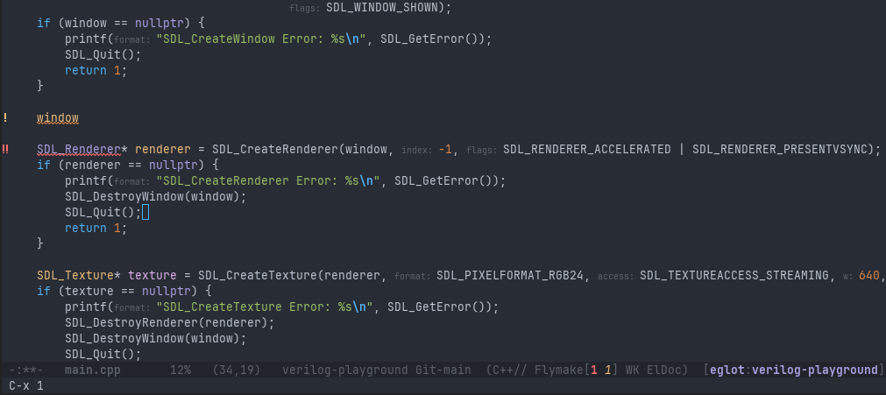

We can now see the `window` we typed has a yellow squigly and an exclamation mark, while
the next line's `SDL_Renderer` clause has a red squiggly and two red exclamation marks. We
can also see the Flymake entry in the mode line shows 1 warning and 1 error.

Flymake messages get surfaced in Eldoc, so if we still have the window split we can see
the errors from our language server right there.

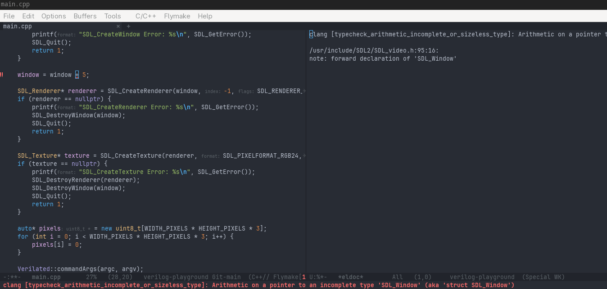

We don't have to manually go to the error to see it though. We can use the
`M-x flymake-goto-next-error` and `flymake-goto-prev-error` to navigate
between them.

We can then fully utilize the language server by running
`M-x flymake-show-buffer-diagnostics` to see a list of diagnostic messages for the
current buffer or `M-x flymake-show-project-diagnostics` to show all diagnostics
for the whole project. 

These will open a window with a list of diagnostics, what file they exist in,
and allow `n` and `p` navigation. While navigating the diagnostic messages you can use `SPC`
to have the main window show the code that the diagnostic message is for, and `RET` to actually focus
the code buffer at the point of the diagnostic.

## Completion At Point

Since we added the corfu package for in-buffer completion popups, we can get auto-complete
style code completion that's supported by the language server. So typing `win<TAB>` produces
the popup. While the popup is active we can use `C-n` and `C-p` to cycle through the options,
and as we select hte options we also get a side popup with documentation for the selected
option:

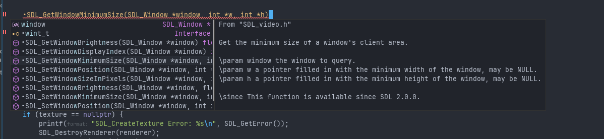

One interesting note is that as you select options, what you currently typed shows a preview
of the selected option **with the full signature**. Obviously, that would not be ideal
in practice because you would have to go back and replace the arguments with your own.

Luckily, you don't have to as once you select and option and press `TAB` or `RET` it will
not include any of the arguments or even the parenthesis for functions.

One thing that tripped me up a few times is that if you type `window` and hit `TAB` it almost
seems like nothing is happening. However if you look closely at the bottom you will see 
`sole match`, so it recognizes that it's at the end of the only option that it could be.

It may be desirable to expand the max width in corfu so that you can see more, if desired.

## Code Actions

Language servers expose refactoring capabilities, and Eglot exposes those.

If we put the point on `window` and do `M-x eglot-rename`, we can now rename the `window`
variable to anything and it will be renamed only for that logical symbol, even if
other functions in the same file have their own `window` local. Of course using
undo `C-/` undoes the whole rename.

There are a variety of code actions that the language server may expose based on what
code the point is at. The code actions available depend on the language server involved.

So if you put your point over a warning or error flymake indicator and perform 
`M-x eglot-code-actions` you'll get a list of actions the language server allows for that
specific spot in the code. 

There are more specific actions that can be performed:
* `eglot-code-action-organilze-imports`
* `eglot-code-action-quickfix`
* `eglot-code-action-extract` 
* `eglot-code-action-inline`
* `eglot-code-action-rewrite`

All of these require support by the language server at the spot the point is currently at, or
the region that has been selected.

`M-x eglot-format-buffer` will reformat/indent the whole file, while `M-x eglot-format` will format
the selected region.

## Other Languages

So C++ was pretty easy. C++ is pretty common (from the perspective of non-IDE editors)
and clangd seems to be the most common C++ language server. It is also installed with
clangd, which is a very common toolchain for C++ development.

So let's try some other languages. Unfortunately, this is where things started breaking
down for me.

### C# (Roslyn Language Server)

If we open up a C# file and `M-x eglot` we get:

> [eglot] Couldn't guess LSP server for 'csharp-ts-mode'
> Enter program to execute (or <host>:<port>)

So I type `roslyn-language-server` which is the C# language server that seems to be
officially supported and ....

> error in process sentinel: [eglot] -1: Server died

Well that isn't very helpful. Lets open an "other" window with the relevant
eglot events buffer:

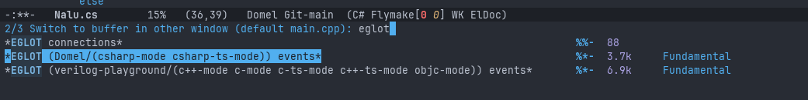

Make sure to select the right one if you Emacs session has multiple projects
open at the moment. Opening it then shows the event buffer:

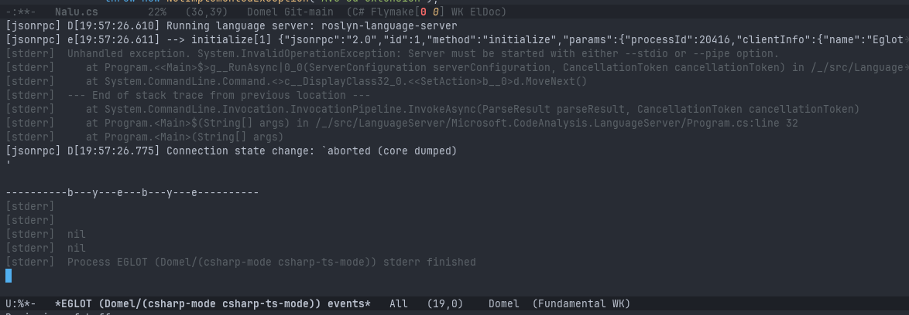

So the events buffer shows that the server is throwing an exception immediately
because it's expecting an `--stdio` or `--pipe` option. Ok sure, so lets go back
to our C# buffer and when prompted for the language server program to execute
lets do `roslyn-language-server --stdio`.

This appears to work at a first glance (eglot claims it's running on the project)
but we quickly find out it's extremely limited. It seems to be working for
xref and other operations only within the file itself and not in the larger
project. I pulled up the eglot events and found a bunch of `Internal Error`
messages from the client side (not from the language server!). 

#### Fixing The Error 

So I ran `M-: (setq debug-on-error t)` (the `M-:` allows evaluating arbitrary
elips expressions ad-hoc), then `M-x eglot-reconnect`. This popped up a buffer
with a lisp error on `eglot--glob-parse`. 

To try and not get into the weeds, the
[LSP 3.17 specification](https://microsoft.github.io/language-server-protocol/specifications/lsp/3.17/specification/#globPattern)
added the ability for glob patterns to be either single pattern strings, or a `RelativePattern`
object (with a baseUrl and pattern properties). Unfortunately, it seems like eglot's 
glob parsing code only supports pattern strings, not objects. This appears to have been
fixed in [a commit back in December 2025](https://lists.nongnu.org/archive/html/emacs-diffs/2025-12/msg00219.html)
but since the current Emacs version of 30.2 was released in August 2025 that fix isn't in my
current Emacs build.

The amazing thing about Emacs is that you have access to everything. That includes access
to override any function, including functions provided by packages. One of the ways to
override a function is with a concept of
[advising a function](https://www.gnu.org/software/emacs/manual/html_node/elisp/Advising-Functions.html).
This allows you to add a function shimmed before or after the real function.

So what we want is an advice that handles the `RelativePattern` object if provided, or
fall back to the original if it's a normal glob string. We can do that with:

```elisp
(defun my-eglot--glob-parse-relative-advice (orig-fun pattern)
  "Around-advice for `eglot--glob-parse' adding RelativePattern support.

PATTERN is either:
  - a plain glob string (LSP `Pattern'), passed straight to ORIG-FUN, or
  - an LSP 3.17 `RelativePattern' plist, (:baseUri URI :pattern STRING),
    in which case BASEURI is resolved to a filesystem path and
    concatenated with PATTERN to form one absolute glob string, which
    is then handed to ORIG-FUN.

This keeps everything downstream (`eglot--glob-compile' and its
callers) working on absolute-path globs as usual, so no other part
of the pipeline needs to change."
  (if (and (consp pattern) (keywordp (car pattern)))
      (let* ((base-uri (plist-get pattern :baseUri))
             (rel-pattern (plist-get pattern :pattern))
             (base-path (and base-uri
                              (if (fboundp 'eglot--uri-to-path)
                                  (eglot--uri-to-path base-uri)
                                base-uri))))
        (unless (and base-path rel-pattern)
          (error "eglot--glob-parse: malformed RelativePattern: %S" pattern))
        (funcall orig-fun
                 (concat (directory-file-name base-path) "/" rel-pattern)))
    (funcall orig-fun pattern)))

(advice-add 'eglot--glob-parse :around #'my-eglot--glob-parse-relative-advice)
```


Now if we run these expressions and restart Eglot, we don't get a ton of errors in the Eglot events
view.

#### Loading The Solution

That didn't fix the issue that xref and other operations are only operating for the local file
itself. After doing some research it appears that the problem is that just opening a `.cs` file
does not automatically associate it with the C# solution file it's relevant to. We need to find
the relevant solution file and tell the roslyn language server about it.

Adding the following function into my `init.el` gave me that functionality:

```elisp
;; Send a json-rpc via eglot to the roslyn-language-server so the server
;; is aware of the relevant solution file.
(defun my/eglot-roslyn-open-solution (sln-file)
  "Send Roslyn's custom `solution/open' notification for SLN-FILE
to the Eglot server managing the current buffer."
  (interactive "fSolution (.sln) file: ")
  (let ((server (eglot-current-server)))
    (unless server
      (user-error "No active Eglot connection in this buffer"))
    (jsonrpc-notify
     server
     :solution/open
     (list :solution (eglot-path-to-uri (expand-file-name sln-file))))))
```

Now, once I have eglot loaded for a project I can use `M-x my/eglot-roslyn-open-solution`, select
the `.sln` file I want, and viola. Now I have full xref, search, and diagnostic support for the
whole solution.

I have not found a good hook to automatically search and load a solution file by default, but
selecting it by hand isn't too big of a deal for now. The roslyn language server claims to have
an `--autoLoadProjects` property and it might load the csproj, but does not seem to load the
solution file (and thus limits a lot of utility).

#### Launching Roslyn Language Server

So right now every time we `M-x eglot`, we have to manually type in `roslyn-language-server --stdio`
in order to launch it. We can have it automatically launch roslyn when we are in a C# buffer
by the following directive in our `init.el`

```elisp
(with-eval-after-load 'eglot
  (add-to-list 'eglot-server-programs
               '((csharp-mode csharp-ts-mode) . ("roslyn-language-server"
                                                 "--logLevel" "Information"
                                                  "--stdio"))))
```

Now just opening any `.cs` file and executing `M-x eglot` will start up the roslyn language server.

#### Missing Diagnostics

Unfortunately, as I played around with the code I realized we were missing actual diagnostic support.

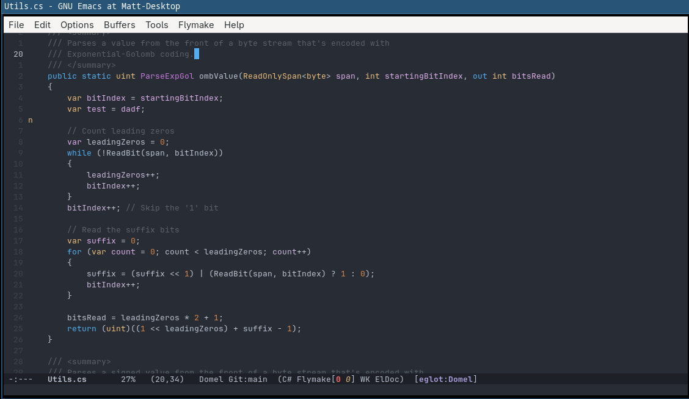

We can see that we have completely broken C# code and the bottom still says zero warnings or errors. This
is not the case for most other languages I have tested out.

It appears the root of the issue is that there are two types of diagnostic mechanisms in the LSP spec,
push and pull. Push is the old mechanism and pull is a much newer mechanism. Since the roslyn language server
does not support push, no diagnostics are shown.

The version of Eglot that is in Emacs 30.2 does not support pull diagnostics and that's the reason nothing
shows for me.

The good news is that this issue and the Glob pattern issue previously mentioned are fixed in the latest
version of Eglot (1.24 at the time of this writing). So we can fix the issue by upgrading. 

Upgrading is usually done by the `M-x eglot-upgrade-eglot` command, but then you have to remember to execute
that on any machine. You can address this by adding the following to your `init.el`:

```elisp

(require 'package)
(let ((eglot-package (assq 'eglot package-alist)))
  (if (not eglot-package)
      (eglot-upgrade-eglot)
    (when (version< (package-version-join
                     (package-desc-version (cadr eglot-package)))
                    "1.24")
      (eglot-upgrade-eglot)))) 
```

This first checks if eglot is in the `packages-alist` variable, which contains a list of all packages that
can be activated. The built-in eglot is not in there, and therefore it will trigger an upgrade. It will
also trigger an upgrade if the package version is before 1.24. The reason for the conditional checks is so 
that every startup time isn't checking for the latest version of eglot.

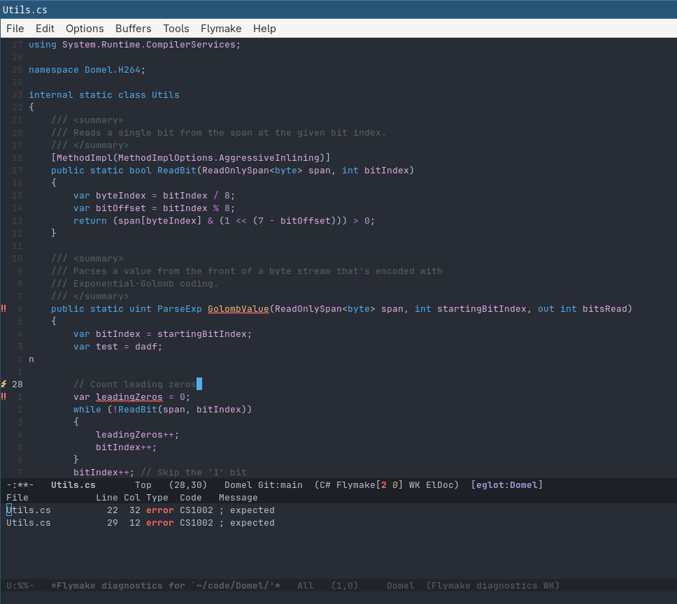


### Typescript

At the time of writing this (August 2026), Typescript is going through a weird transition. Typescript
version 7 was released in July 2026 and with it came with the rewrite in Go. The relevant change
though is that it no longer uses the `typescript-language-server` executable for LSP purposes, the
actual compiler `tsc` is now the language server and the `typescript-language-server` executable
no longer works if you have typescript 7 installed.

This is a confusing situation because many people haven't upgraded yet. So when you upgrade 
the typescript language server just responds to LSP commands with an error that it couldn't find
a typescript environment. Most guides on the internet predate the TS7 transition and thus all
claim you just have to `npm i -g typescript` and viola.

So there are two different configurations that are necessary depending if your typescript environment
is before or after the version 7. It's even worse if you have global TS7 but a project specific
`devDependency` with typescript pinned to a previous version.

#### Typescript 6 And Below

Typescript before version 7 used `typescript-language-server`, and that's what Eglot's default
configuration assumes. So as long as both `typescript` and `typescript-language-server` installed
globally via npm, then it should just work. Loading a typescript file and then running 
`M-x eglot` and you should see a successful startup message:

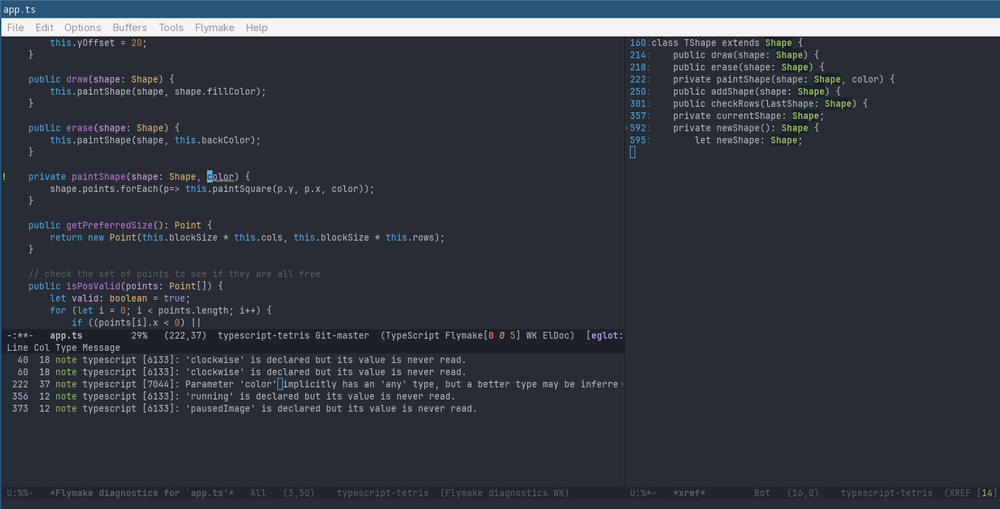

If it didn't work, then open up the Eglot events buffer to try and see why.


#### Typescript 7

When running against Typescript 7, we can't use the `typescript-language-server` executable,
but instead need Eglot to call `tsc` but in LSP mode. This can be done via:

```elisp
(with-eval-after-load 'eglot
  (add-to-list 'eglot-server-programs
               '((typescript-ts-base-mode tsx-ts-mode typescript-mode)
                 . ("tsc" "--lsp" "--stdio"))))
```

With that added, now load a typescript file and run `M-x eglot`. Eglot should now have full
LSP capablities.

#### Better Eldoc Support

Unfortunately, the default integration isn't perfect. If you hover over types or enums and open
the Eldoc buffer, you will notice that the documentation is pretty lackluster.

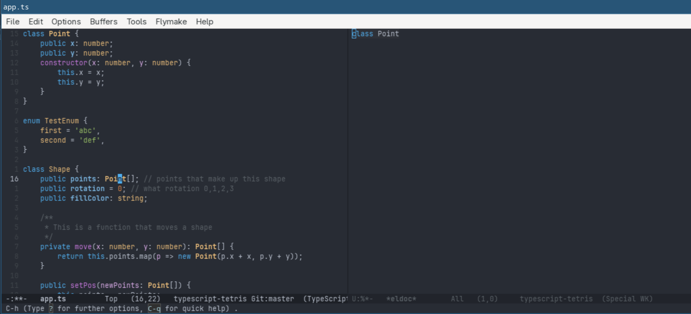

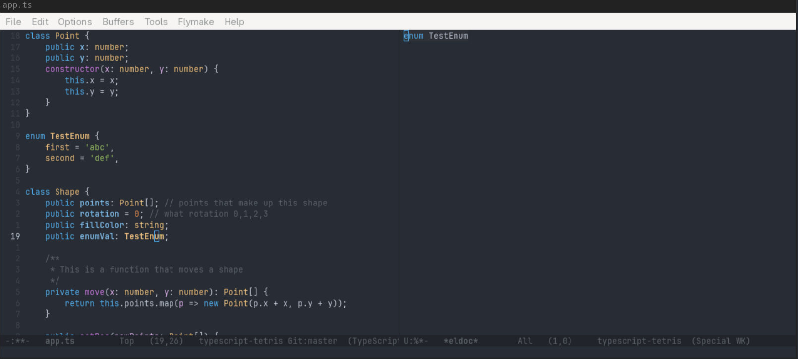

If you look at the Eglot events buffer you'll see that this lack of information comes directly
from the typescript language server itself, it isn't an issue with Eglot directly. 

After doing some research, it appears that the typescript language version has a hover verbosity
setting, which allows it to bring back more information. So we need to tell Eglot to inform the
language server that we support verbosity, and that we want to specify verbosity level when a
hover command is issued by Eglot (which occurs when the point moves onto a symbol).

There are two steps for this. 

The first stepso you need to modify the way Eglot calls `typescript-language-server` or `tsc` and tell
it to support hover verbosity.  The second step to do is to create an advice around the Eglot hover and text document functions.

```elisp
(with-eval-after-load 'eglot
  (add-to-list 'eglot-server-programs
               '((typescript-ts-base-mode tsx-ts-mode typescript-mode)
                 . ("typescript-language-server" "--stdio" ;; **NOTE** Switch to TSC for TS7
                    :initializationOptions
                    (:hostInfo "emacs"
                     :supportsHoverVerbosity t
                     :preferences (:maximumHoverLength 4000))))))

(defvar my/eglot-hover-verbosity nil
  "When non-nil, verbosity level to attach to textDocument/hover.")

(define-advice eglot--TextDocumentPositionParams
    (:around (fn &rest args) hover-verbosity)
  (let ((params (apply fn args)))
    (if my/eglot-hover-verbosity
        (append params (list :verbosityLevel my/eglot-hover-verbosity))
      params)))

;; Make ordinary eldoc hovers always ask for level 1.
(define-advice eglot-hover-eldoc-function
    (:around (fn &rest args) hover-verbosity)
  (let ((my/eglot-hover-verbosity (or my/eglot-hover-verbosity 1)))
    (apply fn args)))
```

After applying this we now get much more useful information:

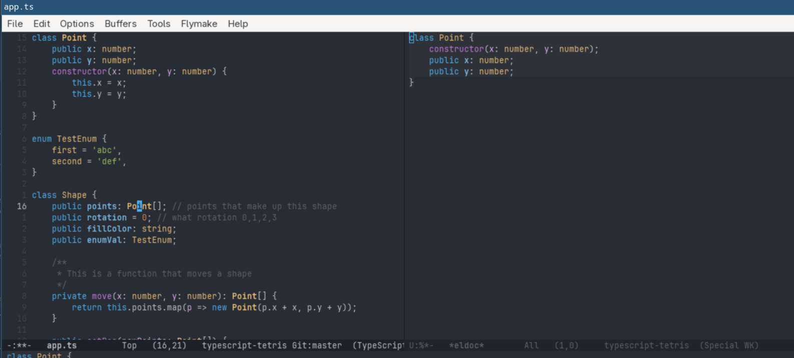

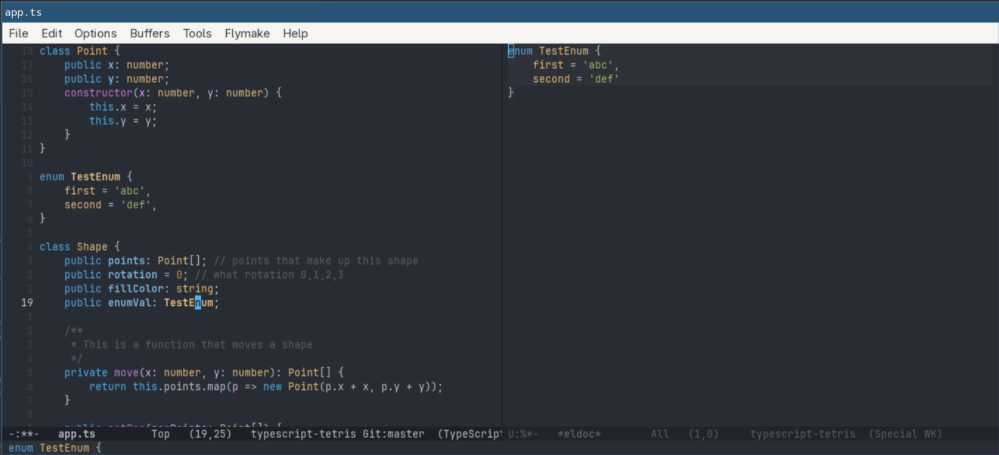

### Verilog

Opening up a verilog file and running `M-x eglot` shows the "Couldn't guess LSP server"
prompt. So I enter `slang-server` and eglot shows

> Server 'slang-server' now managing 'nil' buffers in project

Thats... interesting. Typing `M-.` to go to definition asks me
`Visit tags table (default TAGS)` which I have no idea what it means. Selecting an option
removes all highlighting as it puts it into TAGS major mode. Going back to `verilog-mode`
ends up bringing highlighting back but with a read-only buffer.

Long story short, there was no native Eglot knowledge of `verilog-mode`, and therefore just
because you run `M-x eglot` from within a mode doesn't mean it can automatically attach itself
to that mode. That's even more confusing because C# worked, but that's because the
`eglot-server-programs` list actually had an entry for `csharp-mode`, but none for verilog-mode.

So we want to set up the configuration of this list so it not only knows that Eglot should attach
to this mode, but also what server we want it to use (so we don't have to type it every time).

This can be done with the following `init.el`

```elisp
 
(with-eval-after-load 'eglot
  (add-to-list 'eglot-server-programs
               '(verilog-mode . ("slang-server"))))
```
 
After evaluating this, I can now go back to my verilog buffer, use `M-x eglot` and have full
LSP functionality.

Well mostly... While typing I noticed that pressing `TAB` did not show the popup for completion
options. If I run `M-x completion-at-point` I *do* get the completion options though.

After some research it appears that the `verilog-mode` uses the `electric-verilog-tab` which does
tab indention while in verilog mode. Since I have my `init.el` configuration with `tab-always-indent 'complete`
the tab key will first try to get the line at the correct indention level, and only show completions
if it's already at the correct indention level. For whatever reason, the `electric-verilog-tab` does
not respond that it's at the expected level, and thus completions never show up.

Completions do work when triggered with `M-TAB` (which is bound to `verilog-complete-word` or by
pulling up `C-M-i` (`completion-at-point`). So everything is working with that one caveat.

### Rust

Rust was straight-forward, though I did have the hiccup that `rust-analyzer` wasn't actually
installed. After doing `rustup component add rust-analyzer`, navigating to a rust file and
using `M-x eglot` just worked.

## Conclusion

And like that, I have Eglot up and running for some of the programming languages I use on a
regular basis. 

That being said, Eglot is not the only language server support in town. Doom emacs and many
other distributions seem to use a package called `lsp-mode`. Lets give that a look to see 
if we can compare them.
