# LSP Via LSP-Mode

<!-- markdown toc start -->
**Table of Contents**

  - [What Is LSP-Mode](#what-is-lsp-mode)
  - [C#](#c)
    - [Solution Not Loading](#solution-not-loading)
    - [IMenu Differences](#imenu-differences)
  - [Typescript](#typescript)
  - [Verilog](#verilog)
  - [Other Languages](#other-languages)
  - [Keymap Rebind](#keymap-rebind)
  - [Documentation At Point](#documentation-at-point)
  - [Conclusion](#conclusion)

<!-- markdown toc end -->

So Eglot is setup and good to go. Many people are very happy with just Eglot, but
since a lot of Emacs distributions use lsp-mode I wanted to at least try it. 

The Eglot investigation was worth it even if I don't end up using it because it taught me about Flymake, xref,
imenu, and other Emacs systems that will be important for most other LSP
integrations (and you should read that post if you haven't).

## What Is LSP-Mode

[LSP-Mode](https://emacs-lsp.github.io/lsp-mode/) is an Emacs package that provides
LSP integration with a lot of extras. You may not need the extras, but it's a
more heavyweight option than Eglot. It even includes Github Copilot support, depending
on how you feel about that.

One benefit I do find (in my research) of lsp-mode over Eglot is supposedly lsp-mode
supports multiple LSP integrations per buffer. This is important in web contexts, because
you may have one LSP for html, one for javascript, one for tailwind css, etc... You
have to use a multiplexor with Eglot for the same capabilities.

The [languages](https://emacs-lsp.github.io/lsp-mode/page/languages/) page lists a
lot more languages and language server support than Eglot, although I already was able 
to plug in support for unsupported lsps pretty easily with Eglot.
It also looks like it has a `M-x lsp-install-server` which can make it
not required to manually install language servers (like vscode and others do).

Installation was pretty simple, I just had to add the following to my `init.el`

```elisp
(use-package lsp-mode
  :ensure t
  :hook
  (
   (lsp-mode . lsp-enable-which-key-integration)
   ;; Which major modes to activate for
   (csharp-ts-mode . lsp)
   )
  :commands lsp)
```

I'm sure I'll be adding a lot more modes, but lets start with C#.

Once evaluated, we can make sure it's installed properly with `M-x lsp-doctor`. For
me the only optional performance warning was not having plists enabled. I was able
to activate that by adding `(setenv "LSP_USE_PLISTS" "true")` to the beginning of
my `init.el`, `M-x delete-package` to remove lsp-mode, and then restart emacs. 

## C#

Opening my first C# file now asks me which language server I want to use. I selected
`csharp-roslyn).  I then got presented with:

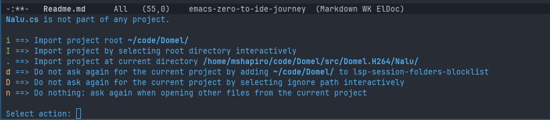

It's not clear if it's talking about a C# project or a Emacs project. My assumption is
this is to designate it as an Emacs project.

Using `i` the mode goes away and I can clearly tell that the lsp-mode is activated automatically:

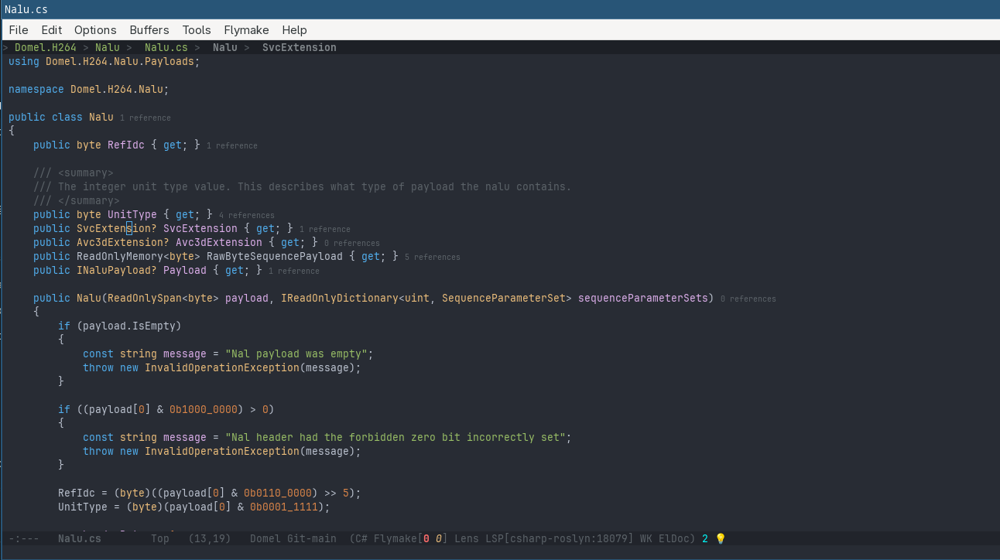

The top has a display showing the hiearchy of the symbol at the point. It appears that
the directory structure from the `csproj` root is up there, and clicking on them opens
`dired` to that path. The hiearchy past the current file we are in navigates to those
symbols. I suspect there is a keyboard shortcut for these but haven't looked yet.

This is actually a useful feature for me because it allows me to quickly see see
the semantic code path (i.e. class -> method) that I am currently in, which can
be confusing if the top of the method definition is above the top of the screen.

Many editors do this either with a single or multiple line, and it's something I was thinking
I may need to customize while going the Eglot route.

I also see Flymake correctly telling me there are zero errors or warnings in the mode
line. I also see the mode line showing the LSP(csharp-roslyn) minor mode (which also
seems to include the process ID of the language server it launched). 

It also shows that the language server is providing two code actions for my current area.
We can execute these actions with `M-x lsp-execute-code-actions`, which gives me two
options specific to the C# line we are on (property refactors).

### Solution Not Loading

The first problem I encountered was `M-.` (go to definition) wasn't working, and 
`M-?` (find references) was also not providing any references outside this file.

I had this issue with Eglot originally too, and it was because the roslyn language server did
not have a solution loaded, so it didn't really know the context that the current file was 
loaded in.

Exploring `M-x` options led me to the `lsp-roslyn-open-solution-file` command.
This command is useful because it allows you to select a different solution file if you have
multiples.

Unfortunately, this command claimed it could not find a solution. This is where Emacs introspective
capabilities came in handy. I ran `M-x describe-function lsp-roslyn-open-solution-file` and then 
clicked on the `lsp-roslyn.el` clickable link to view the source code. This led me to the following
line of code:

```elisp
(defun lsp-roslyn--find-solution-file ()
  (let ((solutions (lsp-roslyn--find-files-in-parent-directories
                    (file-name-directory (buffer-file-name))
                    (rx (* anychar) ".sln" eos))))
    (cond
     ((not solutions) nil)
     ((eq (length solutions) 1) (cl-first solutions))
     (t (lsp-roslyn--pick-solution-file-interactively solutions)))))
```

So lsp-mode's roslyn language server integration doesn't know about the new C# solution format
yet (which has the extension slnx). I was able to use `M-:` to evaluate a new copy/paste of that
function with `slnx`, and then re-run `M-x lsp-roslyn-open-solution-file` and viola, I now
can successfully find references, go to definition, better completion, etc... 

So now we can add an advice when `lsp-roslyn` loads to override the built in functionality

```elisp
(with-eval-after-load 'lsp-roslyn 
  (defun my/lsp-roslyn--find-solution-file ()
    (let ((solutions (lsp-roslyn--find-files-in-parent-directories
                      (file-name-directory (buffer-file-name))
                      (rx (* anychar) "." (or "sln" "slnx") eos))))
      (cond
       ((not solutions) nil)
       ((eq (length solutions) 1) (cl-first solutions))
       (t (lsp-roslyn--pick-solution-file-interactively solutions)))))

  (advice-add 'lsp-roslyn--find-solution-file :override #'my/lsp-roslyn--find-solution-file))
```

After that it found the solution file and successfully loaded it. The other advantage that
lsp-mode is showing here compared to Eglot is that lsp-mode remembers the solution selection
I made last. So opening a file in this project again automatically loads the correct solution,
without me having to select it again. I'm sure I can script Eglot to find and auto-load the 
solution automatically, but this is still nice.

### IMenu Differences

`M-x imenu` is now enhanced in that it first allows me to pick a class/struct, and presents
me with a second menu of properties and methods within the selected type. 

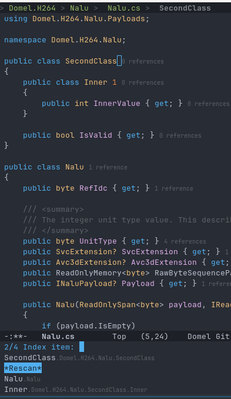

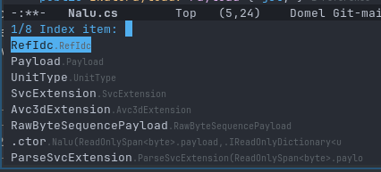

## Typescript

I added the following to the `use-package lsp-mode`'s `:hook` section

```elisp
(typescript-ts-mode . lsp)
```

That will make lsp-mode activate when the typescript major mode is loaded.

Immediately I get the `app.ts is not part of any project` lsp-mode prompt. Selecting `i`
causes me to lose all syntax highlighting and get the "the package typescript is not installed"
error.

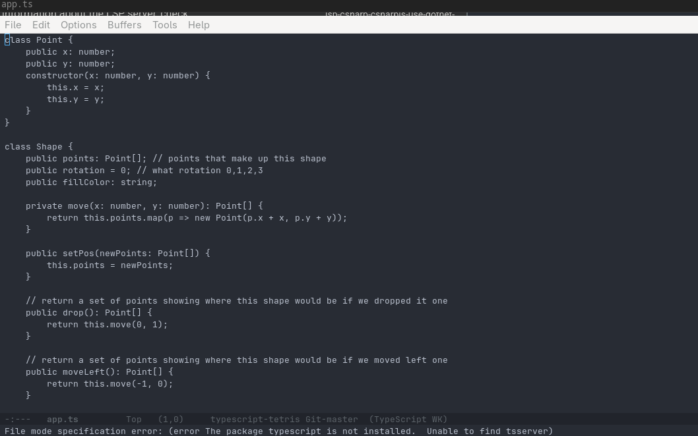

So now we are back in the TS7 vs TS6 issue yet again, and currently the lsp-mode package is
designed against `typescript-language-server`. TS7 support can be patched in with:

```elisp
(with-eval-after-load 'lsp-javascript
  (defcustom lsp-clients-typescript7-path "tsc"
    "Path to the TypeScript 7 native binary (supports `tsc --lsp --stdio`)."
    :group 'lsp-typescript
    :type 'string)

  (defun lsp-clients-typescript7-find-binary ()
    "Prefer the project-local TS7 binary, fall back to PATH."
    (or (when-let* ((root (locate-dominating-file default-directory "node_modules")))
          (let ((local (expand-file-name "node_modules/.bin/tsc" root)))
            (when (file-executable-p local) local)))
        (executable-find lsp-clients-typescript7-path)))

  (lsp-register-client
   (make-lsp-client
    :new-connection (lsp-stdio-connection
                      (lambda ()
                        (list (or (lsp-clients-typescript7-find-binary) "tsc")
                              "--lsp" "--stdio")))
    :activation-fn 'lsp-typescript-javascript-tsx-jsx-activate-p
    :priority -2
    :initialization-options (lambda () (list :supportsHoverVerbosity t))
    :server-id 'ts7-ls)))

;; Fixes bug in lsp-mode that crashes ts7's lsp
(defun my/lsp--strip-null-values (data)
  "Recursively remove plist/hash-table/alist keys whose value is nil."
  (cond
   ((hash-table-p data)
    (let ((new (make-hash-table :test 'equal)))
      (maphash (lambda (k v)
                 (unless (null v)
                   (puthash k (my/lsp--strip-null-values v) new)))
               data)
      new))
   ;; plist: (:key val :key val ...)
   ((and (consp data) (keywordp (car data)))
    (let (result)
      (cl-loop for (k v) on data by #'cddr
               unless (null v)
               do (push k result) (push (my/lsp--strip-null-values v) result))
      (nreverse result)))
   ;; alist: ((key . val) (key . val) ...)
   ((and (consp data) (consp (car data)) (not (listp (caar data))))
    (--keep (unless (null (cdr it)) (cons (car it) (my/lsp--strip-null-values (cdr it)))) data))
   ((vectorp data) (cl-map 'vector #'my/lsp--strip-null-values data))
   (t data)))

(defun my/lsp--make-message-strip-nulls (args)
  (list (my/lsp--strip-null-values (car args))))

(with-eval-after-load 'lsp-mode
  (advice-add 'lsp--make-message :filter-args #'my/lsp--make-message-strip-nulls))

```


Once this was done and I reloaded the lsp buffer, I was off to the races.

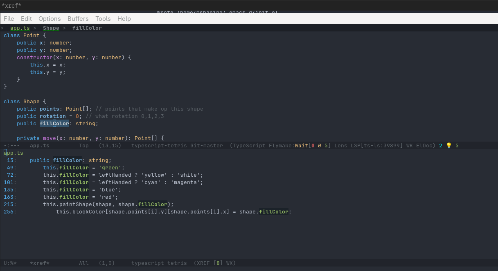

Well mostly, except that we are now back to minimal eldoc info on hover due to the verbosity
command we need to send on hover. We can accomplish this with:

```elisp
(dolist (fn '(lsp-request lsp-request-async))
  (advice-add fn :filter-args
              (lambda (args)
                (if (equal (car args) "textDocument/hover")
                    (cons (car args)
                          (cons (plist-put (copy-sequence (cadr args))
                                            :verbosityLevel 1)
                                (cddr args)))
                  args))))

```

And now we have documentation. Well not exactly but I'll cover that in the documentation at point section.

## Verilog

Lsp-mode does not have support for `slang-server`, the LSP I've been using for verilog. Luckily
they make it easy to register new server support.

```elisp
(with-eval-after-load 'lsp-mode
  (lsp-register-client
   (make-lsp-client
    :new-connection (lsp-stdio-connection "slang-server") ; adjust to actual binary/path
    :major-modes '(verilog-mode verilog-ts-mode)          ; whichever major mode you use
    :priority 1                                            ; higher than built-in clients
    :server-id 'slang-ls)))
```

After adding that, I now have verilog support working as expected.

## Other Languages

I tried C++ and did not really hit any issues worth noting. Everything
seemed to work just fine.

## Keymap Rebind

By default, lsp-mode has it's key bindings attached to `s-l` (Super + l). Since
I use a tiling window manager with vim style bindings, that doesn't work for me
as `s-l` changes focus to another OS window.

Changing the prefix was a matter of adding the following to the
`use-package lsp-mode`'s `:init` section:

```elisp
(setq lsp-keymap-prefix "C-c l")
```

This has to be done in the `:init` so it's active before lsp-mode starts, otherwise
lsp-mode will still bind to `s-l` but the which-key integration will think it's
`C-c l`.

## Documentation At Point

Unfortunately lsp-mode is not a clear win in all cases. The eldoc support so far seems a bit
underwhelming. For example in Eglot we can see the following:

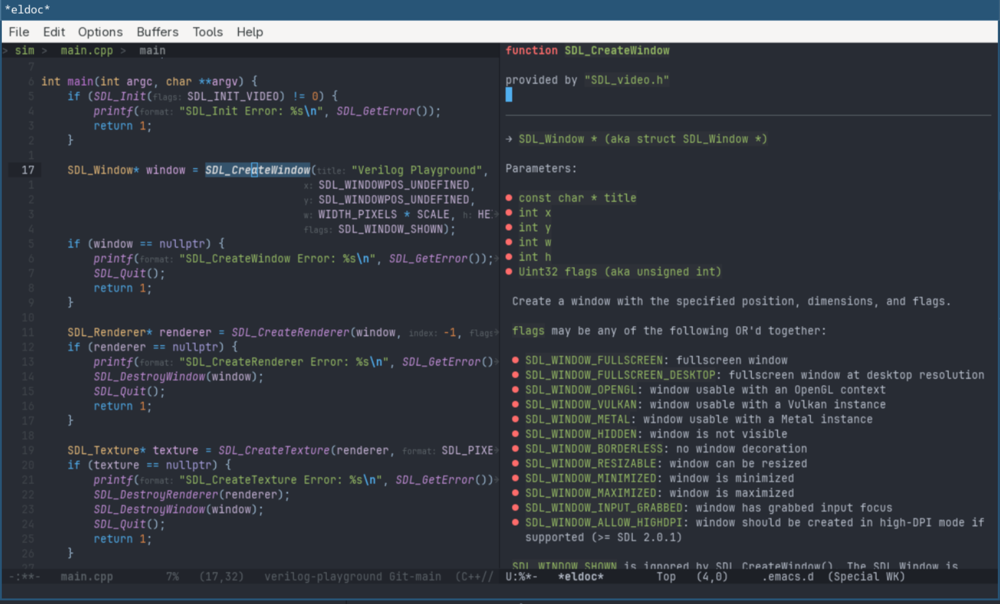

However in lsp-mode we get:

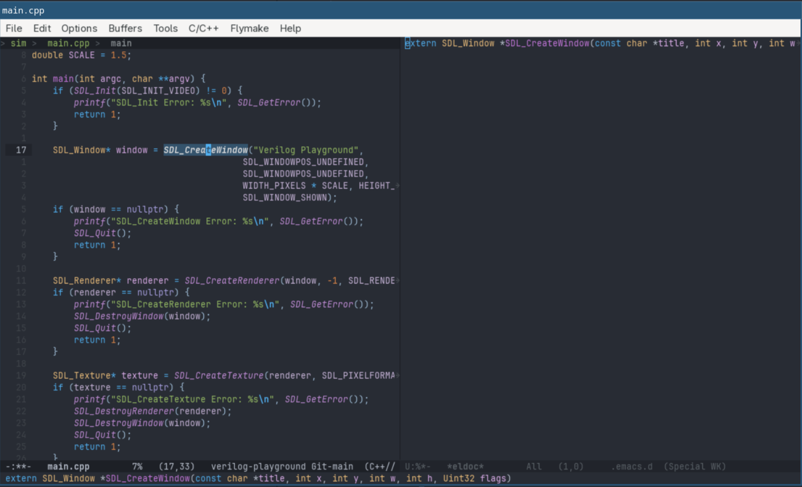

The latter is significantly less helpful to me. We can partially fix this by making sure
that the `lsp-eldoc-render-all` variable is set to `t`. 

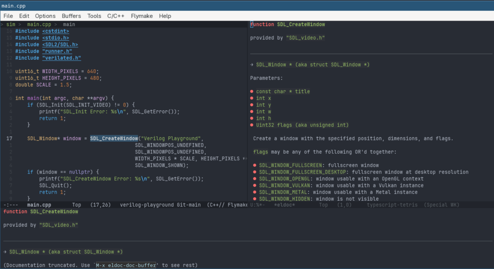

We can then fix this by setting `eldoc-echo-area-use-multiline-p` to `nil`. We make these
active anytime the `lsp-mode-hook` triggers by adding the following to the `:hook` section
of `use-package lsp-mode`

```elisp
   (lsp-mode . (lambda()
             (setq-local lsp-eldoc-render-all t)
             (setq-local eldoc-echo-area-use-multiline-p nil)
             ))
```

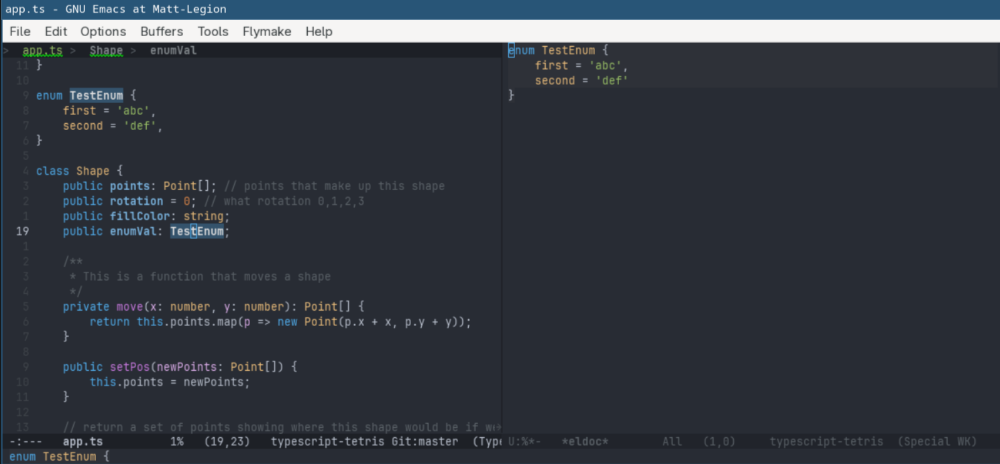

That being said, it apperas that `C-h .` doesn't work to bring up eldoc documentation buffer.
It's not a deal breaker, as it can be opened manually with `M-x eldoc-doc-buffer` but
it would be nice to just work.

## Conclusion

Lsp-mode seems to work pretty well except for a few gotchas.

The one main bug I have found is with find references (`M-?`). It claims the default is
the symbol that's under the point, but that's not actually the case. 

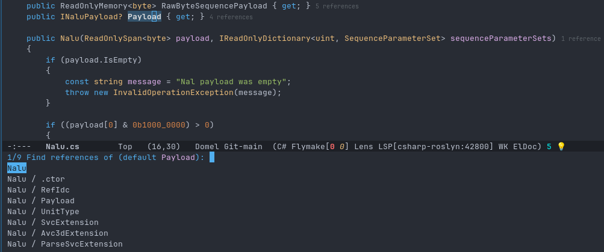

I think that's because there is no `Payload` entry anymore (despite it claiming that's the default)
and the vertical minibuffer completion has no matches (since it's `Nalu / Payload`, not `Payload`.

This is annoying but workable since I can type `payload` and still get it. It does mean there's
not purpose putting the point on the symbol I want to look for. It also means that I can't
find all references of a local value, and have to resort to highlighting and manually scanning
the code. 

I'll have to see how much that annoys me and if there is a work around.

