# Git Via Magit

I have almost always disliked git clients that are in IDEs and always preferred
dedicated clients (and in the past 5+ years mostly the git command line interface).

Most Git interfaces attempt to streamline the concepts of git and conform it to
the currently open project. That's difficult if you haven't even cloned the repository
yet, or if you jump around to different projects or worktrees a bunch. Sometimes, they
make really weird decisions, like in JetBrains UI it used to not clear your commit
message after committing, forcing you to clear the message manually every time. 

Then you need to do something advanced like an ammend commit or interactive rebase,
and the gaps in these interfaces really start to show.

That being said, over the years I've heard so much praise for Emacs' 
[magit package](https://magit.vc/) that I might as well give it a shot and see what all
the praise is about.

## Installation

Adding magit is pretty easy.

```elisp
(use-package magit
  :ensure t
  )
```

Evaluate that and now you can `M-x magit` to open it up.

## Navigating

We can then open up the magit interface for the git repository the current open buffer
is a part of with `C-x g`.  

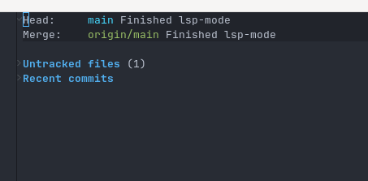

It starts off pretty minimal. It shows the branch and log message of the last Head commit
(the `Finished lsp-mode` message), and shows what remote it's tied to. It shows that there
is one untracked file (the file I'm currently writing) but does not show exactly which ones
are untracked. Finally it shows a heading for recent commits with nothing listed.

This seems to be called the status buffer. 

Switching to this buffer and pressing `RET` on `Untracked Files` gives me a message that

> There is no thing at point that can be visited.

So on the outset I am not sure how to see the actual files that are untracked. I then
selected `Recent commits` and it opened the following in my other buffer:

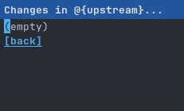

This isn't winning any awards for user friendlyness. I can only assume that Recent commits are
ones not actually pushed to the remote yet?

After playing around with the UI a bit more it turns out I'm not supposed to be pressing
`RET` on these headings, but use `TAB` to collapse/expand these sections.

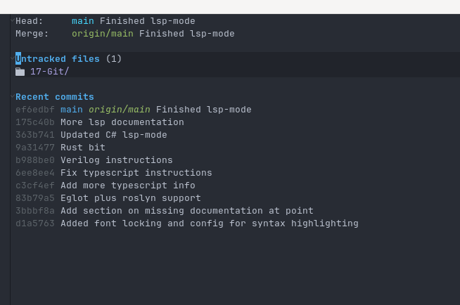

So this allows us to only see what we want to see at any given time.

Navigating with `n` and `p` is exactly like when working in `dired`, so that's natural at
least. I can then highlight any directory and it will open it up in `dired`, if I select
a file it'll open a buffer for it, and if I select a recent commit it will bring up
the diff from that commit in the "other window".

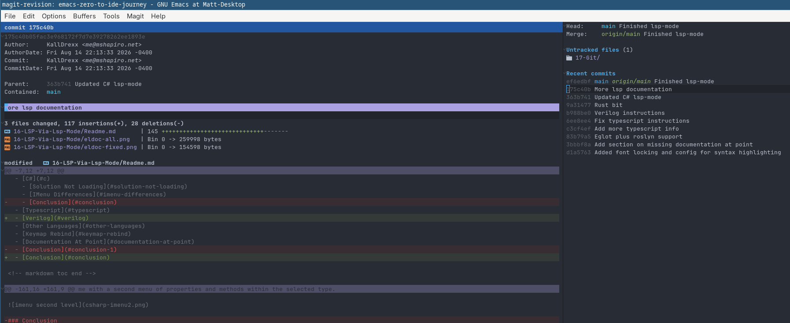

One thing is becoming clear, the back and forth that this interface has is making it
clear I need to figure out a window management strategy. That will have to wait for
its own deep dive though.

Unsure of what to do next, I hit `?` and was presented with help for the keyboard commands.

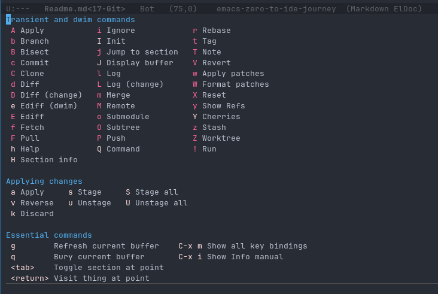

## Fetching

In my case I know I have a commit on the remote that hasn't been pulled down yet, so let's
fetch it. According to the help we can do that with `f`. That presents me with:

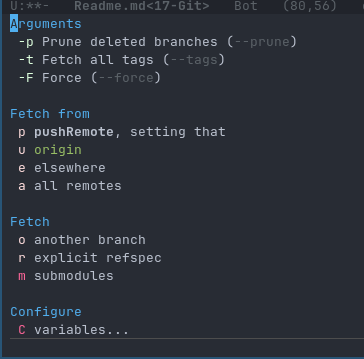

Typing `-` made it visually clear what options will still remaining, and doing `-p u` allowed
it to pull from origin. Now I can see the unpulled commits.

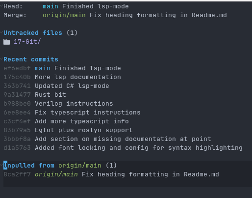

I can then pull them locally with `F u`. 

## Committing

Now that I am up to date, I can navigate to my untracked or changed files and stage them as
a whole (or in my case, stage the directory).

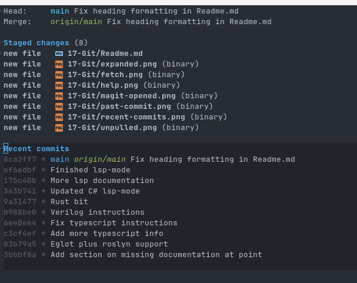

Now that individual files are listed due to the staging, I can actually highlight a file
and expand the contents with `TAB` to see the changes in that file.

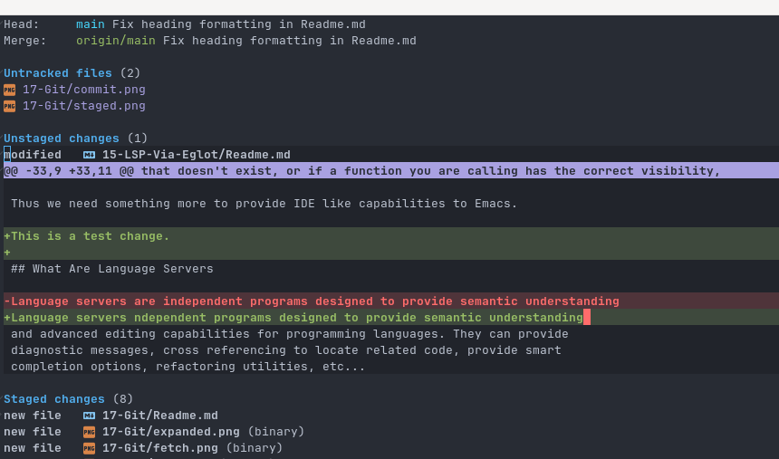

Ok so let's assume we don't want part of this change, how can we manage that? It turns
out we can type `d d` (diff do-what-i-mean) to open up the diff of all unstaged changes. This
allows us to use the `n` and `p` keys to navigate the changes. 

We can then use `s` or `k` to stage or discard individual chunks.

Once done we can stage all the chunks we want to commit, and then commit with `c c`. This will
pop up two windows, one with a diff buffer for the commit and another where you enter the actual
commit message.

After writing the commit it was not obvious how to proceed with the commit. It turns out you have
to `C-c C-c` to do so. That took me a while to find and I'm not sure how you are meant to
discover that. Eventually I noticed it tells you this in the echo buffer (and thus messages
buffer) but only for a short time, so it went away before I noticed it.

Now that you have an unmerged commit, you can push it up to the origin with `P u`. 

## Merge Conflicts

So lets figure out what merge conflict handling is like. I made a commit locally and a commit
on the remote that will trigger a conflict. So let's push our local commit before fetching:

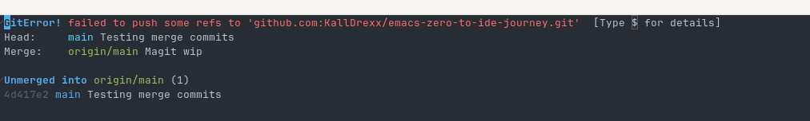

Pressing `$` shows the git command line output saying that our branch is behind. So lets pull.

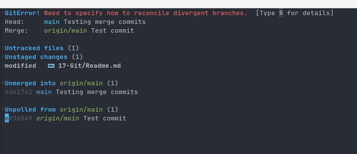

So it recognized that we could not pull successfully and we have one unmerged commit and 
one unpulled commit. However, this isn't necessarily because of a merge conflict, just that
I have not set this machine's git config on how to automatically resolve diverged branches
(I usually have it auto-rebase local commits on remote). 

After setting that up I try a pull again. Now we have the merge conflict.

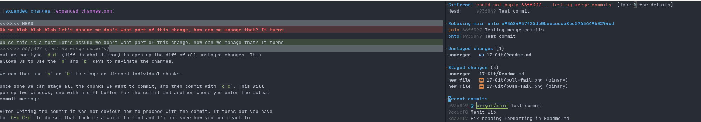

This has opened an `smerge` buffer, which is a built in mode for handling merges. You can use
`C-c ^` to access merge commands. You can do `C-c ^ n` and `C-c ^ p` to navigate to different
merge changes. `C-c ^ u` to keep the upper change while `C-c ^ l` to keep the lower (or 
`C-c & a` to keep both). Not the most ergonomic but we'll see.

After finishing and saving, I went back to the magit interface and did `r r` to continue 
the rebase (since I had it setup to rebase the pull). Once completed I was free to pull
and push successfully.

## Cloning A New Repository

Sometimes I need to clone a repository that I do not have locally. This can be done with the
`M-x magit-clone`. 

## Conclusion

Magit definitely has a lot of options and definitely seems to mimic the command line interface.
The complications I see from it mostly come from getting a handle on Emacs window management
and handling merges with Emacs. Both will require their own larger deep dives.

