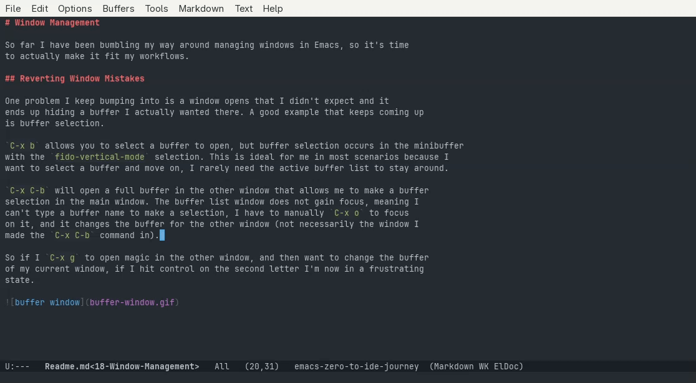
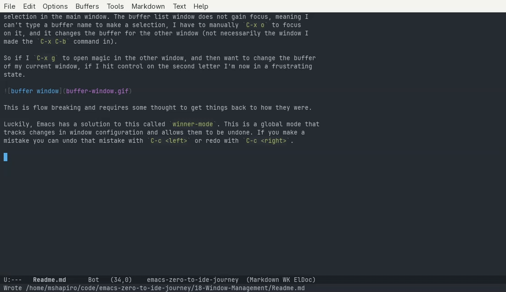
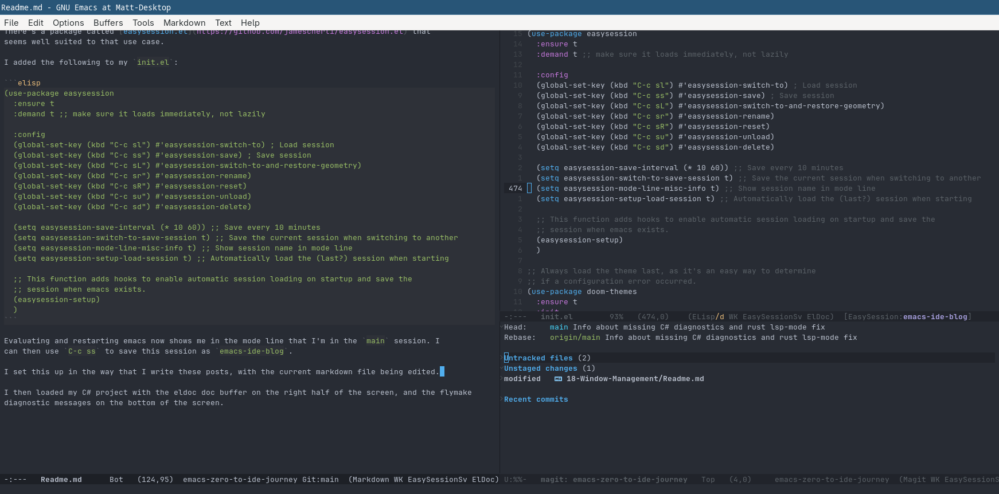
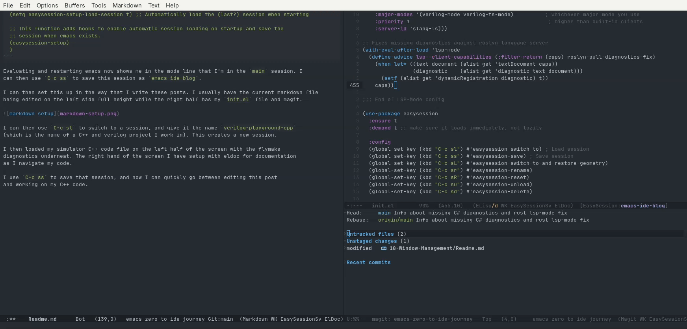

# Window Management

<!-- markdown toc start -->
**Table of Contents**

  - [Undoing Window Mistakes](#undoing-window-mistakes)
  - [Persisting Buffers And Windows](#persisting-buffers-and-windows)
    - [desktop.el](#desktopel)
    - [easysession.el](#easysessionel)
  - [Tabs Per File](#tabs-per-file)
  - [Conclusion](#conclusion)

<!-- markdown toc end -->

So far I have been bumbling my way around managing windows in Emacs, so it's time
to actually make it fit my workflows.

## Undoing Window Mistakes

One problem I keep bumping into is a window opens that I didn't expect and it
ends up hiding a buffer I actually wanted there. A good example that keeps coming up
is buffer selection.

`C-x b` allows you to select a buffer to open, but buffer selection occurs in the minibuffer
with the `fido-vertical-mode` selection. This is ideal for me in most scenarios because I
want to select a buffer and move on, I rarely need the active buffer list to stay around.

`C-x C-b` will open a full buffer in the other window that allows me to make a buffer
selection in the main window. The buffer list window does not gain focus, meaning I
can't type a buffer name to make a selection, I have to manually `C-x o` to focus
on it, and it changes the buffer for the other window (not necessarily the window I 
made the `C-x C-b` command in).

So if I `C-x g` to open magic in the other window, and then want to change the buffer
of my current window, if I hit control on the second letter I'm now in a frustrating
state.



This is flow breaking and requires some thought to get things back to how they were.

Luckily, Emacs has a solution to this called `winner-mode`. This is a global mode that 
tracks changes in window configuration and allows them to be undone. If you make a
mistake you can undo that mistake with `C-c <left>` or redo with `C-c <right>`.



With winner mode active, if I accidentally do `C-x C-b` I can just do `C-c <left>`
and be right back in my previous state.

We can make this permanent by adding the following to the `use-package emacs` `:config`
section:

```elisp
(winner-mode 1)
```

## Persisting Buffers And Windows

### desktop.el
Everytime I exit Emacs (sometimes by accident, doing `C-x C-c` instead of `C-c C-x`)
I have to start fresh. No buffers are loaded and only a single window. This can be
quite disruptive even if I intentionally exit or restart Emacs, as it's not unusual
that the intention is to resume the work I was doing before.

Emacs has an internal package named `desktop.el` that attempts to make this easier. You
can save your current desktop configuration at any time with `M-x desktop-save`. Then
upon a restart you can reload it via `M-x desktop-read`.

Importantly, this did not just restore the buffers that were visible, but typing `C-x b`
confirms that it restored all existing buffers. This could get a bit messy if you do not
kill buffers often. For example, I had a rust buffer open when I did a `save`, and thus
when I did a `read` I saw messages of lsp-mode activating and starting rust analyzer, 
even if I had no intention of doing any rust development.

This created a `~/.emacs.d/.emacs.desktop` file. Opening it shows it's just some lisp
function calls and not a custom configuration format. 

We can have Emacs automatically save and restore the desktop by
adding the following into the `use-package emacs`'s `:init` section

```elisp
(desktop-save-mode 1)
```

Now typing `M-x restart-emacs` brings us back to exactly where we were. We can also add
`(desktop-restore-eager 10)` to the `:custom` section in order to only eagerly load the
first 10 buffers when the desktop session is restored, and load the rest lazily in the
background while emacs is loading.

We can completely clear all the buffers and windows with `M-x desktop-clear`.

### easysession.el

desktop.el is great for restoring Emacs to how it was back when I quit, but it's not good
at remembering how things should be setup in different contexts and switching between it.

One thing I mentioned in the project management post is how I bounce between different
projects a bunch, and in some cases I want completely different buffes and window 
configurations setup between them. It would be nice not to have to recreate them every
time.

There's a package called [easysession.el](https://github.com/jamescherti/easysession.el) that
seems well suited to that use case.

I added the following to my `init.el`:

```elisp
(use-package easysession
  :ensure t
  :demand t ;; make sure it loads immediately, not lazily

  :config
  (global-set-key (kbd "C-c sl") #'easysession-switch-to) ; Load session
  (global-set-key (kbd "C-c ss") #'easysession-save) ; Save session
  (global-set-key (kbd "C-c sL") #'easysession-switch-to-and-restore-geometry)
  (global-set-key (kbd "C-c sr") #'easysession-rename)
  (global-set-key (kbd "C-c sR") #'easysession-reset)
  (global-set-key (kbd "C-c su") #'easysession-unload)
  (global-set-key (kbd "C-c sd") #'easysession-delete)

  (setq easysession-save-interval (* 10 60)) ;; Save every 10 minutes
  (setq easysession-switch-to-save-session t) ;; Save the current session when switching to another
  (setq easysession-mode-line-misc-info t) ;; Show session name in mode line
  (setq easysession-setup-load-session t) ;; Automatically load the (last?) session when starting

  ;; This function adds hooks to enable automatic session loading on startup and save the
  ;; session when emacs exists.
  (easysession-setup)
  )
```

Evaluating and restarting emacs now shows me in the mode line that I'm in the `main` session. I
can then use `C-c ss` to save this session as `emacs-ide-blog`.

I can then set this up in the way that I write these posts. I usually have the current markdown file 
being edited on the left side full height while the right half has my `init.el` file and magit.



I can then use `C-c sl` to switch to a session, and give it the name `verilog-playground-cpp` 
(which is the name of a C++ and verilog project I work in). This creates a new session. 

I then loaded my simulator C++ code file on the left half of the screen with the flymake
diagnostics underneat. The right hand of the screen I have setup with eldoc for documentation
as I navigate my code.

I use `C-c ss` to save that session, and now I can quickly go between editing this post
and working on my C++ code.



This is extremely nice and fast.

It doesn't kill buffers when swapping. This is both a good thing and a bad thing.

It's good because this makes it extremely fast to save different views of the same project. For instance
you may have one window and buffer layout for debugging vs writing code for the same project. This
makes it easy to swap between layouts without having to close and reload the same buffers and
LSP sessions.

It's bad because you will accumulate a lot of buffers, especially if it's setup to save
when you switch to a new session (which I keep going back and forth on). This means your sessions
will constantly keep accumulating buffers that get loaded upon a fresh emacs load, even when
some of the buffers are completely irrelevant to the task at hand. 

You can add a `:hook` with the following to fully reset when loading
a session:

```elisp
(easysession-before-load . easysession-reset) ;; kills all frames, windows, and buffers
(easysession-before-load . easysession-kill-all-buffers) ;; Only kills buffers
```

Only one should be used, whichever makes the most sense. I have not yet decided if I want this
active and the overhead of reloading buffers every time I switch, so I do not have either of these
active.

This setup seemed like a perfect solution, but after some cracks started to show for me. It works well
when the session's buffers are already active, but if you save a session with buffers that have a
pre-requisite action then those don't come up after a restart. For example, the eldoc doc buffer does
not come up without the `eldoc-doc-buffer` command being invoked. So if you save the doc buffer and then
restart Emacs, that whole area of your window won't restore when loading the session.

I also kept forgetting what session I was in at times, and the auto-save would then leave it in an
unexpected state for the next load. 


## Tabs Per File

Many modern editors normally put each open file in it's own visual tab. The default Emacs setup does not
have this, and encourages you to use buffers. However tabs can sometimes be useful to keep track of a
select few buffers and cycle through them without having to filter through the full list of open buffers.

Back in the project management post I talked about tabs in the tab bar. That tab bar is meant to have different
workspaces with different layouts, but is not really meant to have one layout where multiple buffers exist as
tabs within a single window.

For that functionality, we don't want a tab bar but a 
[window tab line](https://www.gnu.org/software/emacs/manual/html_node/emacs/Tab-Line.html).  

These can be enabled in the current window via `M-x tab-line-mode`. This now adds a tab set at the top of the
current window. When I open a new file in the current buffer the new buffer opens and adds a new tab for it.
I can then cycle through these tabs via `C-x C-<left>` and `C-x C-<right>`.

This can be useful to group a bunch of similar buffers into a window. For example, you can open multiple
terminal sessions in a single window and have them all tabbed in that one window.

Well sort of. One issue I have found is that opening a new file in the window with tab line mode activated
does not automatically show the tab line in the newly opened buffer. I have to cycle tabs with the keyboard
before seeing the tab line again. This happens because I didn't enable tab line mode globally for all windows
with `M-x global-tab-line-mode`.

Although that didn't quite fix the issue either for me. The unpredictability of if and when I would see
the tab bar, and what buffers would get added as tabs made it unreliable for me.

## Conclusion

Emacs gives a bunch of flexibility for different people's workflows. I've gone back and forth and I think
going going the `desktop-save-mode` by itself gives me a good starting point that is reliable and predictable. 
I may end up going the`tab-bar-mode` to organizes workspaces as the need arises.


