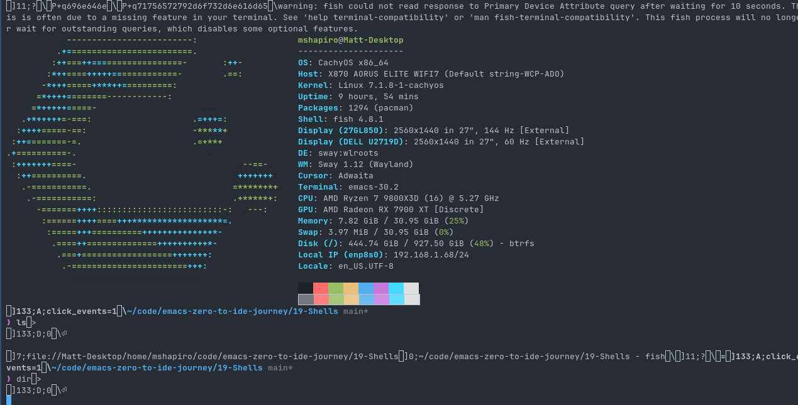
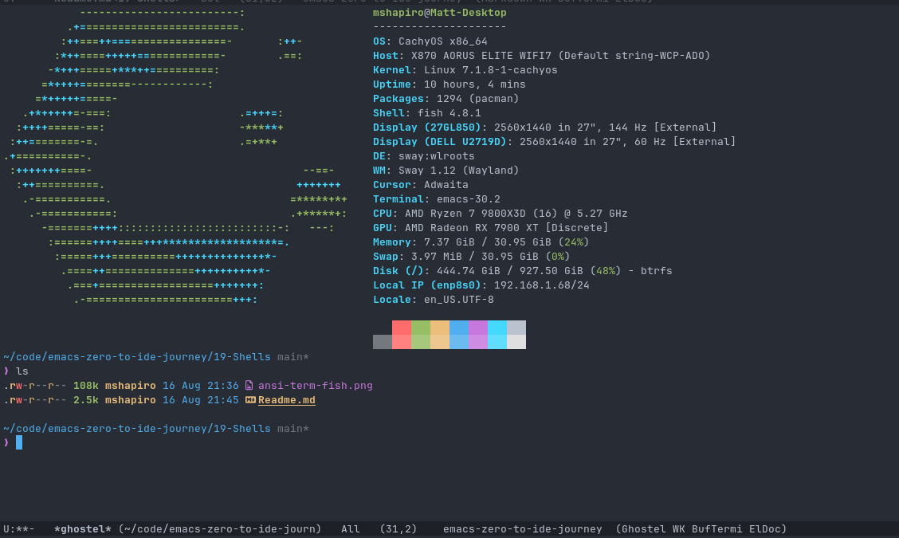

## Shells

It's pretty common to need a terminal, either to execute a one off command for a more
long lasting interactive sessions. 

Having a terminal session active within Emacs is useful so that you can have information from
the terminal session side by side the Emacs content being edited, without relying on
your window manager or tmux (if using Emacs within the terminal).

## ansi-term

Emacs comes with the `M-x ansi-term` terminal. When run interactively, it asks which command
you wish to run.

I did some basic tests with bash and it worked ok. I didn't try it out much though because
my main terminal shell is fish, and fish seems completely unusable within ansi-term.



I know that fish does a lot of non-standard things and that's probably why. That being
said, it's what I'm used to and what I have configured, so I'm not going to change
just for Emacs.

So I'm sure `ansi-term` is fine, but it won't work for me.

## ghostel

[Ghostel](https://github.com/dakra/ghostel) is a package that uses the libghostty-vt
terminal engine. It claims to be fast, so lets see if that works.

I'm using the fuller example from the page in my `init.el`

```elisp
(use-package ghostel
  :ensure t
  :bind (("C-x m" . ghostel)
         :map ghostel-semi-char-mode-map
         ("C-s"  . consult-line)
         ("C-k"  . my/ghostel-send-C-k-and-kill)
         ;; I'm used to go up/down the shell history with M-n/p from eshell
         ;; Simulate this behavior in ghostel by sending C-p and C-n
         ("M-p" . (lambda () (interactive) (ghostel-send-key "p" "ctrl")))
         ("M-n" . (lambda () (interactive) (ghostel-send-key "n" "ctrl")))
         :map project-prefix-map
         ("m" . ghostel-project)
         ("M" . ghostel-project-list-buffers))
  :config
  (defun my/ghostel-send-C-k-and-kill ()
    "Send `C-k' to ghostel.
Like normal Emacs `C-k'.  Kill to end of line and put content in kill-ring."
    (interactive)
    (kill-ring-save (point) (line-end-position))
    (ghostel-send-key "k" "ctrl"))

  (add-to-list 'project-switch-commands '(ghostel-project "Ghostel") t)
  (add-to-list 'project-switch-commands '(ghostel-project-list-buffers "Ghostel buffers") t)
  (add-to-list 'ghostel-eval-cmds '("magit-status-setup-buffer" magit-status-setup-buffer)))
```

I then run `M-x ghostel` and get prompted if I want to download the native module or compile it
myself. I chose to download the precompiled version and viola.



One nice thing about the ghostel package is I can do `M-x ghostel-project`, which starts a new
ghostel terminal session that's bound to my current project, which means it'll show up if I
am in a project buffer and do `C-x p b`. However, this does not necessarily support multiple terminals
under the project, since hitting `M-x ghostel-project` will just open a new window to the existing
project buffer.

This is resolved by opening a new ghostel window and navigating to the project folder. Once ghostel
sees that you are inside the root of an Emacs project, it will associate it with that project.

It integrates properly with `desktop.el`, so if `desktop-save-mode` is active the terminal will come
back at the same directory it was originally at.

Typing `C-c C-e` puts the terminal in emacs mode, where I can move the cursor around with standard
Emacs keyboard commands and mark/copy/paste output that I want.

The performance feels great and I haven't noticed any issues with it so far.
