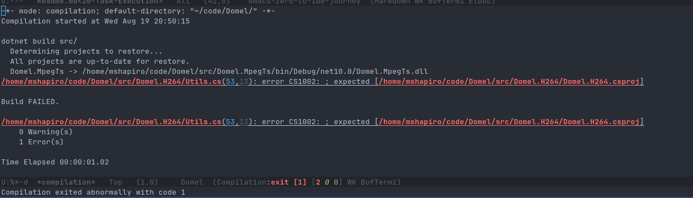
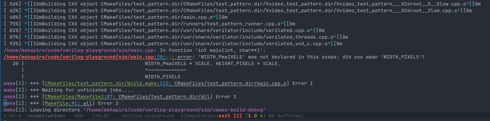
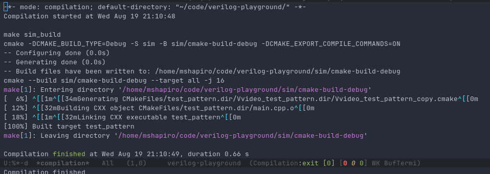
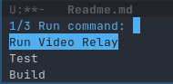

# Task Execution
<!-- markdown toc start -->
**Table of Contents**

  - [Ad-Hoc Commands](#ad-hoc-commands)
    - [Compilations](#compilations)
  - [Per Directory Local Variables](#per-directory-local-variables)
  - [Custom Interactive Functions](#custom-interactive-functions)
    - [Making It Easier With Macros](#making-it-easier-with-macros)

<!-- markdown toc end -->

It is a common need to run commands to perform different actions against your project
from within your editor. VSCode and Zed both use `task.json` files to specify how
they are run, and JetBrains IDEs have run configurations. Lets see how we can
do the same in Emacs!

## Ad-Hoc Commands

One way to execute arbitrary commands is with the `M-!` key binding. This will ask you
to specify what shell command to run and it will run. Once it is finished it will open
a buffer with the results.

**This is run synchronously**, which means if you run a command that takes a while (like
a fresh compile or a test run) your Emacs instance will be frozen until it has finished
(or until you `C-g` spam enough times to interrupt it).

Instead you can use `M-&` to run a shell command asynchronously. This will open an
`*Async Shell Command*` buffer with the results, and the results will stream into
the buffer as they are executed. This is usually more ideal than the synchronous
version unless you are absolutely sure the shell command won't block.

### Compilations

If you want to compile your code, then `M-x compile` is a better command than `M-&`. When
you run it you will be prompted for the command to run to compile the project. It will default
to `make` but you can change it to anything (such as `cargo build`, `npm build`, `dotnet build`, etc...). 
It will open it up in a compilations buffer but it will be run asynchronously and not block anything.

This explicit compilation command has several advantages than just running `M-&` alone:

1. It shows the compilation status and exit code in the mode line
2. It remembers the last compilation command, so another `M-x compile` defaults to it
   or a `M-x recompile` immediately re-executes it.
3. It uses regular expressions to find errors. It highlights any errors it finds and makes
   them clickable directly to the buffer for the file and placing the cursor directly on the
   line that caused the error.
4. You can use `M-g M-n` and `M-g M-p` to navigate between the errors in the compilation buffer
   (well in theory, for some reason this didn't work for me in my tests).
   






You can also execute this from the project root via `C-x p c`. This is required if you are
currently viewing a file and need to run a script that's not in that same file's directory.

It seems like error detection works for many languages but not rust. The supported languages can
be found in by describing the `compilation-error-regexp-alist` variable. At a quick glance I wasn't
able to find a quick solution to getting rust errors highlighting. Most other languages I tried
seemed to work though.

The fact that this remembers the last compilation command is a blessing and a curse. It does
not remember the last command on a project by project basis but globally, so if you need to
swap between projects you will constantly have to change the command.

Compilation buffers default to keeping the point at the top of the buffer and not scroll
as the contents of the buffer scrolls. This is confusing for me because generally errors
and final status are the most important things to me and those tend to be at the bottom. I will
scroll up if I need to see more details, but the initial context for me is usually at the end
of the compilation output.

This can be fixed by adding the following to the `use-package emacs`'s `:custom` section:

```elisp
(compilation-scroll-output t)
```

The shell that `M-x compile` runs compilation in does not handle a lot of modern console
commands very well, and it can't actually do positional updates. So if you have a compilation
command that has its current status in a single spot it will end up scrolling each status
update as a new line. It will also show console escape characters for a lot of functionality.

If you are using the `ghostel` shell, you can have all compilation commands run through
ghostel (and thus fix these issues) by adding the following to `use-package ghostel`'s `:custom` section:

```elisp
(ghostel-compile-global-mode 1)
```


## Per Directory Local Variables

When opening files and projects Emacs looks for a `.dir-locals.el` file, and if it exists it
will load the variables from that file. This can be used to force major modes, indentations,
etc... 

However it can also be used for project wide settings. For example, adding the following
to the `.dir-locals.el` in a rust's project root:

```elisp
((nil . ((compile-command . "cargo build"))))
```

Now opening the project with `C-x p p` and then running `C-x p c` to compile the project will
automatically set the default compilation target to `cargo build`. Unfortunately, once you change
this it doesn't stick so that limits its usefulness a bit.

Another option is to specify a list of lambdas contained within a variable that could be
executed. So in my video rust project I have the following in my `.dir-locals.el`

```elisp
((nil . ((my-project-commands
          . (("Build" . (lambda () (compile "cargo build")))
             ("Test"  . (lambda () (compile "cargo test")))
             ("Run Video Relay" . (lambda ()
                                     (let ((default-directory (project-root (project-current t))))
                                       (async-shell-command "cargo run --bin video-relay")))))))))
```

By default this does nothing because nothing knows about a `my-project-commands` variable. However,
we can add the following into our `init.el` to run it:

```elisp
;; Allow executing project commands
(defvar-local my-project-commands nil
  "Alist of (LABEL . THUNK) commands, normally set via `.dir-locals.el'.")

(defun my/project-run-command ()
  "Interactively select and run one of the buffer's `my-project-commands'."
  (interactive)
  (unless my-project-commands
    (user-error "No `my-project-commands' defined for this buffer"))
  (let* ((choice (completing-read "Run command: "
                                   (mapcar #'car my-project-commands)
                                   nil t))
         (thunk (cdr (assoc choice my-project-commands))))
    (if (functionp thunk)
        (funcall thunk)
      (user-error "`%s' is not callable" choice))))

(global-set-key (kbd "C-c p r") #'my/project-run-command)
```

After evaluating this and re-opening our project we can now use `M-x my/project-run-command` and get
a list of available commands for that project:



This works but has some quirks. The first quirk is that Emacs doesn't automatically notice an update to
`.dir-locals.el`, and so the easiest way I have found to make it take effect is to kill all project
buffers and then reload the project `C-x p k C-x p p`. Since editing this file probably isn't an everyday
occurrance that's probably fine.

The bigger issue is that having lambdas in a `.dir-locals.el` file triggers a warning from Emacs
*every time you open a file in this project*. That's because if a malicious actor adds code into a
variable it can get code execution. You can mark this specific variable as safe by adding the following
in the `init.el`.

```elisp
(put 'my-project-commands 'safe-local-variable #'listp)
```

You just have to be aware that if you download a project with that same variable name wiht malicious
code, it could cause execution of code you didn't intend. You will need to evaluate that risk on
your own.

## Custom Interactive Functions

I spent a while playing with the `.dir-locals.el` concept and looking for a package when I realized
I can just define custom interactive functions just like I have already been doing.

My Emacs configuration is synced across multiple personal and work machines, so I need tasks to work
even if the absolute path of a project root is different. Luckily, we can ask Emacs for every
known project root with the `project-known-project-root` variable. So my initial idea is to have
each task get the relevant absolute root from the emacs known project list, and execute from there.

I created an `~/.emacs.d/tasks.el` file to keep all this logic together, and tell my `init.el` to
load it via:

```elisp
(load-file (locate-user-emacs-file "tasks.el"))
```


We can then add functions to run the same tasks as in the `.dir-local.el` example with the following:

```elisp
(defun my/find-relevant-project-root (string)
  "Searches all known project roots for one ending in the specified string"
  (seq-find (lambda (path) (string-suffix-p (concat string "/") path))
            (project-known-project-roots)))


(defun my/rml/run-build ()
  "Runs a compilation for the rust-media-libs project"
  (interactive)
  (let ((default-directory (my/find-relevant-project-root "rust-media-libs")))
    (if (not default-directory)
        (message "No known project for 'rust-media-libs'")
      (compile "cargo build")
      (with-current-buffer "*compilation*"
        (rename-buffer "*compilation: rml build*" t))
      )
    )
  )

(defun my/rml/run-tests ()
  "Runs tests for the rust-media-libs project"
  (interactive)
  (let ((default-directory (my/find-relevant-project-root "rust-media-libs")))
    (if (not default-directory)
        (message "No known project for 'rust-media-libs'")
      (compile "cargo test")
      (with-current-buffer-window "*compilation*"
          (rename-buffer "*compilation: rml test*" t))
      )
    )
  )

(defun my/rml/run-video-relay ()
  "Runs the video relay project for the rust-media-libs project"
  (interactive)
  (let ((default-directory (my/find-relevant-project-root "rust-media-libs")))
    (if (not default-directory)
        (message "No known project for 'rust-media-libs'")
      (async-shell-command "cargo run --bin video-relay")
      (with-current-buffer "*Async Shell Command*"
        (rename-buffer "*Async Shell: rml video-relay*" t))
      )
    )
  )
```

With the power of orderless and completions read, I can type `M-x rml build` to select `my/rml/run-build`, which
will now open a compilation specific for the `cargo build` run. Since we rename the created buffers they won't
conflict or overwrite each other when they run.

While this isn't scoped to the actual Emacs project I am working in (like the `.dir-locals.el` solution),
that is ok because it also means I am able to start an application for one Emacs project while coding
for another one. Since I bounce around a lot of different git repositories for my day job this is less
context I have to keep track of.

### Making It Easier With Macros

So each of those functions can be a bit time consuming to write and it's mostly
boilerplate. We can actually take advantage of elisp's macro system too make this
vastly easier to write out.

Instead of the `defun`s specified above we can replace it with the following macro:

```elisp
(defun my/find-relevant-project-root (string)
  "Searches all known project roots for one ending in the specified string"
  (seq-find (lambda (path) (string-suffix-p (concat string "/") path))
            (project-known-project-roots)))

(require 'cl-lib)
(cl-defmacro my/deftask (task-name &key compile shell new-buffer-name description project-name dir)
  "Defines an interactive function to run a project task. You must pass in a name for the task,
 which will be the name for the interactive function (what M-x executes).

The function for the task is a shell command that can either be executed with the Emacs compile
function (via :compile) or as an async shell execution (via :shell).

The task can be executed from a specific directory. A specific directory can be specified with the
:dir keyword or you can use the root of a known Emacs project with :project. Only one of these
should be specified.

When :project is used, it should be the inner most directory from the absolute path of the project
root. So if `C-x p p` shows the directory \"~/code/test/\" then you can specify ':project \"test\"`.

By default, compilations use the same buffer and will overwrite each other. Likewise async shell
executions always have a buffer named '*Async Shell Command*'. The task specific buffer can be
given a specific name via the :new-buffer-name keyword.

The created interactive function can be given a description with the :description keyword.
"
  (declare (indent defun))
  (unless (or shell compile)
    (error ":compile or :shell must be specified"))
  (unless (or project-name dir)
    (error ":project-name or :dir must be specified"))
  (unless (not (and project-name dir))
    (error "Both :project-name and :dir cannot be specified, only one should be specified"))
  `(defun ,task-name ()
     ,description
     (interactive)
     (let ((default-directory 
            ;; set default-directory either to the specified project's root or the cwd
            ,(cond
              (project-name `(my/find-relevant-project-root ,project-name))
              (dir dir)
              )))
       
       (if (not default-directory)
           ;; Should only be here if project-name was provided but no project root was resolved
           (message "No known project for '%s'" ,project-name)
         ,(when compile
            `(progn
               (compile ,compile)
               ,(if new-buffer-name
                    `(with-current-buffer "*compilation*"
                       (rename-buffer ,new-buffer-name)))
               )
            )
         ,(when shell
            `(progn
               (async-shell-command ,shell)
               ,(if new-buffer-name
                   `(with-current-buffer "*Async Shell Command*"
                      (rename-buffer ,new-buffer-name)))
               )
            )
         )
       )
     )
  )
```

This may be daunting if you haven't worked with lisp before (and it was for me initially
trying to write it) but it allows us to outilize a `my/deftask` to define interactive functions
for different tasks.

This allows us to do the following to write out the tasks I previously wrote the `defun`s for:

```elisp
(my/deftask my/rml/run-build
  :project-name "rust-media-libs"
  :description "Runs a compilation for the rust-media-libs-project"
  :compile "cargo build"
  :new-buffer-name "*compilation: rml build*")

(my/deftask my/rml/run-tests
  :project-name "rust-media-libs"
  :description "Runs all tests for the rust-media-libs project"
  :compile "cargo test"
  :new-buffer-name "*compilation: rml tests*")

(my/deftask my/rml/run-video-relay
  :project-name "rust-media-libs"
  :description "Runs the video relay executable for the rust-media-libs project"
  :shell "cargo run --bin video-relay"
  :new-buffer-name "*Async Shell: rml video-relay*")
```

That's much easier to read and quickly define more. Even though it's much more concise, I am
still able to `M-x my/rml/run-video-relay` to run the video relay executable for my project.

### Grouping Project Tasks Together

In the above task list, there are two minor inconvieniences.

The first is that you have to repeat the project name for every task for that project, and hope
you don't accidentally mistype it in one of them.

The bigger inconvienience though is that this always adds every task's interactive function
into Emacs, thus always showing them in `M-x`. This may not be a big issue if your `tasks.el`
is only used on a single machine, but since I have my configuration synced across multiple
personal and work devices this causes a lot of command bloat.

We can address both of these by having a macro that generates a `my/deftask` call for a specific
project, but *only* if Emacs knows about that project. The idea is that if Emacs doesn't have
knowledge of the task that project probably doesn't exist on that computer and therefore isn't
relevant.

The macro to do this is:

```elisp

(defmacro my/def-project-tasks (project-name &rest specs)
  "Define multiple tasks for PROJECT-NAME only if PROJECT-NAME is a project that
is currently recognized by Emacs. The SPECS is (NAME . DEFTASK-PLIST) to define
the non-project-name properties of the task.

This is primarily used to allow synchronization of this tasks.el file without
polluting the interactive function list with tasks for projects that are not
on that host."
  (declare (indent defun))
  `(when (my/find-relevant-project-root ,project-name)
     ,@(mapcar (pcase-lambda (`(,name . ,args))
                 `(my/deftask ,name :project-name ,project-name ,@args))
               specs)
     )
  )
```

The task definitions now can be replaced with:

```elisp
(my/def-project-tasks "rust-media-libs"
  (my/tasks/rml/run-build
    :description "Runs a compilation for the rust-media-libs-project"
    :compile "cargo build"
    :new-buffer-name "rml: compile")
  
  (my/tasks/rml/run-tests
    :description "Runs all tests for the rust-media-libs project"
    :compile "cargo test"
    :new-buffer-name "rml: tests")
  
  (my/tasks/rml/run-video-relay
    :description "Runs the video relay executable for the rust-media-libs project"
    :shell "cargo run --bin video-relay"
    :new-buffer-name "rml: video-relay")
  )
```

Now on my personal laptop and work computer these commands won't even exist because I do not have
this project on those machines. Likewise, any tasks I define for work projects wont' show up
on my personal machines. It also made it slightly easier to type.

### Ghostel Command Execution

If you are using the `ghostel` package, then you can have the `:compile` and `:shell` commands run through
ghostel instead of normal shells. Besides the more modern terminal handling, it actually allows for easier
buffer management and buffer re-use.

This can be done by modifying the `my/deftask` macro's compile/shell section with:

```elisp
         ,(when compile
            `(let ((ghostel-compile-buffer-name ,new-buffer-name))
               (ghostel-compile ,compile))
            )
         ,(when shell
            `(let ((buffer (get-buffer-create (or ,new-buffer-name "*ghostel-run*"))))
               (display-buffer buffer)
               (prog1
                   (ghostel-exec buffer shell-file-name ;; Use the system shell to execute the command
                                 (list shell-command-switch ,shell))
                 (with-current-buffer buffer
                   ;; Ghostel kills variables upon entering its mode, so we need to set this after
                   ;; exec has run so it still is set on the buffer
                   (setq-local ghostel-kill-buffer-on-exit nil))
                 )
               buffer))
```


## Conclusion

The macro setup is mostly all I need from a task runner, so I'm pretty happy with the final result.
