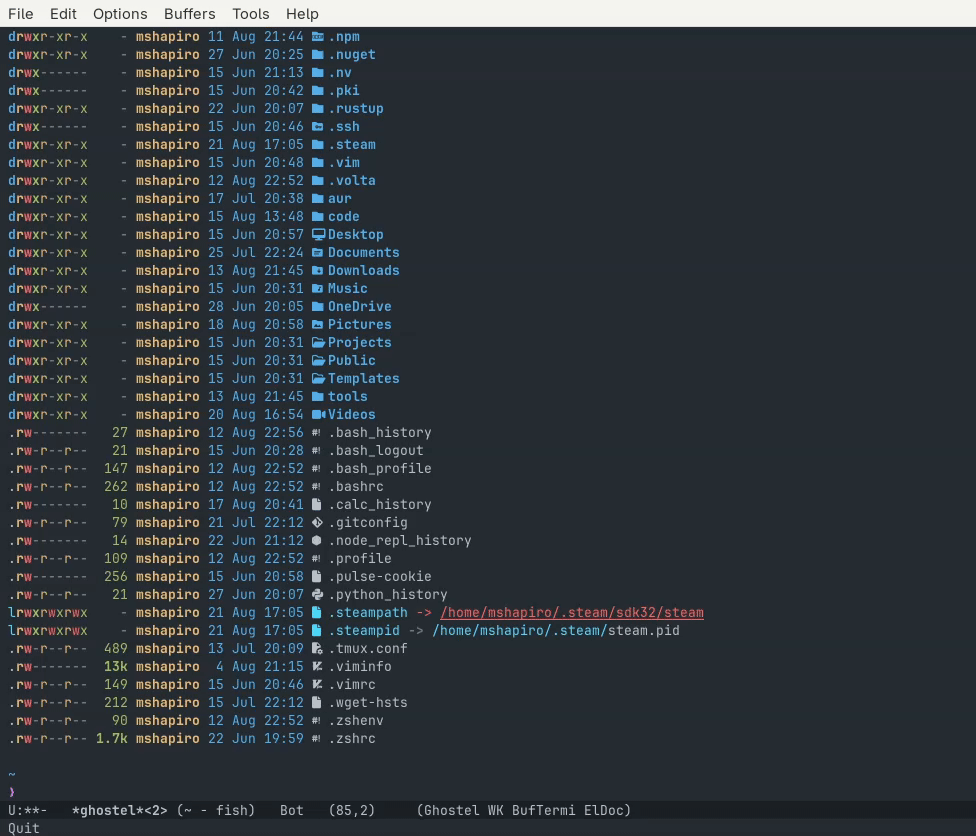
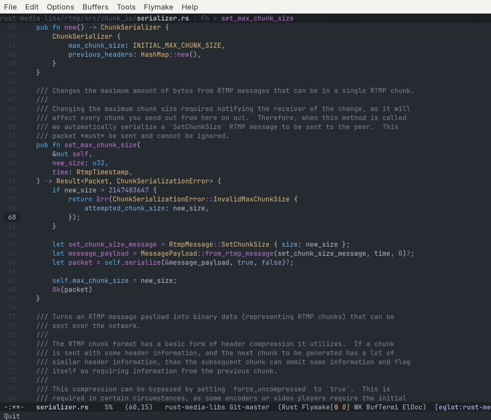
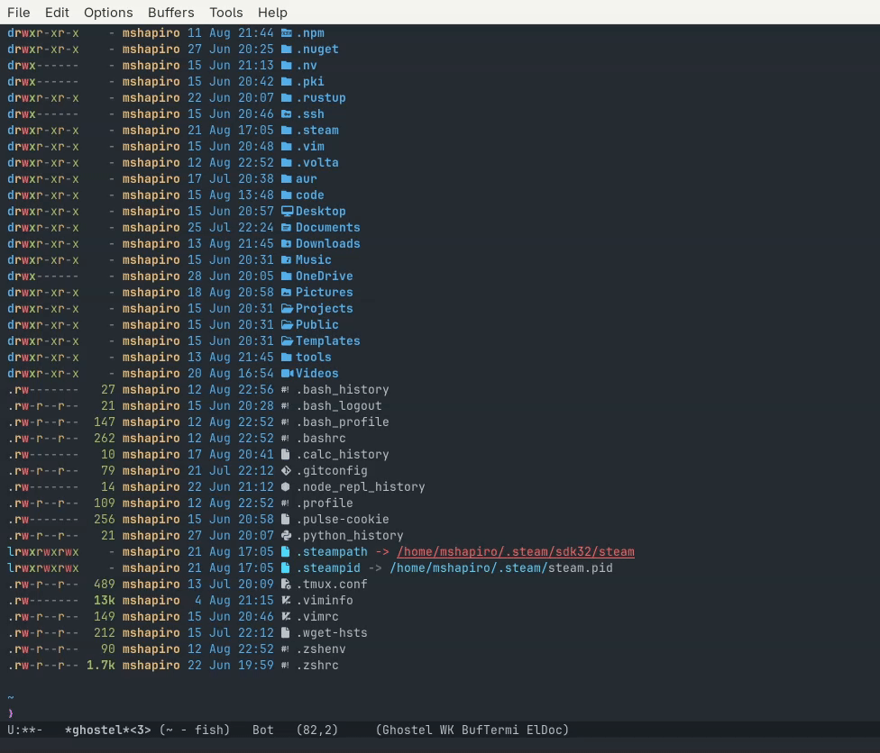
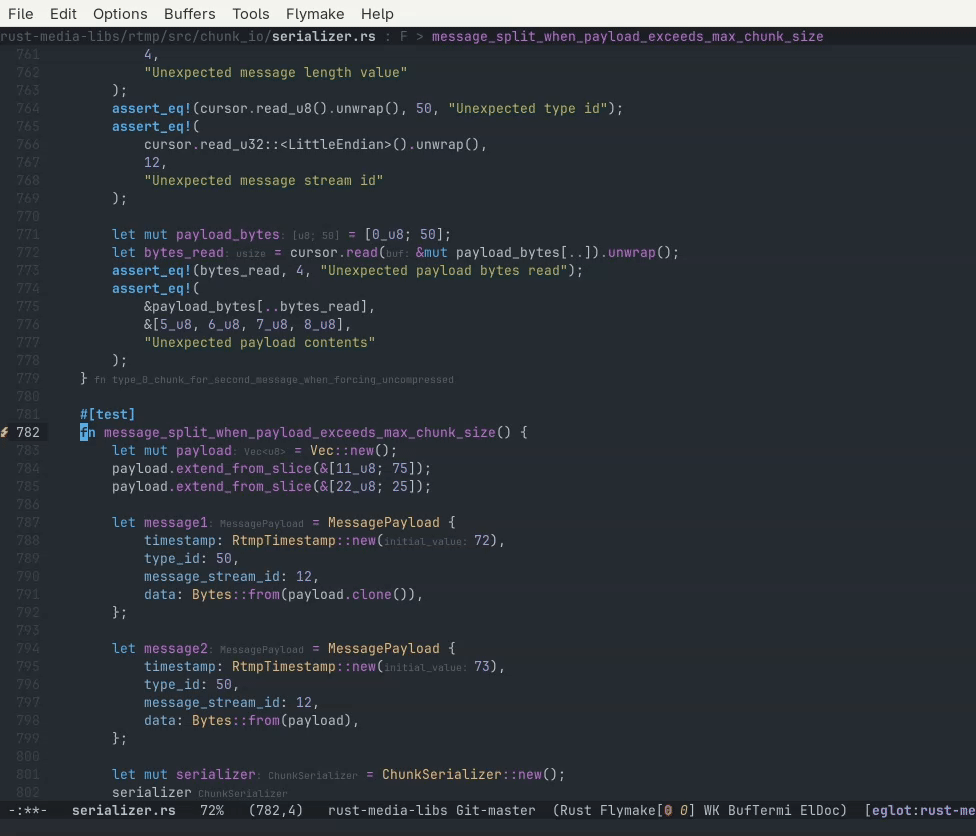
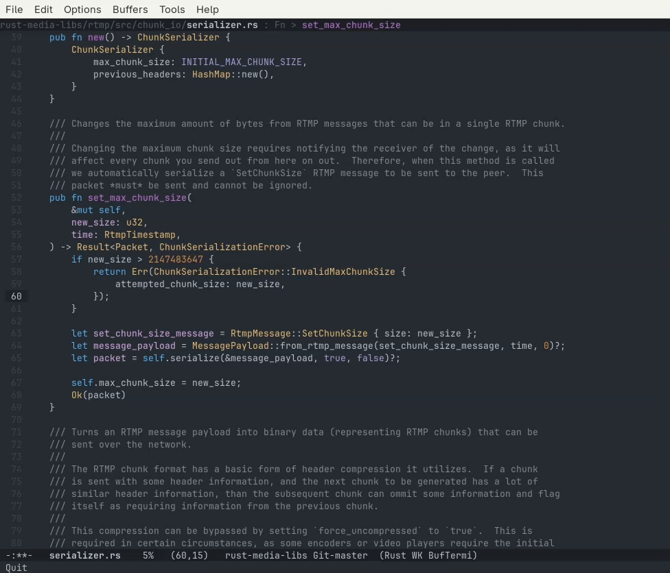
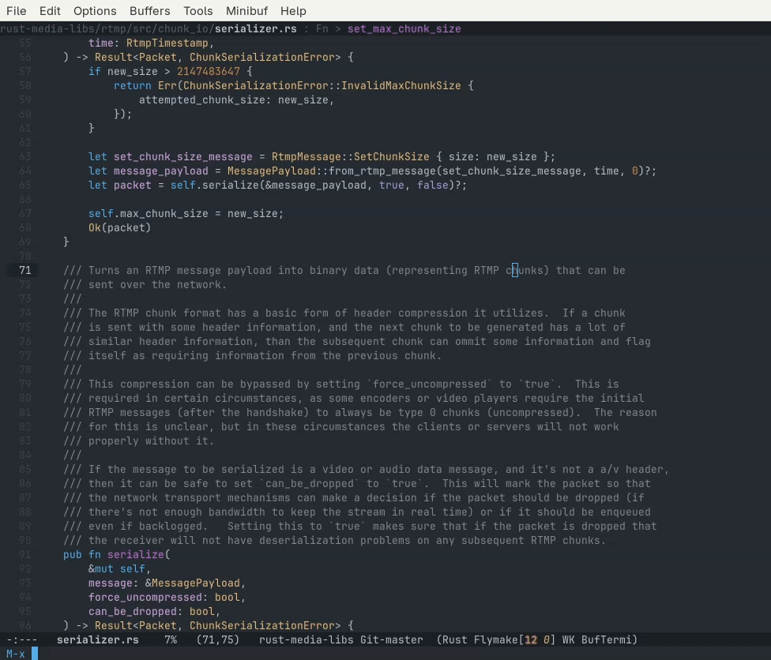

# Live Previews

<!-- markdown toc start -->
**Table of Contents**

  - [Default Behavior](#default-behavior)
  - [Consult](#consult)
    - [More Comprehensive Config](#more-comprehensive-config)
    - [Fast Project File Grepping](#fast-project-file-grepping)

<!-- markdown toc end -->


## Default Behavior

When executing common Emacs commands you do not get much feedback on if the
selection you are making is what you actually want. 

If you are familiar withthe already open buffers than `C-x b` works perfectly fine 
to select the one you want.

Let's say you have three `ghostel` terminals open to the same directory but with
different contents loaded in them. You will have the buffers probably named 
`*ghostel*`, `*ghostel*<2>` and `*ghostel*<3>`. It may not be obvious which one
you want when you try to switch buffers, which means you have to use `C-x b`,
select one, then repeat until you find the one you expect.



The same happens with `imenu` when trying to find a specific symbol:



If you make the wrong selection you have to repeat the filter process again.

## Consult

This experienced is improved by the package called [consult.el](https://github.com/minad/consult).

This package contains replacements for many common minibuffer commands, so that
as available options are highlighted it automatically previews what that option
will show.

The package can be added by adding the following to `init.el`:

```elisp
(use-package consult
    :ensure t
```


Now when we load the buffer list with `consult-buffer` the active window will now display
the buffer we have highlighted even before we've committed.



The same goes with `consult-imenu`:



This can also be useful for going to a specific line as well via the `consult-goto-line`.



### More Comprehensive Config

You can use keybinds to override the built-in commands with a config based on the example
in the github page

```elisp
(use-package consult
  :ensure t
  :bind (
         ("C-c M-x" . consult-mode-command)
         ("C-x M-:" . consult-complex-command)     ;; orig. repeat-complex-command
         ("C-x b" . consult-buffer)                ;; orig. switch-to-buffer
         ("C-x 4 b" . consult-buffer-other-window) ;; orig. switch-to-buffer-other-window
         ("C-x 5 b" . consult-buffer-other-frame)  ;; orig. switch-to-buffer-other-frame
         ("C-x t b" . consult-buffer-other-tab)    ;; orig. switch-to-buffer-other-tab
         ("C-x r b" . consult-bookmark)            ;; orig. bookmark-jump
         ("C-x p b" . consult-project-buffer)      ;; orig. project-switch-to-buffer
         ("M-g e" . consult-compile-error)
         ("M-g r" . consult-grep-match)
         ("M-g f" . consult-flymake)               ;; Alternative: consult-flycheck
         ("M-g g" . consult-goto-line)             ;; orig. goto-line
         ("M-g M-g" . consult-goto-line)           ;; orig. goto-line
         ("M-g o" . consult-outline)               ;; Alternative: consult-org-heading
         ("M-g m" . consult-mark)
         ("M-g k" . consult-global-mark)
         ("M-g i" . consult-imenu)
         ("M-g I" . consult-imenu-multi)
         ;; M-s bindings in `search-map'
         ("M-s d" . consult-find)                  ;; Alternative: consult-fd
         ("M-s c" . consult-locate)
         ("M-s g" . consult-grep)
         ("M-s G" . consult-git-grep)
         ("M-s r" . consult-ripgrep)
         ("M-s l" . consult-line)
         ("M-s L" . consult-line-multi)
         ("M-s k" . consult-keep-lines)
         ("M-s u" . consult-focus-lines)
         ;; Isearch integration
         ("M-s e" . consult-isearch-history)
         :map isearch-mode-map
         ("M-e" . consult-isearch-history)         ;; orig. isearch-edit-string
         ("M-s e" . consult-isearch-history)       ;; orig. isearch-edit-string
         ("M-s l" . consult-line)                  ;; needed by consult-line to detect isearch
         ("M-s L" . consult-line-multi)            ;; needed by consult-line to detect isearch
         ;; Minibuffer history
         :map minibuffer-local-map
         ("M-s" . consult-history)                 ;; orig. next-matching-history-element
         ("M-r" . consult-history))                ;; orig. previous-matching-history-element

  :init

  ;; Use Consult to select xref locations with preview
  (setq xref-show-xrefs-function #'consult-xref
        xref-show-definitions-function #'consult-xref)

  :config

  ;; Optionally configure preview. The default value
  ;; is 'any, such that any key triggers the preview.
  ;; (setq consult-preview-key 'any)
  ;; (setq consult-preview-key "M-.")
  ;; (setq consult-preview-key '("S-<down>" "S-<up>"))
  ;; For some commands and buffer sources it is useful to configure the
  ;; :preview-key on a per-command basis using the `consult-customize' macro.
  (consult-customize
   consult-theme :preview-key '(:debounce 0.2 any)
   consult-ripgrep consult-git-grep consult-grep consult-man
   consult-bookmark consult-recent-file consult-xref
   consult-source-bookmark consult-source-file-register
   consult-source-recent-file consult-source-project-recent-file
   ;; :preview-key "M-."
   :preview-key '(:debounce 0.4 any))

  ;; Optionally configure the narrowing key.
  ;; Both < and C-+ work reasonably well.
  (setq consult-narrow-key "<") ;; "C-+"
)
```

### Fast Project File Grepping

Consult also provides a `consult-ripgrep`which allows using ripgrep for very fast grep searches
within your project root. It automatically updates the grep results in the minibuffer completion
area while previewing the currently highlighted file and line in the current window:



