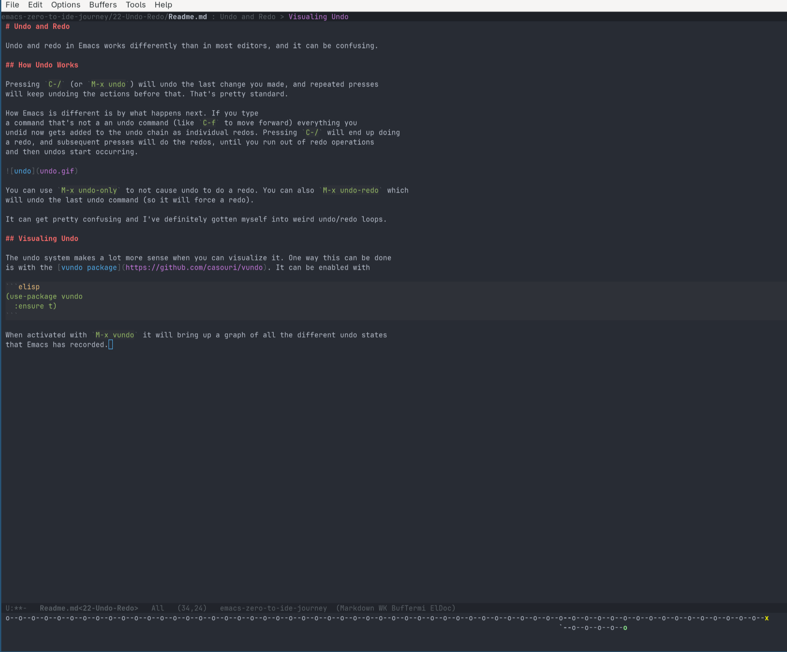
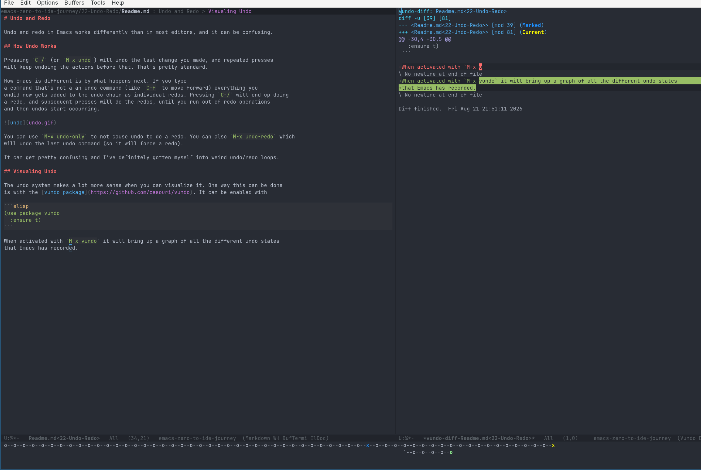
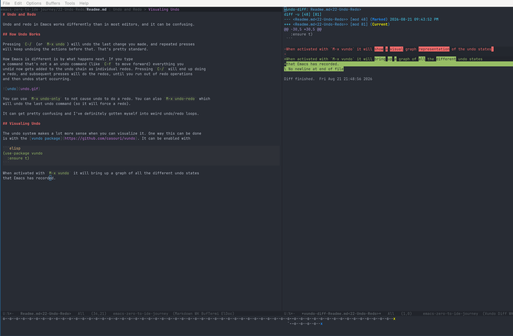
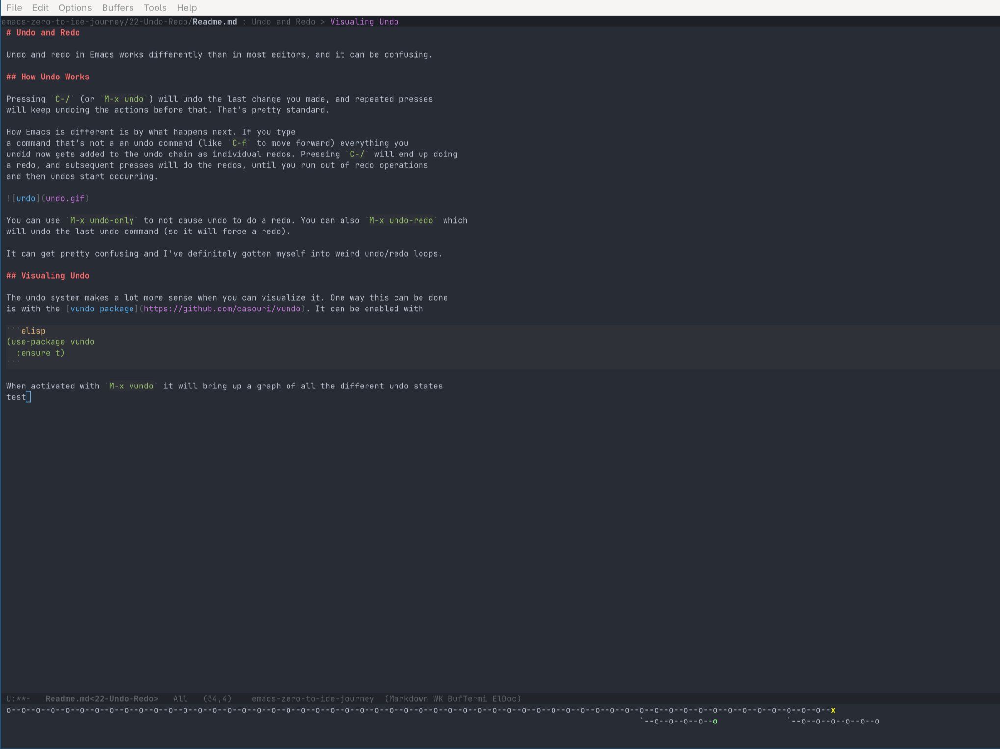

# Undo and Redo

Undo and redo in Emacs works differently than in most editors, and it can be confusing.

## How Undo Works

Pressing `C-/` (or `M-x undo`) will undo the last change you made, and repeated presses 
will keep undoing the actions before that. That's pretty standard. 

How Emacs is different is by what happens next. If you type
a command that's not a an undo command (like `C-f` to move forward) everything you
undid now gets added to the undo chain as individual redos. Pressing `C-/` will end up doing
a redo, and subsequent presses will do the redos, until you run out of redo operations
and then undos start occurring.


You can use `M-x undo-only` to not cause undo to do a redo. You can also `M-x undo-redo` which
will undo the last undo command (so it will force a redo).

It can get pretty confusing and I've definitely gotten myself into weird undo/redo loops.

## Visualing Undo

The undo system makes a lot more sense when you can visualize it. One way this can be done
is with the [vundo package](https://github.com/casouri/vundo). It can be enabled with

```elisp
(use-package vundo
  :ensure t)
```

When activated with `M-x vundo` it will bring up a graph of all the different undo states
that Emacs has recorded.



The yellow `x` is the state you are currently and the green `o` is what state has been
saved to the disk. You can then navigate the tree with arrow keys or `f/b/p/n`, and as you
move around the graph the current buffer will preview what it looks like with those changes.

Pressing `d` will show the diff of what changed in that specific undo state, however that is
not very useful since Emacs seems to create new undo steps pretty often and these diffs will
be granular.

This can be made useful though by pressing the `m` key to mark one of the states. This makes that
undo state a blue `x`. Now when you move to another state you can press `d` and see the difference
between the two states.



This also works across branches to see what changed



You can then either select a state and press `RET` to change the buffer to the selected state, or
`C-g` to exit vundo.

As you type, if you brig vundo back you will start seeing it add new branches.



Running `M-x vundo-popup-mode` will enable vundo to pop up so you can see the current tree
when you execute an undo command.
