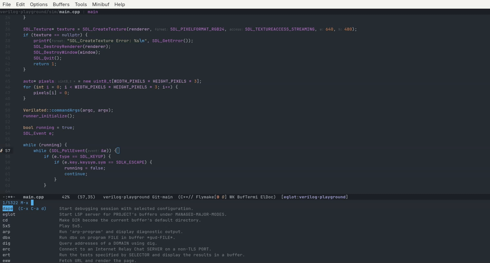
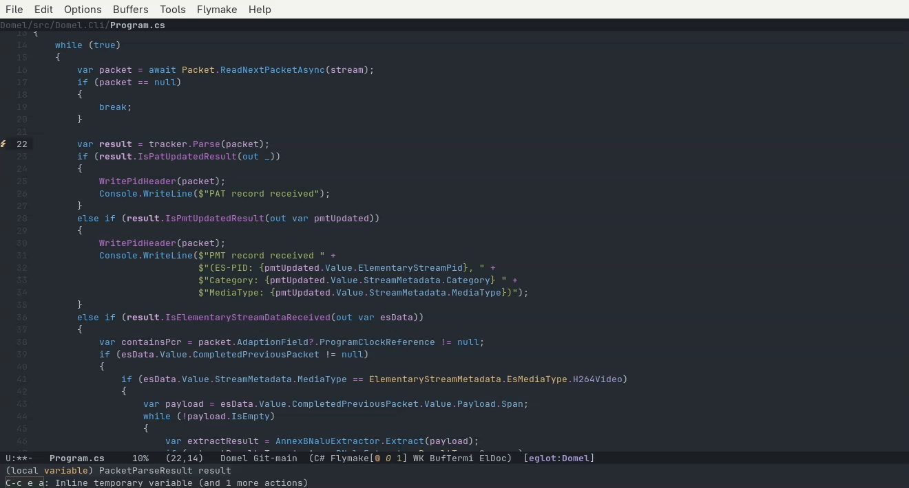

# Debugging
<!-- markdown toc start -->
**Table of Contents**

  - [Dape](#dape)
    - [C++](#c)
    - [C#](#c)
    - [Read Only Buffers While Debugging](#read-only-buffers-while-debugging)
    - [Attaching To Running Processes](#attaching-to-running-processes)
    - [Predefined Debugging Tasks](#predefined-debugging-tasks)

<!-- markdown toc end -->

While many developers can work fine with debugging via log files, being able to
place breakpoints and step through your algorithms one function at a time
can really speed things up.

So lets set Emacs up for interactive debugging.

## Dape

Just like there is a protocol for language servers, there is also a protocol for
debugging called the Debug Adapter Protocol (DAP). This allows for non-language
specific editors to interact with language/runtime specific debuggers without
having to explicitely code for each language and runtime.

One package that provides integrations into this [Dape](https://github.com/svaante/dape).

It supports conditional and non-conditional breakpoints, a locals/watch window,
thread viewer, and a lot of the functionality you would see in a vscode or zed
debugging session.

Lets get it enabled by adding the following to our `init.el` file:

```elisp
(use-package dape
  :ensure t
  :hook
  (kill-emacs . dape-breakpoint-save)
  (after-init . dape-breakpoint-load)

  :custom
  (dape-buffer-window-arrangement 'right)
  (dape-breakpoint-global-mode +1) ;; Supposedly allows setting breakpoints with the mouse
  )
```

After evaluating the package should install. 

The primary commands needed to get started I found were
* Breakpoints can be toggled with `C-x C-a b` (`dape-breakpoint-toggle`). 
* Execute to the next line via `C-x C-a n` (`dape-next`)
* Step into the next function via `C-x C-a s` (`dape-step-in`)
* Step out of the current function via `C-x C-a o` (`dape-step-out`)

The step functions (especially step to the next line) can be pretty annoying to hit if you
want to keep executing it over and over again quickly. Emacs has a "repeat last command"
command which is `C-x z`. After you hit that it will repeat the previous command, and
repeat it every time you hit the `z` key again.

So `C-x C-a n C-x z z z z` will have dape execute the next 5 lines of code. That's not just
a dape thing, but it definitely came in handy for it.

Even better is to add support for Emacs built in repeat mode:

```elisp
(use-package repeat
  :custom
  (repeat-mode +1))
```

This will allow you to press the last key for these commands to repeat them, so the same
"execute the next 5 lines" can be done via

`C-x C-a n n n n n`.

That being said, all of these are awkward for me (specifically the `C-x C-a` portion) and I
need to figure out better bindings. I'm used to using function keys for this in most IDEs
so lets replicate the JetBrains shortcuts in our `init.el`.

```elisp
(define-key prog-mode-map (kbd "<f5>") 'dape)
(define-key prog-mode-map (kbd "<f7>") 'dape-step-in)
(define-key prog-mode-map (kbd "<f8>") 'dape-next)
(define-key prog-mode-map (kbd "S-<f8>") 'dape-step-out)
(define-key prog-mode-map (kbd "<f9>") 'dape-breakpoint-toggle)
(define-key prog-mode-map (kbd "<f10>") 'dape-continue)
```

These will enable these keys for any programming mode.

### C++

C++ just worked with gdb (which it defaulted to). 



### C#

An open source .net debugger was created by Samsung (yes apparently that Samsung) called
[netcoredbg](https://github.com/Samsung/netcoredbg). It implements the DAP protocol and has
native support by Dape.

So after installing `netcoredbg` on the system we can load into our C# project and
run `M-x dape`. Dape will detect that we are in a C# buffer and default the debugger
to `netcoredbg`. From there we provide the `:cwd` argument to the directory we want as
the root directory and the `:program` argument which maps to the `dll` you want to run.



### Read Only Buffers While Debugging

In most cases, typing in a buffer that is beign debugged is confusing because the code that
is visible to you isn't the code that's being executed by the program. It is easy to accidentally
chane the buffer without realizing it so it would be beneficial if any buffers dape has triggered
due to an active debugging session are read-only by default.

We can do this with the `dape-display-source-hook` to mark a specific buffer dape has loaded as
read-only. We can then add this to a list to keep track of, so that when dape exits and calls
the `dape-active-mode-hook` it will mark all buffers it made read-only as writable again.

This can be done with

```elisp
(defvar my/dape-read-only-buffers nil
  "Buffers this hook made read-only while a dape session was active.")

(defun my/dape-mark-buffer-read-only ()
  "Put the current source buffer in `read-only-mode', remembering it.
Meant for `dape-display-source-hook', which runs in the buffer
where dape places the stack-frame overlay."
  (unless buffer-read-only
    (read-only-mode 1)
    (add-to-list 'my/dape-read-only-buffers (current-buffer))))

(defun my/dape-restore-read-only-buffers ()
  "When `dape-active-mode' turns off, un-read-only the buffers we touched."
  (unless dape-active-mode
    (dolist (buf my/dape-read-only-buffers)
      (when (buffer-live-p buf)
        (with-current-buffer buf
          (read-only-mode -1))))
    (setq my/dape-read-only-buffers nil)))

(add-hook 'dape-display-source-hook #'my/dape-mark-buffer-read-only)
(add-hook 'dape-active-mode-hook #'my/dape-restore-read-only-buffers)
```

Note that his won't work correctly if you have multiple debugging sessions
active at one time (though I'm not sure if dape allows multiple concurrent debugging sessions).

### Attaching To Running Processes

Theoretically dape can attach and start debugging a process that is already running by passing
in the `:request "attach"`, but I was not able to accomplish this (at least with gdb). I don't tend
to do this much except for a work node code base, and even that's pretty rare. I'll need to figure
this out eventually though.

### Predefined Debugging Tasks

There are two methods for defining and running custom dape configurations. One option is to utilize
add custom configurations to the known configs via `add-to-list 'dape-configs`. You can use the
`M-x describe-variable RET dape-configs` to see what the different options are. The next time
you run `M-x dape` you can then use your configuration name to execute it.

This will add configurations globally though, and most of the configuration options I would
add are project specific. So instead I'm using an updated version of my task macro to
allow for passing in a dape configuration via `:debug-config`. 

```elisp
(require 'cl-lib)
(cl-defmacro my/deftask (task-name &key compile shell new-buffer-name description project-name dir debug-config)
  "Execute a project task based on the specified criteria.

TASK-NAME specifies the name of the interactive function (what
\\[execute-extended-command] executes).

The function for the task are one of the following mutually exclusive types:
* COMPILE - runs the provided command as a shell script in a compilation buffer
* SHELL - runs the provided command in as a normal async shell buffer
* DEBUG-CONFIG - a dape config to execute

Only one can be provided, but at least one is required.

The task can be executed from a specific directory.  A specific directory can
 be specified with DIR or you can use the root of a known Emacs
project specified with PROJECT.  Only one of these should be specified.

When PROJECT-NAME is specified, it should be the leaf directory from the
absolute path of the project root.  So if `C-x p p` shows the directory
\"~/code/test/\" then you can specify ':project \"test\"`.

By default, compilations use the same buffer and will overwrite each other.
Likewise async shell executions always have a buffer named
'*Async Shell Command*'. The task specific buffer can be given a specific name
via NEW-BUFFER-NAME keyword.

The created interactive function can be given a description with the
specified DESCRIPTION."
  (declare (indent defun))
  (unless (= (cl-count-if #'identity (list shell compile debug-config)) 1)
    (error ":compile, :shell, or :debug-config must be specified, but only one of them"))
  (unless (or project-name dir)
    (error ":project-name or :dir must be specified"))
  (unless (not (and project-name dir))
    (error "Both :project-name and :dir cannot be specified, only one should be specified"))
  `(defun ,task-name ()
     ,@(when description (list description))
     (interactive)
     (let ((default-directory
            ;; set default-directory either to the specified project's root or the cwd
            ,(cond
              (project-name `(my/find-relevant-project-root ,project-name))
              (dir dir)
              )))
       
       (if (not default-directory)
           ;; Should only be here if project-name was provided but no project root was resolved
           (message "No known project for '%s'" ,project-name)
         ,(when compile
            `(let ((ghostel-compile-buffer-name ,new-buffer-name))
               (ghostel-compile ,compile))
            )
         ,(when shell
            `(let ((buffer (get-buffer-create (or ,new-buffer-name "*ghostel-run*"))))
               (display-buffer buffer)
               (prog1
                   (ghostel-exec buffer shell-file-name ;; Use the system shell to execute the command
                                 (list shell-command-switch ,shell))
                 (with-current-buffer buffer
                   ;; Ghostel kills variables upon entering its mode, so we need to set this after
                   ;; exec has run so it still is set on the buffer
                   (setq-local ghostel-kill-buffer-on-exit nil))
                 )
               buffer))
         ,(when debug-config
            `(let ((dape-config (copy-sequence ,debug-config)))
               (unless (plist-member dape-config :cwd)
                 (setq dape-config (plist-put dape-config :cwd default-directory)))
               (dape dape-config)))
            )
       )
     )
  )
```

Now I can define my custom debugging configuration via:

```elisp
(my/def-project-tasks "verilog-playground"
  (my/tasks/verilog-playground/build-sim
   :description "Build the verilog playground simulator"
   :compile "make sim_build"
   :new-buffer-name "verilog-playground: sim_build"
   )

  (my/tasks/verilog-playground/debug-test-pattern
   :description "Build, run, and debug the verilog playground simulator"
   :debug-config '(command "gdb"
                           command-args ("--interpreter=dap")
                           compile "make sim_build"
                           :type "gdb"
                           :request "launch"
                           :program "sim/cmake-build-debug/test_pattern"
                   )
   )
  )
```

Now I can do `M-x verilog debug pattern` and it will compile with dape attached.
